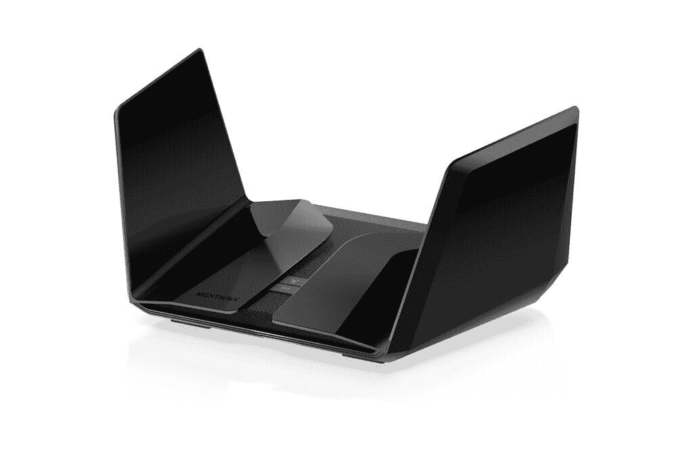
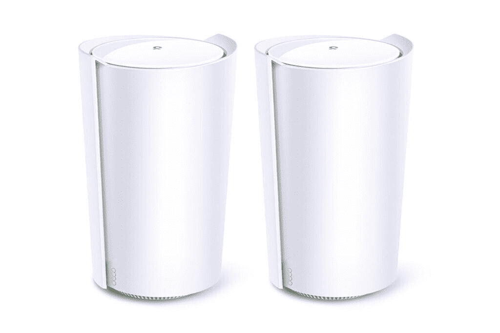
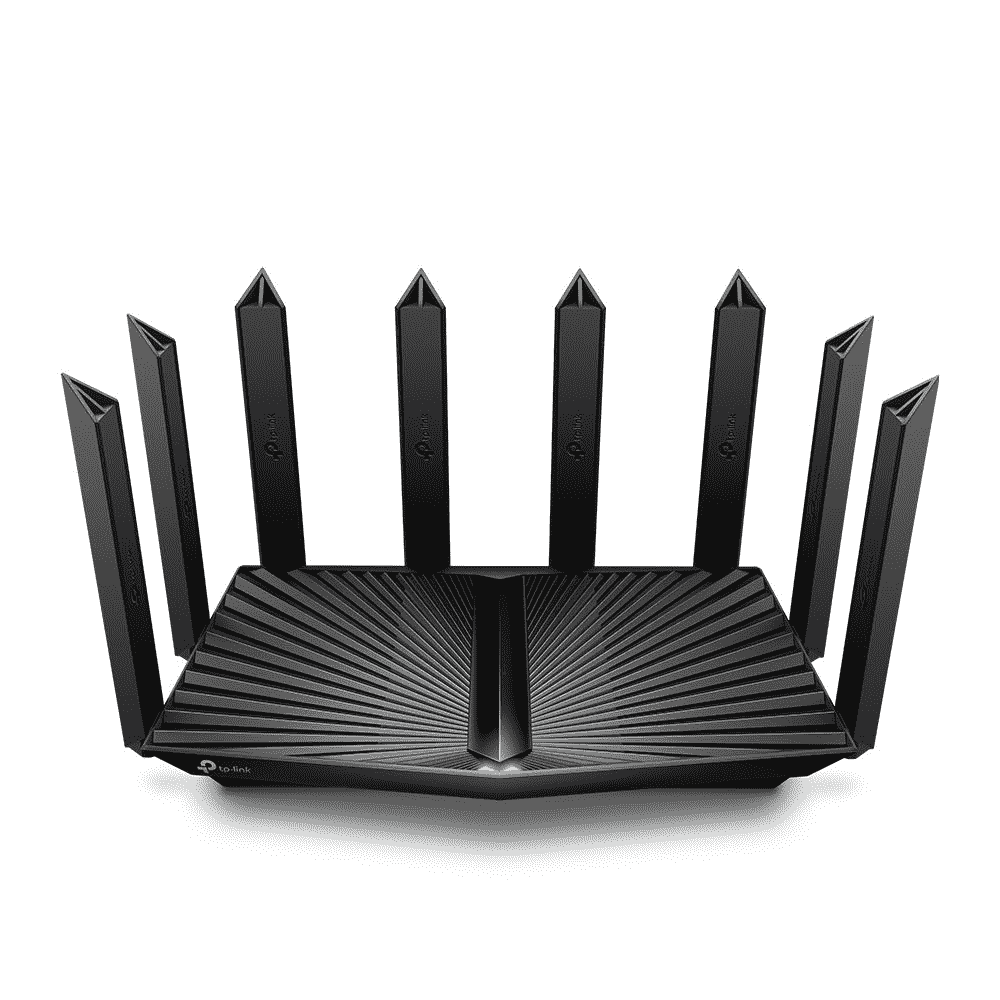
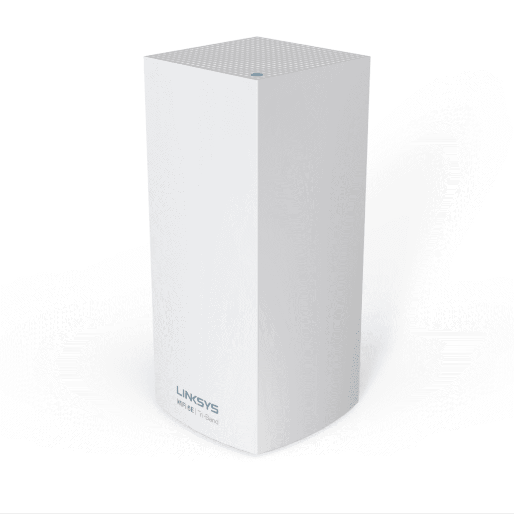
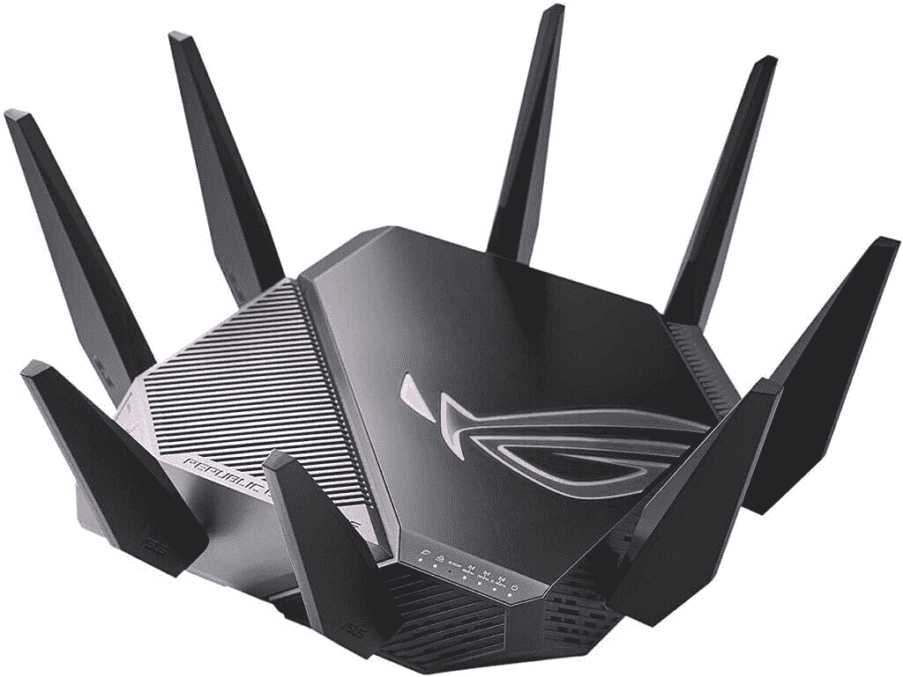

# 这些是在 CES 2021 上发布的 WiFi 6e 路由器

> 原文：<https://www.xda-developers.com/adb-wifi-lollipop/>

WiFi 6e 一直是今年 CES 的一大谈论点。对于外行人来说，Wifi 6e 标志着无线网络的一个变化，我们以前只见过一次:使用一个全新的频段——5 GHz 之上的 6GHz 和旧的 2.4GHz(但非常拥挤)

如果你在想“我以为我们已经有了”，不要被愚弄了——Wifi 6 已经存在了一段时间，尽管它使用了相同的技术，但只有 Wifi 6e 实际上利用了新的波段。值得注意的是，许多国家尚未许可这部分频谱，尽管 WiFi 联盟最近推出了 Wifi 6e 认证计划，称美国、英国、欧洲、智利、韩国和阿拉伯联合酋长国已经开放了 6GHz，许多其他国家正在批准使用。

还值得记住的是，尽管 Wifi 6e/6GHz 的吞吐量是 5GHz 的两倍多，但“燃烧两倍亮度的星星燃烧的时间是一半”——或者简单地说——信号无法传播那么远，所以在更大的家庭或企业中，你更有可能需要网状节点。哦，还有一件事，如果你的设备不支持 WiFi 6e，拥有 WiFi 6e 路由器对你来说不会有太大的影响，但它将在未来几年内改善你的网络。

所有这些都准备好了，这里是本周在 CES 2021 期间公布的 WiFi 6e 路由器。在可能的情况下，我们已经包括了价格和可用性，但这项技术是如此的前沿，在许多情况下，这些信息还不会可用。

## Netgear

 <picture></picture> 

Netgear Nighthawk RAXE500

正如你对一家专注于网络的公司的期望，Netgear 没有浪费时间参与 WiFi 6e 行动。它的第一款产品是网件夜鹰 RAXE500，具有“曼达洛人飞船”的美感。它提供了一个四核 1.8GHz 处理器，5 个千兆端口，2 个 USB 3.0 端口，并在支持的设备上实现了高达 10.8Gbps 的传输速度。它总共可以提供 12 个流——三种带宽各四个，以及 Netgear Armor cybersecurity 与 BitDefender 一起开发的选项。这款手机没有超过“2021 年春季”的具体日期，但定价已经定在了 599 美元。

目前还没有任何关于流行的 Netgear Orbi 系列的 WiFi 6e mesh 产品的消息，但我们预计它们不会太远。

## TP-Link

 <picture></picture> 

TP-Link Deco X96

TP-Link 将在 WiFi 6e 上全力以赴，在其 Deco mesh 和 stalwart Archer 系列中使用路由器。从 Deco 系列开始，TP-Link 的 Deco X96 全屋系统的速度高达 7800Mbps，该系统还提供了更强的回程，从而改善了覆盖范围、速度和范围。与所有新设备一样，TP-Link 正在提供其新推出的 HomeShield 服务，加入了以物联网为重点的全网络安全产品的趋势。Deco X76 Plus 的速度不太快，提供 5400Mbps 的速度，但“Plus”指的是它的机载智能家居中枢，支持 TP-Link 和第三方的一系列产品，并支持 Zigbee。正如 [*The Verge*](https://www.theverge.com/2021/1/11/22213115/tp-link-wifi-6e-first-routers-mesh-smart-speaker) 所指出的，尽管如此，你实际上不能将 6GHz 以上的 WiFi 6E 小工具连接到这些 Deco mesh 路由器中的任何一个，因为它们使用 6GHz 相互通信，而不是客户端设备。

 <picture></picture> 

TP-Link Archer AX96

如果您确实想通过 6GHz WiFi 连接 WiFi 6E 设备，那么您会对 TP-Link 即将推出的 Archer 系列非网状路由器感兴趣。旗舰产品 Archer 系列推出了 Archer AX96，它提供了更高的 7800 Mbps 吞吐量，并支持 TP-Link OneMesh 协议。但是，校园内的大型路由器是 Archer AX206，它提供高达 10Gbps 的 wifi 速度，两侧是一些我们见过的最令人印象深刻的以太网选项-10Gbps WAN/LAN SFP+端口和第二个 10g bps WAN/LAN 端口。TP-Link 表示，其 OFDMA 和 UL/DL MU-MIMO 的结合消除了延迟，并允许更多设备在家庭网络中舒适地共存。

TP-Link 在价格和可用性上甚至更加谨慎，只是说它们将在 2021 年上市。我们会随时通知你最新进展。

## cisco 公司在家用及 soho 市场的数据通信设备品牌

 <picture></picture> 

Linksys AXE8400

Linksys 在 CES 上推出了 AXE8400，这是一个由高通网络 Pro 1210 平台驱动的全家庭网状系统。它与该系列中以前的产品完全兼容，尽管如果您连接到非 6e 节点，您将感受不到好处。Linksys 表示，AXE8400 可以轻松地允许超过 65 台设备共享相同的带宽，此外，基本单元还提供 4 个千兆以太网端口和一个 USB 3.0 连接器。每个节点能够覆盖多达 3000 平方英尺，尽管我们敢说在现实世界中这个数字会下降很多。TP-Link 承诺将于 2021 年春夏在美国推出，今年晚些时候将在世界其他地区推出。定价为单个节点 449.99 美元，2 个节点 849.99 美元，3 个节点 1199.99 美元。

## 华硕

 <picture></picture> 

ASUS ROG Rapture GT-AXE11000

尽管在这个名单上排在最后，华硕声称是第一个发布 WiFi 6e 路由器的 ROG Rapture GT-AXE11000。它是与 Skyworks 联合开发的，支持高达 11Gbps 的速度(列表中最快的速度)。它提供了与去年宣布的 GT-AX11000 几乎相同的规格，但它增加了 6GHz 频谱。有一个 1.8GHz 四核处理器，带有 4 个千兆局域网端口、一个千兆广域网端口和一个 2.5Gbps 多千兆局域网/广域网端口。与其他产品不同，GT-AXE11000 将于 1 月底上市，售价为 549.99 美元，是我们列表中唯一一款已经预购的设备。

## 其余的在哪里？

这张单子上有几处明显的遗漏。虽然 D-Link 在 CES 上宣布了几款新机型，但它们都在双频 WiFi 6 上名列前茅。今年晚些时候，我们可能会看到他们的 WiFi 6e 设备，但这是一家决定暂时不出手的公司。同样，Ubiquiti 还没有提到 WiFi 6e，尽管我们认为这也只是时间问题。最后，虽然小米已经宣布了 WiFi 6e 路由器，但我们没有将它包括在内，因为它没有使用 WiFi 6e 的全部好处，目前只在中国可用(奇怪的是，6GHz 还没有为 WiFi 6E 划分)。

正如你所看到的，有这么多的规格和发布日期失踪，WiFi 6e 仍然处于初级阶段。到目前为止，只有极少数设备真正能够使用 6GHz 频率，并且在操作中有明确的“早期采用者定价”意识，这些产品目前不会给大多数用户带来最大好处。不过，如果你想在它们上市后进行升级，它们仍然值得考虑来改善你的网络。