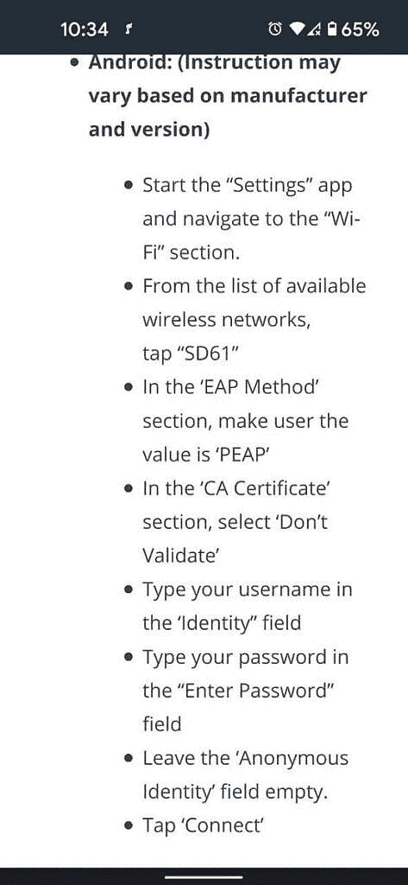

# Android 11 将不再让你连接到一些企业 WiFi 网络

> 原文：<https://www.xda-developers.com/android-11-break-enterprise-wifi-connection/>

如果你拥有一台谷歌 Pixel，并且已经将[更新到 2020 年 12 月的最新安全更新](https://www.xda-developers.com/december-android-security-update-memory-camera-pixel-3/)，你可能会发现你无法连接到某些企业 WiFi 网络。如果是这样，那么要知道你并不孤单。这不是一个错误，而是谷歌对 Android 11 的有意改变，只是碰巧出现在 12 月份推送到 Pixel 手机的版本中。所有将收到 Android 11 更新的 Android 手机预计最终都会有这一变化*，这意味着我们将在不久的将来看到许多无法添加企业 WiFi 网络的用户的愤怒投诉。以下是你需要知道的谷歌为什么要做出改变，以及你能做些什么。

## Android 11 中为什么不能添加我的企业 WiFi 网络？

很多用户更新到 Android 11*后都会遇到的问题是“CA certificate”下拉列表下的“不验证”选项被去掉了。此选项以前出现在使用 WPA2 企业安全添加新的 WiFi 网络时。

为什么这个选项被删除了？根据谷歌的说法，让用户选择“不验证”选项是一个安全风险，因为它可能会泄露用户凭据。例如，如果用户想要进行网上银行业务，他们将他们的浏览器指向他们的银行所拥有的已知域名(例如 www.bankofamerica.com)。如果用户注意到他们点击了一个链接，而他们的浏览器从错误的域中加载了一个网页，那么他们当然会犹豫是否给出他们的银行账户信息。但是除此之外，用户如何知道他们的浏览器连接的服务器是其他人都连接的服务器呢？换句话说，人们如何知道他们看到的银行网站不仅仅是一个由恶意第三方注入的虚假版本，该恶意第三方已经获得了网络访问权限？网络浏览器通过验证服务器证书来确保这种情况不会发生，但当用户在连接到他们的企业 WiFi 网络时切换“不验证”选项时，他们会阻止设备进行任何证书验证。如果攻击者执行中间人攻击并控制网络，那么他们可以将客户端设备指向攻击者拥有的非法服务器。

多年来，网络管理员一直被警告这种潜在的安全风险，但是仍然有许多企业、大学、学校、政府组织和其他机构不安全地配置了他们的网络配置文件。展望未来，WiFi 联盟为 WPA3 规范采用的安全要求已经强制要求进行这一更改，但众所周知，许多组织和政府在升级方面速度缓慢，在安全方面往往比较松懈。一些组织-即使知道所涉及的风险-仍然建议用户在连接到他们的 WiFi 网络时禁用证书验证。

 <picture></picture> 

A screenshot showing instructions from a neighborhood school board on how to connect to their WiFi network. Notice the 4th step where this insecure practice is told to users.

支持 WPA3 的设备和路由器可能需要数年时间才能普及，因此谷歌现在正在迈出一大步，以确保用户不再面临跳过服务器证书验证的风险。随着这一变化，他们提醒网络管理员继续让用户不安全地连接到他们的企业 WiFi。希望有足够多的用户向他们的网络管理员抱怨他们不能按照指示添加他们的企业 WiFi 网络，促使他们做出改变。

*由于 Android 软件更新的工作方式，针对您特定设备的 Android 11 初始版本可能不会受此变化的影响。这一变化仅在 2020 年 12 月的更新中引入到 Pixel 手机中，根据型号的不同，该更新带有内部版本号 RQ1A/D。然而，由于这是一个平台级的变化，作为“R QPR1”构建的一部分(正如内部所知)，合并到 Android 开源项目(AOSP)中，我们预计其他 Android 手机最终会有这一变化。

## 这个问题有什么解决办法？

在这种情况下，第一步是要意识到用户在他们的设备上能做的事情并不多。除非用户选择不更新他们的设备，否则这种变化是不可避免的——但这可能会引发一系列其他问题，所以不建议这样做。因此，必须向受影响的 WiFi 网络的网络管理员传达此问题。

Google 建议网络管理员指导用户如何安装根 CA 证书或使用浏览器等系统信任存储，此外，还应指导他们如何配置服务器域名。这样做将允许操作系统安全地验证服务器，但它要求用户在添加 WiFi 网络时多做几个步骤。或者，谷歌表示，网络管理员可以创建一个应用程序，使用 [Android 的 WiFi 建议 API](https://developer.android.com/guide/topics/connectivity/wifi-suggest) 为用户自动配置网络。为了让用户更加方便，网络管理员可以使用 pass point——一种运行 Android 11 的所有设备都支持[的 WiFi 协议——并指导用户配置他们的设备，允许设备在靠近网络时自动重新连接。由于这些解决方案都不要求用户更新任何软件或硬件，他们可以继续使用他们已经拥有的相同设备。](https://source.android.com/devices/tech/connect/wifi-passpoint)

不过，实际上，企业和其他机构采用这些解决方案还需要一段时间。这是因为他们需要在第一时间意识到这一变化，而不可否认的是，这一点并没有很好地传达给用户。许多网络管理员已经关注这些变化几个月了，但也有许多人可能没有意识到。如果你是一名网络管理员，想了解更多关于正在发生的变化的信息，你可以从 [*SecureW2*](https://www.securew2.com/blog/android-11-server-certificate-validation-error-solution/) 的这篇文章中了解更多。