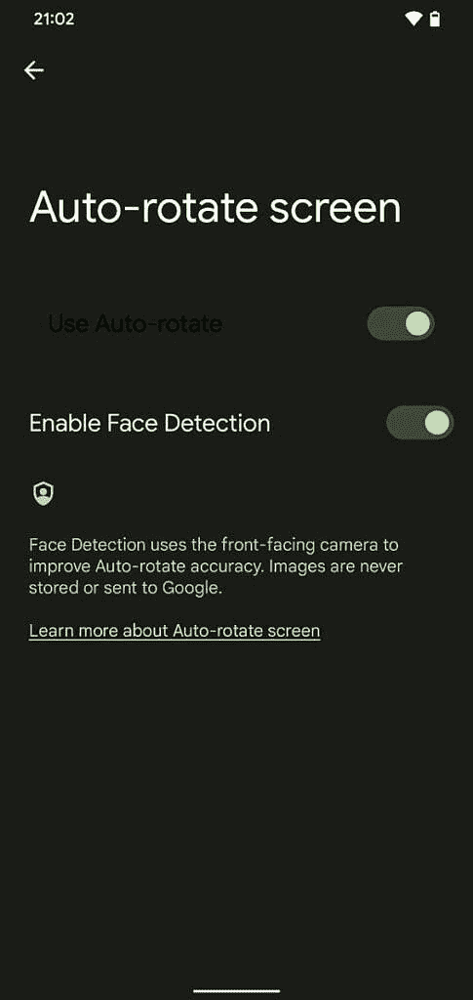

# Android 12 Beta 3 Changelog:所有的新功能和变化！

> 原文：<https://www.xda-developers.com/android-12-beta-3-features/>

今天早些时候，谷歌发布了 Android 12 的第三个测试版，与之前的测试版相比，它有一系列的变化和改进。虽然我们离 Android 12 的稳定发布还有一段距离，但当它到来时，许多用户将会大吃一惊。Android 12 将成为 Android 多年来最大的更新，谷歌仍未在发布前添加新功能。[例如，Android 12 Beta 3](https://www.xda-developers.com/android-12-beta-3-changes/) 增加了滚动截图、更智能的自动旋转等新功能。

* * *

**浏览这篇文章**

* * *

## Android 12 Beta 3 中面向用户的新功能

也许 Beta 3 中添加的最令人兴奋的新功能是滚动屏幕截图。Android 12 中的滚动截图让你可以捕捉可滚动内容的截图，这样你就不必一个接一个地捕捉截图，然后在图像编辑应用程序中将它们拼接在一起。OEM 厂商多年来一直有自己的滚动屏幕截图实现，但谷歌自去年 Android 11 开发者预览版以来一直在致力于平台级功能[。可悲的是，谷歌的版本](https://www.xda-developers.com/android-11-scrolling-screenshot-feature/)[没有在 Android 11 版本中被删除](https://www.xda-developers.com/android-11-ama-summary/)，但它终于在 Android 12 Beta 3 中出现了。

谷歌的滚动截图功能在 Android 12 中的工作方式是基于视图，而不是 OEM 软件中的图像拼接技术。当您捕获可滚动内容的截图时，您会在截图预览中看到一个新的“捕获更多”按钮。当你点击这个按钮时，Android 会扩展截图以显示整个屏幕，供用户裁剪。下面是一段简短的屏幕录音，展示了 Beta 3 中的这一新功能:

为了给新的“捕捉更多”按钮腾出空间，截图预览中的其他两个按钮——共享和编辑——的文本已被删除。

目前，滚动屏幕截图对于使用基于标准视图的用户界面的应用程序来说是现成的。不使用基于视图的 UI 或使用高度定制的 UI 的应用程序需要实现新的 [ScrollCapture API](https://developer.android.com/reference/android/view/ScrollCaptureCallback) 来告诉系统如何捕捉屏幕。在 Android 12 Beta 4 中，滚动截图将支持滚动 ListViews 对抓取网络视图的支持正在进行中，但是还不知道什么时候会加入。

### 更好更快的自动旋转

在 Android 12 Beta 3 中，Android 的自动旋转屏幕功能得到了增强。谷歌优化了屏幕的动画和重绘，他们还添加了 ML 驱动的手势检测算法。总体而言，这些更改将自动旋转的延迟减少了 25%。

在 Pixel 4 和更高版本的 Pixel 手机上，还有另一个自动旋转的增强功能，用户可以选择启用。在设置>显示>自动旋转屏幕下，可以找到一个新的“启用面部检测”选项。启用后，Android 12 将使用你的 Pixel 手机的前置摄像头来更准确地检测屏幕何时应该旋转。这将有望减少你躺下时无意的屏幕旋转。谷歌表示，这项功能捕捉的图像是在手机的[私人计算核心](https://www.xda-developers.com/android-12-privacy-private-compute-core-privacy-dashboard/)内进行处理的，这意味着它们不会存储在云中，也不会离开设备。

 <picture></picture> 

Credits: GooglePixels on Telegram.

### 设置不再使用彩色图标

多彩的设置菜单图标已被静音。在旧版本的 Android 操作系统中，图标通常是这样的，所以在 Android 12 中看到它们的回归可能会有点奇怪。然而，谷歌可能想让图标更加一致，这样它们就不会与你的壁纸上的“莫奈”主题相冲突。

### 你的动态主题现在可以自定义了

更有趣的是，Android 12 Beta 3 让“莫奈”更加可定制。在 Beta 2 中，一旦你选择了壁纸，“莫奈”会自动为你生成一个主题，但你不能改变调色板。谷歌在谷歌 I/O 上取笑了这个调色板选择功能，现在，Beta 3 增加了更新的壁纸选择器应用程序，增加了这个功能。

在 Android 12 Beta 3 中应用壁纸后，可以返回更改系统主题颜色。你可以选择你从壁纸中动态生成的调色板选项，或者你可以选择一个“基本”的颜色作为整个系统的主题。根据你的墙纸的复杂程度，你可以从四个调色板选项中挑选。

有趣的是，在你应用壁纸之前，壁纸预览屏幕本身就会改变，以反映 Android 12 将从你的壁纸中生成什么样的调色板。这将让你看到 Android 将动态生成什么主题，而不需要改变你的壁纸。当然，如果你不喜欢 Android 生成的调色板，你可以像我们之前提到的那样改变系统主题颜色。

### 主题图标

在壁纸&风格应用程序(又名壁纸选择器)中，有一个新的“主题图标”开关。这个开关暴露了[在 Beta 2](https://www.xda-developers.com/android-12-beta-2-features/#android12beta2_icontheming) 中隐藏的功能。当您启用此选项时，大多数 Google apps 的图标将跟随您的系统主题。不是每个谷歌应用都受此影响——在我们的设备上，聊天、查找我的设备、玩游戏和任务的图标没有动态主题——但绝大多数谷歌应用都受此支持。

不幸的是，看起来动态主题化的应用图标列表是硬编码的。目前没有第三方应用遵循这一主题，不过一旦你的素材库发布，开发者将能够改变他们自己应用的图标。主题应用程序图标也只显示在主屏幕上，而不显示在应用程序抽屉、设置或最近的应用程序概述中。这当然是一个很好的特性，但是如果你的主屏幕上只有一个图标不跟随你的系统主题，而其他的都跟随，那就太不和谐了。

### 从最近的应用程序概览中快速复制链接

Pixel 手机上的设备个性化服务应用程序提供了一些漂亮的功能。值得注意的是，该应用程序使用 OCR 从最近应用程序概述中的任务中提取文本和图像。

从 Android 12 Beta 3 开始，在最近的应用概述中发现了一个新动作。当你关注一个包含 URL 的任务时，比如谷歌 Chrome 或微软 Edge，Android 会显示一个链接图标，点击它，你就可以复制或分享 URL。

我们还没有确定该功能的具体工作原理，但它似乎不是基于 OCR 的。它能够获得完整的网址，即使整个网址没有显示在最近的应用程序概览中。一位用户[告诉我们](https://www.xda-developers.com/google-pixel-6-xl-ultra-tele-camera-rumor/)它在 Reddit 上对他们有效，所以它可能以某种方式从 WebView 中提取 URL。

### 禁用推送以调用助手手势

如果你曾经不小心通过从手机底部向上滑动来调用谷歌助手，那么你会很高兴知道 Android 12 Beta 3 引入了一个开关来禁用这个手势。它可以在设置>系统>手势>系统导航>手势导航中找到(点击齿轮图标。)

在 Android 11 中，谷歌将媒体播放器从通知面板移到了快速设置面板下面的专用空间。在 Android 12 中，这个媒体播放器经过了改进，现在看起来比以前更加集成。每当用户暂停媒体播放时，Android 会继续在快速设置面板下显示媒体播放器，以便用户可以快速恢复播放。用户可以通过进入设置>声音和振动>媒体来禁用此行为。

现在在 Beta 3 中，这个“媒体”设置页面又增加了一个选项:“显示媒体推荐”。这项功能实际上还没有发挥作用，因为它与即将推出的“Live Space”功能捆绑在一起。一旦上线，“Live Space”小工具将在连接耳机等音频附件时显示媒体建议。

### “一目了然”现在是“生活空间”

说到“Live Space”，在 Android 12 Beta 3 中，谷歌已经将“一览”小工具重命名为“Live Space”。目前，这只是一个品牌重塑，因为没有添加新功能。然而，新的“Live Space”小工具[将获得一些目前“一览”小工具中没有的新功能](https://www.xda-developers.com/live-space-widget-replace-at-a-glance/)。这些功能包括“在商店”切换到表面购物清单和 Google Pay 奖励卡，当你在商店时，mdia 推荐切换，以及与股票、体育和生日相关的信息。

左边的第一个截图来自 Beta 3，而右边的两个截图来自我们之前关于“Live Space”小部件的文章。

### 存储设置显示垃圾存储使用

你手机的存储设置现在会显示你手机的垃圾占用了多少存储空间。嗯，从技术上讲，它会告诉你所有标记为垃圾的文件在你的设备上占用了多少存储空间，因为从技术上讲，Android 没有一个垃圾目录。

几个月前，[我们了解到](https://www.xda-developers.com/android-12-recycle-bin/)谷歌可能最终会让用户管理他们手机的回收站，这一新增功能似乎与此有关。Android 上的垃圾项目目前对大多数文件管理器都是隐藏的，因为它们以“.”开头在它们的文件名中，这是 Android 理解文件应该被认为是隐藏的方式。这些隐藏的垃圾文件存储在它们原来所在的目录中，而不是移动到系统范围的回收站/垃圾桶文件夹中。当你点击存储设置中的“垃圾”项时，你会被谷歌应用重定向到文件的[垃圾活动。](https://www.xda-developers.com/files-by-google-trash-folder-nearby-share/)

### 你现在可以从“互联网”面板关闭 Wi-Fi

第二个 Android 12 测试版[通过将 Wi-Fi 和移动数据磁贴合并为一个名为“互联网”的磁贴，简化了连接体验](https://www.xda-developers.com/android-12-beta-2-features/#android12beta2_internetsettings)当你在快速设置中点击新的“互联网”图标时，它会在屏幕底部启动“互联网”面板，让你改变 Wi-Fi 网络或切换移动数据。然而，这种简化有点过头了，因为你不能*关闭* Wi-Fi 而不点击你当前网络上的设置齿轮来深入设置。

然而，在 Android 12 Beta 3 中，你不再需要进入设置来关闭手机的 Wi-Fi，因为现在互联网面板的左下角有一个名为“关闭 Wi-Fi”的开关。

在 Android 12 Beta 3 中关闭 Wi-Fi 仍然需要比 Android 11 多一个步骤，所以如果你想直接从快速设置面板中关闭 Wi-Fi，你可以使用 Tasker 这样的应用程序[进行自己的 Wi-Fi 切换](https://www.xda-developers.com/bring-back-wifi-toggle-quick-settings-android-12-tasker-project/)。

### 气泡和 PIP 窗口具有重新设计的关闭体验

当你在 Android 12 Beta 3 中拖动气泡或画中画窗口时，你可能会注意到一些变化。首先，近距离目标(底部的“X”)现在要大得多。第二，当气泡或画中画窗口接近关闭目标时，有一个整洁的捕捉动画。您可以在下面嵌入的屏幕记录中看到这两者的运行。

[video width = " 303 " height = " 624 " MP4 = " https://static 1 . xdaimages . com/WordPress/WP-content/uploads/2021/07/Android-12-Beta-3-Bubble-closing . MP4 "]

### 全新的安装体验

如果你重置了你的手机或者买了一个新的 Pixel，你会看到 SetupWizard 应用程序。这个应用程序会引导你连接到互联网，添加你的谷歌帐户，并设置一些功能，在 Android 12 Beta 3 中，它有一个更令人愉快的设计，与其他以你为主题的系统应用程序相一致。

### 游戏设置

在 Google for Games 开发者峰会上，Google [终于推出了期待已久的 Android 12 游戏仪表盘功能](https://www.xda-developers.com/android-12-game-dashboard-gaming-mode-apis/)。一旦该功能推出，您将能够访问带有关键实用程序的仪表板，如屏幕记录器、屏幕捕捉快捷方式、FPS 计量器和勿扰开关。仪表盘还有一个 YouTube 直播的快捷方式、一个 Google Play 游戏小工具和一个游戏优化菜单。在 Beta 3 中，游戏仪表盘技术上还没有对用户开放，但我们发现了一个新的“游戏设置”页面，在那里你可以全局切换游戏仪表盘和游戏免打扰功能。

### 单手模式和“滑动通知”手势的整合

在 Android 12 DP2 中，谷歌[增加了](https://www.xda-developers.com/android-12-dp2-new-features/#:~:text=New%20Notification%20swipe-down%20gesture)一个新的“滑动通知”手势，让你在任何屏幕底部附近向下滑动，下拉通知栏。这与 Android 12 的单手模式相冲突，该模式也是在 DP2 中添加的[，因为两种手势的触发方式相同。在 Beta 3 中，谷歌取消了“滑动通知”手势的独立设置页面，而是将其移至单手模式页面。](https://www.xda-developers.com/android-12-dp2-new-features/#:~:text=s%20dark%20theme-,One-handed%20mode,-As%20devices%20get)

### 杂项变更

1.  辅助功能设置下的“文本和显示”子菜单增加了一个实验部分。这里实际上没有什么新东西——只是谷歌方面的重新安排。
2.  一个可选的功能标志启用位置指示器警报，很像摄像头和麦克风。然而，考虑到像 Google Play Services 这样的应用程序访问该位置以便为其他应用程序提供位置服务的频率，该指标更令人讨厌，而不是提供信息。
3.  隐藏的“高级安全性”活动列出了“安全性设置”页面中的各种设置。看起来谷歌可能会通过将一些不常用的选项移到一个专门的页面来减少主安全设置页面中显示的内容。
4.  电源菜单设置页面现在可以在“系统”下找到，而不是“系统>手势”
5.  由于设备控制和快速访问钱包功能[不再是电源菜单](https://www.xda-developers.com/android-12-beta-2-features/#android12beta2_powermenu)的一部分，Android 12 Beta 3 为用户显示了一个提示，告诉他们当他们第一次打开电源菜单时，这些功能被移动到了哪里。
6.  Android 12 将对 widgets 进行重大革新，尽管大部分改进后的谷歌应用 widgets 尚未推出。为了让用户了解新的小部件，Pixel Launcher 现在会在用户第一次打开小部件选择器时显示一个帮助提示。
7.  通知设置已重新排列。“常规”部分现在位于顶部，“应用程序设置”让您可以快速管理应用程序的通知。
8.  Pixel 手机[搭载了谷歌相机 8.3.252](https://www.xda-developers.com/google-pixel-6-xl-ultra-tele-camera-rumor/) ，支持素材你的动态主题化。

来自米沙·拉赫曼的许多信息