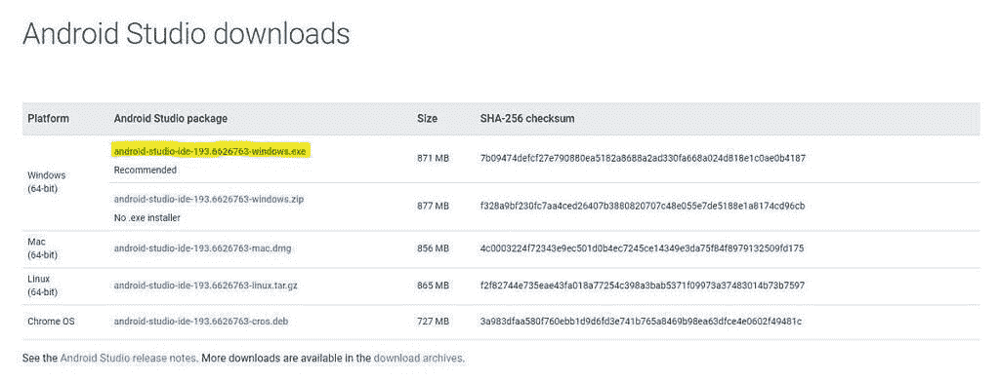
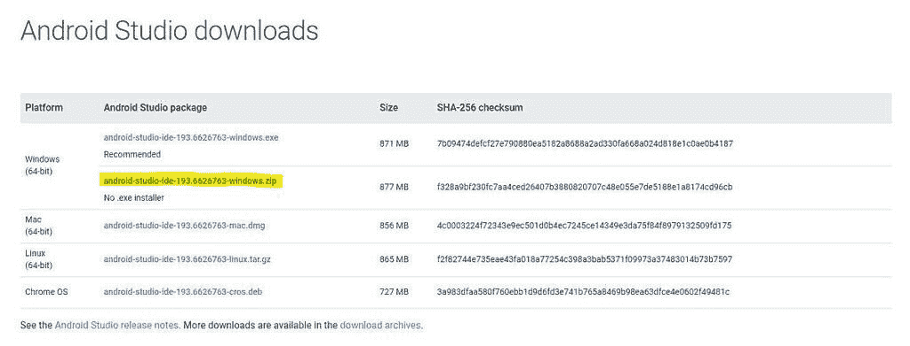
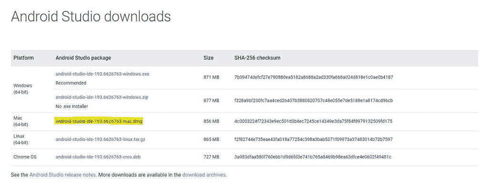
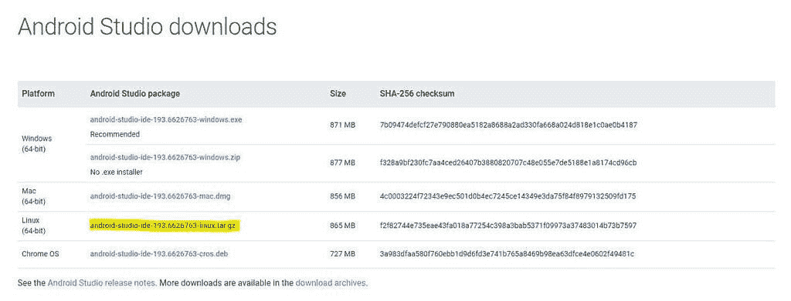
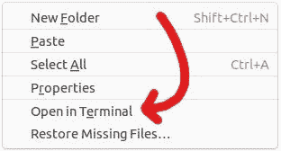
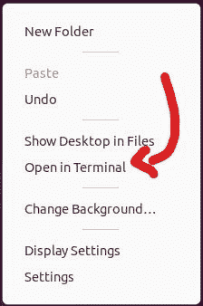
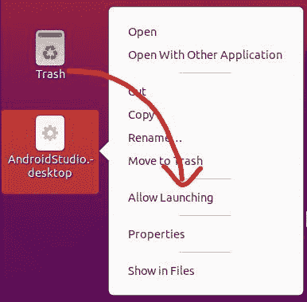
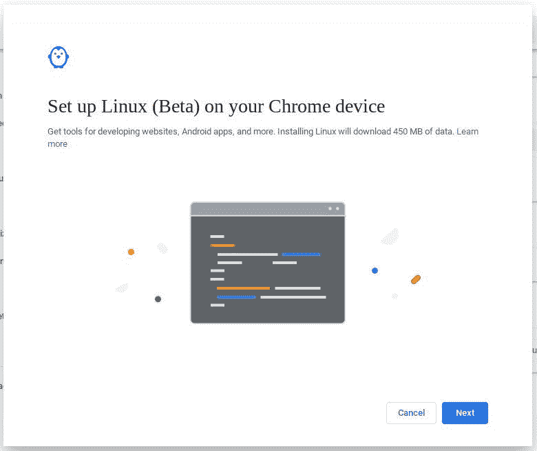
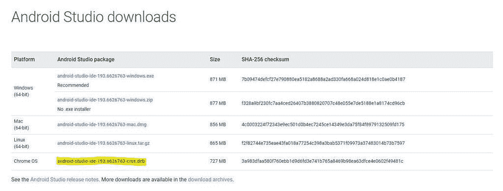
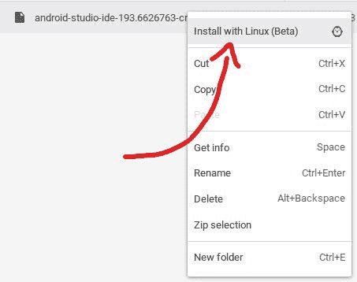

# 如何在 Windows、macOS、Linux 和 Chrome OS 上安装 Android Studio

> 原文：<https://www.xda-developers.com/android-studio-3-2-beta-app-bundle-emulator-snapshots-energy-profiler/>

如果你刚刚开始 Android 应用程序开发，你可能知道也可能不知道 Android Studio。它是谷歌的官方 IDE(集成开发环境)，专门用于开发原生 Android 应用程序。对于 Java 或 Kotlin Android 应用程序，就开发的容易程度而言，没有更好的选择了。

当然，Android Studio 是一个开发工具，所以它并不完全是您首选开发平台的即插即用安装。需要进行一些手动设置，这就是本文的目的。今天，我们将在 Windows、macOS、Linux 和 Chrome OS 上安装和设置 Android Studio。我们开始吧！

* * *

## 下载 Android Studio

这可能是最显而易见的一步，但是为了方便使用，我还是把它放在这里。在实际使用 Android Studio 之前，您需要下载适合您系统的版本。点击以下链接，为您的设备下载合适的文件。

**[安卓工作室下载](https://developer.android.com/studio#downloads)**

* * *

## 安装 Android Studio

现在有趣的部分来了。根据您的操作系统，按照以下部分安装 Android Studio。

### Windows 操作系统

Windows 实际上有几种方法来安装它。

#### 方法 1

如果你只是想要一个简单的安装，你可以下载并运行 installer EXE。你将被引导安装 Android Studio，然后你就完成了！

 <picture></picture> 

Just download the EXE and run it.

#### 方法 2

这种方法有点复杂，但是如果您的计算机没有管理员权限，这是更好的选择。我们开始吧。

1.  首先要做的是下载 Android Studio。获取 Windows 的 ZIP 版本。<picture></picture>

    下载 Windows 的 ZIP 文件

    T12
2.  在下载的时候，为你想存放 Android Studio 的地方创建一个文件夹。例如，我的安装位于 **E:\AndroidStudioDevWin\** 。
3.  接下来，打开你下载的压缩文件。在里面，你应该会看到一个名为 **android-studio** 的文件夹。进入那个文件夹，你应该会看到一大堆文件夹和文件，包括**宾**、 **jre** 和**uninstall.exe**。这些是你要提取的文件。<picture></picture>

    你应该会看到类似这样的东西。

4.  打开一个新的文件资源管理器窗口，在步骤 2 中创建的文件夹中导航。在我的情况下，那就是 **E:\AndroidStudioDevWin\** 。
5.  回到 ZIP 窗口，选择所有文件夹和文件，并将它们拖到您在步骤 4 中打开的窗口。<picture></picture>

    将文件解压到您为 Android Studio 创建的文件夹中。

    T12
6.  解压缩完成后，如果需要，您可以删除 ZIP 文件。
7.  现在，进入 **bin** 目录，找到 studio64.exe 的**文件。右击并选择**固定到任务栏**选项。再次右击并选择**引脚启动**选项。**

就是这样！你应该能够在开始菜单中搜索“ **studio** ”或者简单地点击任务栏中的 Android Studio 图标来运行它。

### 马科斯

按照以下步骤在 macOS 上安装 Android Studio:

1.  下载苹果安卓工作室 DMG。<picture></picture>

    下载 Mac 版 DMG

    T12
2.  打开下载的 DMG。应该会打开一个带有 Android Studio 图标和应用程序文件夹快捷方式的窗口。如果你以前在 macOS 上安装过第三方应用，这应该看起来很熟悉。<picture></picture>

    你打开 DMG 的时候应该会看到这样的东西。

    T12
3.  将图标拖到“应用程序”文件夹快捷方式，并让它拷贝。

复制完成后，在 spot light(**CMD**+**Space**)或 Launchpad ( **Fn** + **F4** )中搜索即可打开 Android Studio。

### Linux 操作系统

有相当多的 Linux 发行版，这些说明不可能涵盖所有的发行版。我们将在这里专门讨论基于 Debian 和基于 Fedora 的发行版，但是一般说明应该适用于所有发行版。

1.  首先，你需要下载适用于 Linux 的 Android Studio TAR.GZ。<picture></picture>

    下载 TAR.GZ Linux 版

    T12
2.  您需要做的第二件事是创建一个安装目录。例如，它可以位于**/home/Zachary/Desktop/Android studio/**。
3.  接下来，打开你下载的 TAR.GZ 档案。你应该会看到一个名为 **android-studio** 的文件夹。进入那个文件夹，你应该会看到一大堆文件夹和文件，包括 **bin** 、 **jre** 和 **product-info.json** 。<picture></picture>

    你应该在 ZIP 里看到一堆文件，像这样。

4.  打开一个新文件窗口，导航到您在步骤 2 中创建的文件夹。我的情况是**/home/Zachary/Desktop/Android studio/**。
5.  回到存档管理器窗口，选择所有的文件夹和文件，并将它们拖到您在步骤 4 中打开的窗口中。提取完成后，如果需要，可以删除 TAR.GZ。
6.  在文件复制的同时，打开一个终端(**Ctrl**+**Alt**+**T**)。我们需要确保安装了一些库，以便 Android Studio 可以运行。
    1.  在基于 Debian 的发行版上，运行:

        ```
         sudo apt-get install libc6:i386 libncurses5:i386 libstdc++6:i386 lib32z1 libbz2-1.0:i386 
        ```

    2.  在基于 Fedora 的发行版上，运行:

        ```
         sudo yum install zlib.i686 ncurses-libs.i686 bzip2-libs.i686 
        ```

    3.  在其他发行版中，您需要使用适当的包管理器来找到并安装这些库。
7.  解压完成后，进入安装目录中的 **bin** 目录。在里面，你应该会看到一个名为 **studio.sh** 的文件。
8.  右击窗口中的空白区域，选择**在终端**中打开选项。<picture></picture>

    选择【打开终端】

9.  一旦终端窗口打开，运行以下命令:

    ```
     ./studio.sh 
    ```

    这将打开 Android Studio。

现在你已经安装了 Android Studio！如果您想让它更容易打开，可以尝试创建一个桌面条目。请按照下面的说明进行操作。

1.  右键点击你的桌面并选择**在终端**中打开。<picture></picture>

    选择【打开终端】

2.  在终端窗口中，运行:

    ```
     touch AndroidStudio.desktop 
    ```

    关闭终端。
3.  在一个文本编辑器中打开 **AndroidStudio.desktop** 文件，比如 Gedit，并粘贴以下内容:

    ```
     [Desktop Entry]
    Name=Android Studio
    Exec=/home/zachary/Desktop/AndroidStudio/bin/studio.sh
    Icon=/home/zachary/Desktop/AndroidStudio/bin/studio.sh
    Type=Application
    Terminal=False
    Categories=Utility; 
    ```

4.  您需要在 **Exec=** 和 **Icon=** 之后更改路径，以匹配您的路径。<picture></picture>

    你的桌面条目应该是这样的。

5.  保存，然后右键 **AndroidStudio.desktop** 。选择**允许发射**选项。这可能不是所有发行版都需要的。<picture></picture>

    选择“允许启动”选项。

6.  最后双击文件启动 Android Studio。

### Chrome OS

如果你使用的是 Chrome 操作系统或 Chrome 操作系统的某个变种，你很幸运，因为谷歌已经通过 Linux 框架提供了 Android Studio。请继续阅读，了解如何在 Chrome 操作系统上运行 Android Studio。

#### 安装 Linux

在 Chrome 操作系统上安装 Android Studio 之前，你需要安装 Linux。不过，这不是双重引导的情况，所以不要担心。谷歌在 Chrome OS 中增加了一个功能，可以在不安装 Ubuntu/Arch/etc 的情况下运行 Linux 应用。然后重启。如果你已经在 Chrome OS 上启用了 Linux，你可以跳过这一节。

1.  打开设置。你可以通过点击屏幕右下角的时间，然后点击齿轮图标，或者打开搜索(左下角的圆圈)并搜索**设置**来完成。
2.  在左侧工具条中，点击 **Linux (Beta)** 或者向下滚动到设置窗口的底部。
3.  点击 **Linux** 卡中的**打开**按钮。<picture></picture>

    点击“开启”启用 Linux。

4.  此时，应该会弹出一个窗口，告诉您 Linux 将占用多少空间。点击**下一个**。<picture></picture>

    点击【下一步】。

5.  在下一个屏幕上，指定 Linux 安装的用户名，然后单击 **Install** 。<picture></picture>

    点击【安装】。

6.  等待几分钟，安装完成。将出现一个终端窗口。关上它。

如果一切顺利，你现在应该可以在 Chrome OS 上运行 Linux 了！

如果你在设置中看不到 **Linux** 选项，很可能意味着你的 Chromebook 不支持它。2019 年或之后推出的 Chromebooks 大多支持，2019 年之前推出的也有部分支持。你可以在这里找到此类设备的完整列表。

#### 安装 Android Studio

现在您已经启用了 Linux，是时候安装 Android Studio 了。

1.  下载 Android Studio DEB for Chrome OS。<picture></picture>

    下载 Chrome OS 的 DEB。

    T12
2.  打开**文件**并导航到**下载**文件夹。
3.  右键点击下载的 DEB，选择**安装 Linux (Beta)** 。<picture></picture>

    点击“随 Linux 安装”。

4.  在弹出的窗口中，等待细节加载，然后点击**安装**。<picture></picture>

    点击【安装】。

5.  您将收到一个通知，告诉您安装的进度。这可能需要一点时间。
6.  一旦安装完成，你将能够在启动器的 **Linux apps** 文件夹中找到 Android Studio。<picture></picture>

    Android Studio 会在你的 apps launcher 里面的“Linux apps”文件夹中。

就是这样！在 Chrome OS 上安装 Android Studio 并不简单，但至少相当简单。

* * *

希望这篇指南能帮助你在你可能使用的任何操作系统上安装 Android Studio。