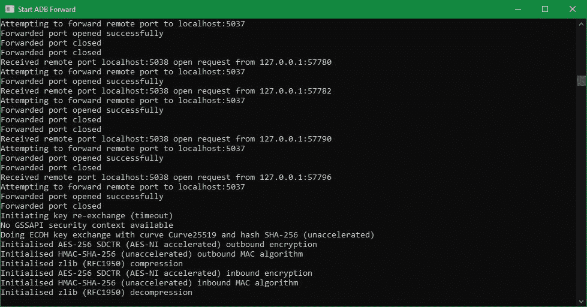
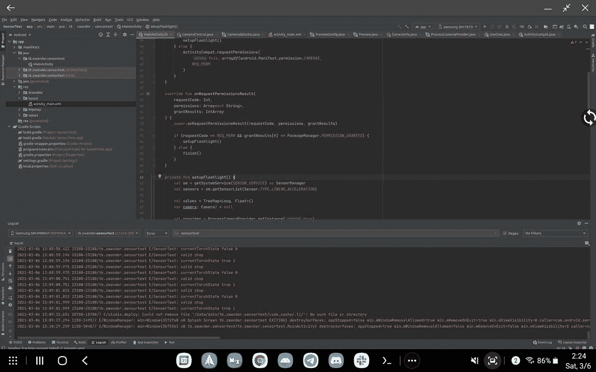

# 如何从任何带有 JetBrains 投影仪的设备在 Android Studio 中编码

> 原文：<https://www.xda-developers.com/android-studio-remote-development-jetbrains-projector/>

JetBrains 是一些最流行的 ide 背后的公司，包括 IntelliJ IDEA、PyCharm 和 PhpStorm。即使是 Android Studio，谷歌内部的 Android 开发集成环境，也是基于 IntelliJ 的。

虽然 IntelliJ 的 ide 受欢迎是有原因的(它们很好)，但它们有时可能有点笨重。例如，IntelliJ 和 Android Studio 仅仅是开放就会占用大量资源。如果你在编译什么东西，他们会用到更多。你还不能在移动设备上运行 JetBrains 的东西，因为 JetBrains 没有易于访问的 ARM 版本。

那么如果你没有一台功能强大的电脑，或者你连一台电脑都没有会怎么样呢？通常，您会在这里寻找其他在 ARM 上工作的 ide。但是 JetBrains 有一个解决方案，它叫做 JetBrains 投影仪。

## 什么是投影仪？

你可能听说过远程桌面或 VNC。它让你通过局域网甚至互联网与计算机进行图形交互。JetBrains 投影仪的工作原理有点像远程桌面，但是没有一些缺点。

要使用 JetBrains 投影仪，你需要在互联网上的某个地方安装一台电脑。这可能是 AWS 实例或家庭服务器。然后你可以从任何支持的浏览器连接到它，包括移动 Chrome 和 Firefox。

但是，JetBrains Projector 不是显示整个桌面并将视频反馈发送回连接的客户端，而是发送客户端显示 IDE 所需的信息，就像它在本地显示一样。这意味着没有任何压缩或分辨率缩放，因此 IDE 看起来几乎是本机的。

此外，JetBrains 投影仪不仅限于官方的 JetBrains IDEs。只要你有一个基于 JetBrains 的 IDE，你就可以在 JetBrains Projector 中使用它。这包括 Android Studio。

## 为什么是投影仪？

您可能想要进行远程开发的最大原因是我在介绍中谈到的:如果您没有一台功能强大的基于 x86 的计算机，该怎么办？你可以买一个半强大的专门用于开发工作的，或者你可以旋转云服务器并使用 JetBrains 投影仪。

如果您只想卸载资源需求，它也会很有用。例如，我有一台非常强大的游戏笔记本电脑，配有 i7-9750H 和 32GB 内存。这对我处理的大型项目来说已经足够了。但是如果我想在开发之外做一些资源密集型的事情，比如看 YouTube，玩游戏？然后事情开始分崩离析。

但是我有一台 32GB 内存的锐龙 7 5800X 服务器。所以我在上面安装了 JetBrains 投影仪。现在我可以打开一个新的 Chrome 窗口，从我的笔记本电脑连接到它，而不用担心杂耍资源。服务器的构建速度也比我的笔记本电脑快得多，所以这是一个双赢的局面。

## 如何使用投影仪？

JetBrains 投影仪应该在 Linux 机器上运行。这并不意味着你不能在 macOS 或 Windows 上运行 WSL，但是你可能会因此遇到一些奇怪的问题。

要进行设置，你需要做的就是前往[投影仪安装程序 GitHub repo](https://github.com/JetBrains/projector-installer/) 并按照那里的说明进行操作。他们将指导您安装依赖项并设置 IDE。如果您需要，甚至还有一些 WSL 故障排除步骤。

然后，您可以使用正确的端口和令牌(如果您设置了一个)连接到您的服务器地址，现在您就有了一个运行在您的设备上的 IDE，而没有任何膨胀。

### Android 开发

我是一名 Android 开发人员，所以虽然我可以使用 IntelliJ IDEA 进行开发，但 Android Studio 往往更好。虽然 JetBrains Projector 确实支持第三方 ide，但现在只需使用内置的命令行界面下载和安装即可。尽管如此，它仍然非常简单。

要将 Android Studio 与 JetBrains 投影仪配合使用，您所要做的就是下载并解压缩 Android Studio 到某个合理的地方。然后，您可以通过命令行指定路径，手动将其添加到投影仪。

Android 开发和投影仪还有另一个问题:运行应用程序。不需要任何额外的东西，你可以编写应用程序并在投影仪中查看预览，但你不能使用仿真器或连接到真实的设备来实际运行和调试应用程序。还是可以？

这几乎就像谷歌预计这种情况会发生，因为亚行可以通过互联网连接到远程服务器。所需要的只是一个从客户机到投影仪服务器的 SSH 隧道。我将投影仪上的 Android Studio 设置为不尝试管理 ADB，而是使用端口 5038。然后，我使用某种 SSH 客户端(OpenSSH、plink 等)创建一个隧道，将本地运行在端口 5037 上的 ADB 服务器转发到端口 5038 上的服务器。轻松点。

 <picture></picture> 

All you need is an SSH tunnel for proper Android development.

如果你想了解更多关于如何让 Android Studio 和 SSH 隧道工作的细节，请查看 Joaquim Verges 的 GitHub 文档。

关于 Android Studio 和其他第三方基于 JetBrains 的 ide，有一点需要注意:你不能从投影仪屏幕上更新它们。您需要直接远程访问服务器，并从那里更新它们。在此之前，请确保相应的投影仪实例已停止。

### Android Android 开发

由于 JetBrains 投影仪在浏览器中运行，并且您可以从类似 Android 手机的东西连接，作为一个完全随机的例子，我想尝试一些东西。

Android 11 引入了直接从设备[启用无线 ADB](https://www.xda-developers.com/android-11-developer-preview-3-announced/) 的功能。虽然一些制造商在此之前曝光了该设置，但只要是在 Android 11 或更高版本上，它并不适用于所有谷歌认证的设备。虽然无线调试意味着可以在计算机上使用，但也不是必须如此。

像[滴](https://shizuku.rikka.app/)这样的应用证明了在 Android 11 上可以通过 ADB 连接到你的设备...甚至不用考虑使用电脑。虽然滴利用这一点让应用程序运行更高的操作，但我认为你可能会看到这将走向何方。

所以我做了一个 app！我不知道我会不会把它公之于众，但这很简单。我有一个 SSH 库和一个 ARM64 ADB 二进制文件。我使用 ADB 二进制文件连接到我正在使用的设备，然后使用 SSH 库创建从我的设备到投影仪服务器的转发隧道。最后，我用它来存储和启动投影仪的 URL。

Bam，为 Android 开发...来自安卓！每当我不在家，但我想进行一些 Android 开发工作时，我只需拿出我的[三星 Galaxy Tab S7。](https://www.xda-developers.com/samsung-galaxy-tab-s7-review/)我有一个蓝牙键盘和一个蓝牙鼠标(附注:如果你用的是投影仪，你会*真的*想用鼠标或触控板。它不能很好地处理触摸输入)，所以我可以在不需要切换设备和不需要携带更重的笔记本电脑的情况下进行开发和调试。

## 问题

JetBrains 投影仪仍处于早期开发阶段，因此它并不完美。

1.  有时它在响应滚动和拖动等事情时会有点滞后，控件会变得不稳定。
2.  随机地，当查看库代码(反编译或在源代码视图中)时，字体变得很重，一切都滞后了。不过，在我写这篇文章的时候，这个问题可能已经解决了。
3.  有些插件不能正常工作。由于这不是一个直接的视频流，像嵌入式浏览器这样的插件不会显示任何东西。
4.  没有 X 服务器支持，可能也不会有。这使得开发桌面和浏览器应用程序变得棘手，但是如果你真的需要的话，你可以使用带有 X 转发和本地 X 服务器的 SSH 隧道。
5.  有时界面会锁定，您需要刷新页面，甚至重新启动服务器服务才能让它再次工作。

还有更多。

但所有这些都是交易的阻碍吗？对我来说肯定不是。我对稍微不那么完美的体验非常满意(毕竟我用的是 Android Studio Canary)，尤其是如果这意味着我可以将所有的编译工作卸载到另一台电脑上，甚至可以从我的平板电脑上为我的平板电脑开发。

 <picture></picture> 

Android Studio running on a Samsung Galaxy Tab S7 via JetBrains Projector

* * *

即使有它的问题，我仍然真的很喜欢 JetBrains 投影仪。它使得从移动设备开发成为可能，它将资源负载从本地计算机转移到远程计算机，而且它真的很酷。

我知道其他的 IDE，比如 Visual Studio，允许你把编译卸载到远程计算机上，但是仍然需要你在本地安装并运行 IDE。

我个人真的很兴奋看到 JetBrains 投影仪从这里走向何方，因为它现在已经非常不可思议了。希望他们能够解决我上面描述的一些问题，但即使是现在，Projector 也应该可以安全地用于生产就绪的项目。

如果你想亲自试用 JetBrains 投影仪，[这里是安装和初始设置指南的链接](https://github.com/JetBrains/projector-installer/)。如果你想在投影仪中设置 Android Studio，[这里还有一个链接](https://github.com/joaquim-verges/ProjectorAndroidStudio/blob/main/README.md)。