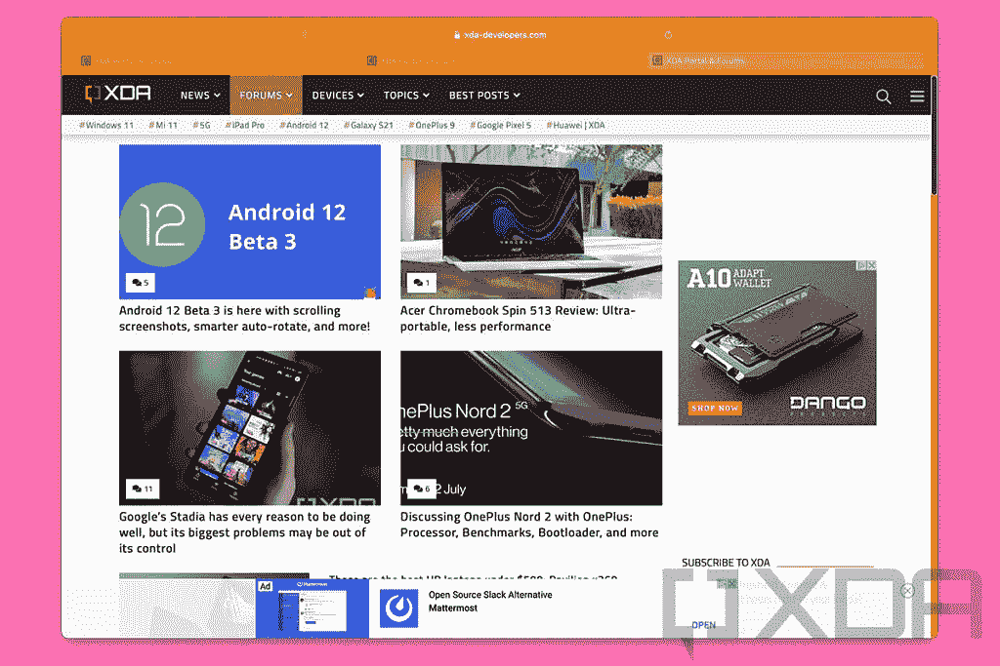

# 苹果在 macOS Monterey beta 中撤销了一些 Safari 的设计变更

> 原文：<https://www.xda-developers.com/apple-rolls-back-safari-design-macos-monterey/>

当苹果在 6 月份宣布其下一代操作系统时，它说它将在 macOS Monterey 中重新设计 Safari。将要改变的事情之一是标签体验，这在第一个开发者测试版中就已经出现了。

 <picture></picture> 

Safari in the first macOS Monterey Beta

有一样东西消失了，那就是地址栏，这显然是人们不太喜欢的东西。你可以看到标签变成了带圆角的单独的矩形，然后你可以在标签里输入一个 URL。这种情况正在改变，完整的地址栏又回来了。

 <picture></picture> 

macOS Monterey Developer Beta 3

今天，苹果发布了 macOS Monterey Developer Beta 3，以及 iOS 15、iPadOS 15、watchOS 8 和 tvOS 15 的新版本。现在，窗口顶部的空间不那么紧凑了，在浏览器窗口中占据了更多的空间。虽然有些人不喜欢最初的设计，但如果苹果公司提供一个允许用户在两个选项之间进行选择的设置，那可能会很好。

然而，这并不是马科斯蒙特里的 Safari 的唯一变化。整个浏览器被重新设计。你也可以看到窗户的顶部是橙色的，这是因为它借用了 XDA 的强调色。这取决于您使用的网站。你还可以创建标签组，类似于微软 Edge 浏览器中的收藏。这样，您可以为您正在处理的报告创建一组选项卡，为您的下一个假期创建一组选项卡，以此类推。

可能最大的变化甚至不在 macOS 上；它在 iOS 15 和 iPadOS 15 中。苹果的移动平台实际上将支持 Safari 中的扩展，这是我们在谷歌 Chrome 或微软 Edge 中没有看到的。

所有这些更新都计划在今年秋天发布。除了重新设计的 Safari 浏览器，macOS Monterey 还获得了 Siri 快捷方式，能够共享 FaceTime 通话的链接，在各种应用程序中与您共享标签，如新闻、重新设计的地图应用程序等。