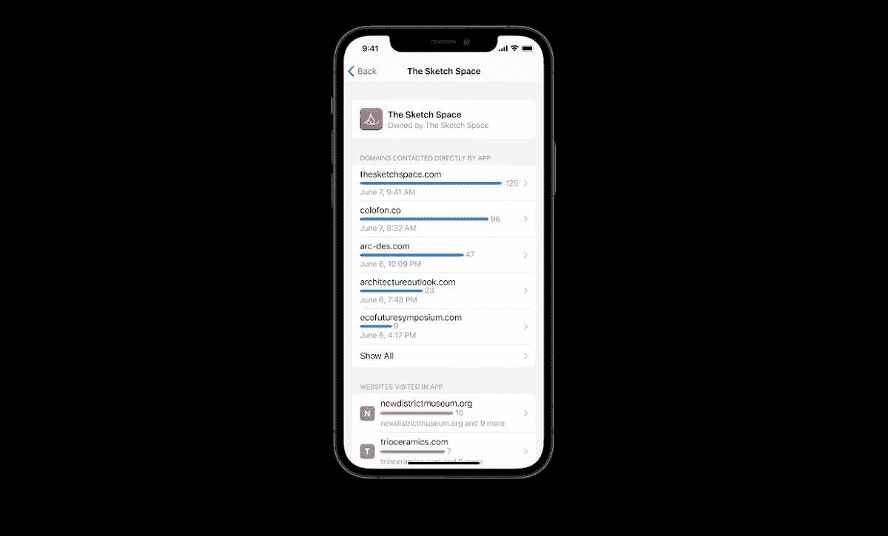

# 苹果用新的隐私功能攻击脸书和谷歌

> 原文：<https://www.xda-developers.com/apple-takes-a-jab-at-facebook-and-google-with-new-privacy-features/>

过去几年，苹果一直非常关注用户隐私，虽然他们的一些声明只是口头说说，但该公司一直在推进一些变化，谷歌和脸书等广告公司并不完全满意。去年，[苹果开始要求所有 App Store 应用解释它们如何处理用户数据](https://www.xda-developers.com/google-not-updated-ios-apps-last-two-months/)，今天该公司宣布 iPad、iPhone 和 Mac 将出现更多与隐私相关的变化。

首先，苹果公司透露，其 Safari 网络浏览器的未来更新将对追踪者隐藏你的 IP 地址。目前还不清楚 Safari 将如何阻止这一点，因为网站可以使用许多方法来获取你当前的 IP 地址，包括在 web 服务器上记录 IP 地址的跟踪器，而无需在浏览器中运行任何脚本。苹果将在 Safari 的隐私报告中列出活跃的追踪器，类似于 Firefox 和其他浏览器(除了 Chrome)多年来提供的功能。该公司还承诺在邮件应用中隐藏你的 IP 地址和位置，可能会阻止常见的跟踪像素。

 <picture></picture> 

Privacy report for installed application

除了 Safari 和 Mail 的变化，苹果正在 iOS(和 iPadOS)中开发一个应用隐私报告，让你可以概述应用如何跟踪你。该报告将显示应用程序请求访问摄像头、麦克风、联系人和其他权限的频率，以及跟踪第三方域。

最后，Siri 数字助理正在切换到设备上的语音识别，因此音频记录永远不会离开你的设备。这也加快了响应速度，因为你的设备不需要等待苹果服务器的响应。亚马逊一直在为其 Echo 智能扬声器开发类似的功能。

请关注 [XDA 对 2021 年 WWDC 奥运会的报道](https://www.xda-developers.com/tag/wwdc-2021/),了解更多关于 iPad、iPhone 和其他苹果平台的突发新闻！