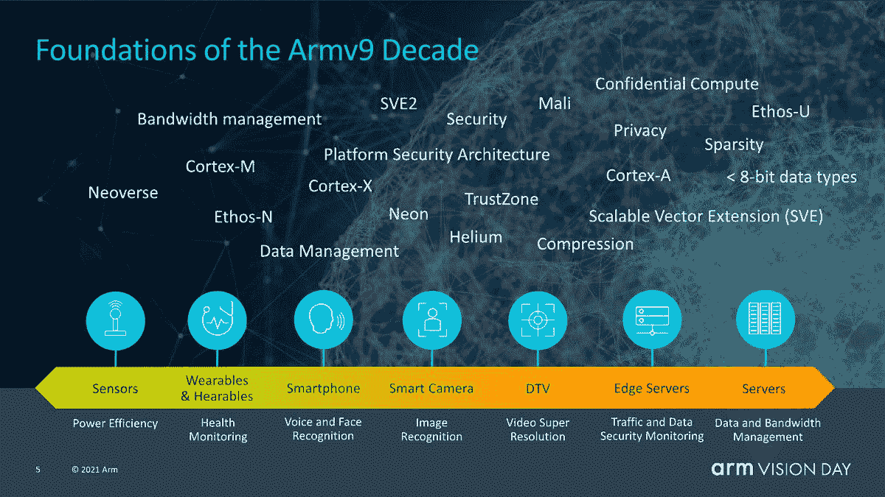
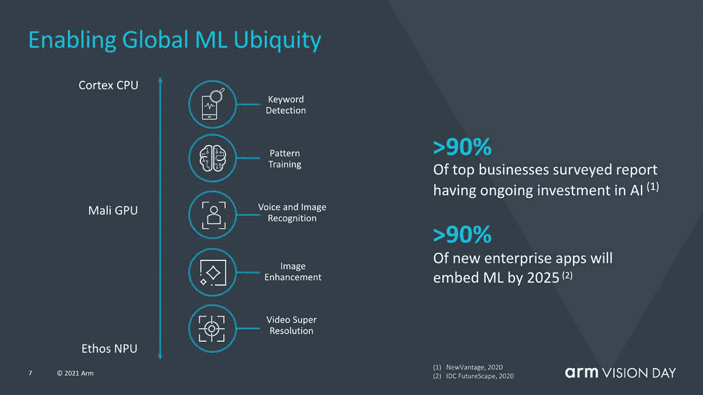

# ARMv9 架构带来 SVE2 和新的安全特性

> 原文：<https://www.xda-developers.com/armv9-architecture/>

今天早些时候，作为其视觉日活动的一部分，ARM 披露了其新 ARMv9 架构的一些细节，该公司预计该架构将在十年内用于超过 3000 亿个芯片。

ARM ISA 的最后一次重大修订是 v8，于 2011 年 10 月推出，采用 64 位 AArch64 指令集。然而，ARM 多年来一直在扩展 ARMv8，在 ARMv8.5 中添加了内存标记等新功能。对于 ARMv9，该公司继续使用 AArch64 作为基准指令集，但扩展了旨在提高安全性和性能的新功能。

据 ARM 称，ARMv9-A 架构的主要新特性如下:

*   SVE2 :将可扩展向量的优势扩展到更多的用例
*   **领域管理扩展(RME):** 将 Arm 平台上的机密计算扩展到所有开发人员。
*   **BRBE** :提供剖析信息，如自动 FDO
*   **嵌入式跟踪扩展(ETE)** 和**跟踪缓冲扩展(TRBE)**:arm v9 的增强跟踪功能
*   **TME**:Arm 架构的硬件事务内存支持

 <picture></picture> 

Source: ARM. Via: [AnandTech](https://www.anandtech.com/show/16584/arm-announces-armv9-architecture).

为了更深入地了解 ARMv9 带来的高级别变化，我建议阅读 Andrei Frumusanu 在 [*AnandTech*](https://www.anandtech.com/show/16584/arm-announces-armv9-architecture) 的报道，但我将提供您应该了解的主要变化的摘要。

### 霓虹灯被 SVE2 取代

NEON 是一种高级单指令多数据(SIMD)架构扩展。这里的 SIMD 指的是对多个数据项并行操作的单个指令。这些数据项被组织到保存位向量的寄存器中。

可扩展矢量扩展(Scalable Vector Extensions，简称 SVE)是对 ARMv8.2 或更高版本的扩展，它扩展了 AArch64 的矢量处理能力，以满足高性能计算(HPC)任务和机器学习的计算要求。重要的是，它还支持 128 至 2048 位的向量寄存器长度。从软件开发的角度来看，可变向量寄存器长度的好处在于，代码只需要编译一次，就可以充分利用未来具有更长向量寄存器的 CPU。同样，这些代码也可以在 SIMD 执行流水线较少的 CPU 上运行，比如物联网设备中的 CPU。

由于 SVE 更多地针对 HPC 工作负载，也不像 NEON 那样是多功能的指令集，ARM 在 2019 年初推出了 SVE2 来解决这些问题。SVE2 增加了针对仍然依赖 NEON 的 DSP 工作负载的新指令。现在有了 ARMv9，SVE2 作为 ARMv9 CPUs 的基准特性，正在取代 NEON。

### 机器学习的改进

ARM 认为机器学习工作负载在未来十年将变得越来越受欢迎，这也是为什么之前对 ARMv8 的修订引入了新的矩阵乘法指令。这些将是 ARMv9 CPUs 的基准特性，支持更小范围的 ML 工作负载直接在 CPU 上运行，而不是在专用加速器上运行。显然，当人们喜欢快速性能或能效时，在专用加速器上运行 ML 工作负载是可取的，但这并不总是可能在所有硬件上实现。

 <picture></picture> 

Source: ARM. Via: [AnandTech](https://www.anandtech.com/show/16584/arm-announces-armv9-architecture).

### ARMv9 机密计算机架构

为了提高安全性，ARMv9 引入了新的机密计算架构(CCA)。正如 *AnandTech* 所解释的，ARM 的 CCA 是对当前软件堆栈情况的一种转变，在当前软件堆栈情况下，设备上运行的安全应用程序必须信任它们所运行的操作系统和虚拟机管理程序。当前的安全模型建立在这样一个事实上，即特权较高的软件层可以监控特权较低的软件层的执行，当操作系统或虚拟机管理程序受到危害时，这可能会产生问题。

CCA 通过动态创建“领域”来解决这个问题，这些领域是安全的、容器化的执行环境，对操作系统或管理程序来说是不透明的。“领域”内的应用程序可以向“领域管理器”证明它们的可信度，领域管理器是虚拟机管理程序大小的一小部分，它现在只负责资源分配和调度。使用“领域”的好处是减少了信任链，允许安全应用程序在任何设备上运行，而不管底层操作系统如何，这对安全问题是透明的。

*来源:ARM。Via: [AnandTech](https://www.anandtech.com/show/16584/arm-announces-armv9-architecture) 。*

根据 AnandTech 的说法，ARM 没有详细说明“领域”是如何从操作系统和虚拟机管理程序中分离出来的，但他们推测这种分离源于硬件支持的地址空间，这些地址空间无法相互交互。

### 未来的 ARM CPU 和 GPU 设计

虽然它与 ARMv9 没有直接关系，但 ARM 分享了它对未来基于 v9 的 CPU 设计的预期性能。在接下来的两代移动 IP 核心设计中，ARM 预计 IPC 性能将提高 30%。正如 AnandTech 公司解释的那样，这意味着性能的实际增长达到了 14%左右。显然，与前几年相比，[的改善速度有所放缓。](https://www.xda-developers.com/arm-cortex-a76-cpu-mali-g76-gpu-mali-v76-vpu-announcement/)

我们已经看到高通、三星和华为等公司的 CPU 实现如何达不到新 ARM 内核设计的预期性能预测，ARM 在一张幻灯片中指出了这一事实，该幻灯片详细介绍了如何通过改善内存路径、缓存或频率来提高 CPU 性能。

*来源:ARM。Via: [AnandTech](https://www.anandtech.com/show/16584/arm-announces-armv9-architecture) 。*

尽管如此，ARMv9 承诺在 2022 年初基于 ISA 的新 CPU 在商业设备中发布时，将为性能、安全性和机器学习带来可喜的改进。

至于未来的 Mali GPUs，ARM 已经透露，它正在研究可变速率着色(VRS)和光线跟踪等技术。这些功能已经在高端 PC GPU 硬件和第九代视频游戏主机中流行起来，如[索尼的 PlayStation 5](https://www.xda-developers.com/sony-playstation-5-first-impressions/) 和[微软的 Xbox 系列 X/S](https://www.xda-developers.com/xbox-series-s-review/) 。

 <picture></picture> 

Source: ARM. Via: [AnandTech](https://www.anandtech.com/show/16584/arm-announces-armv9-architecture).

*特色图片鸣谢:ARM via[Anand tech](https://www.anandtech.com/show/16584/arm-announces-armv9-architecture)*