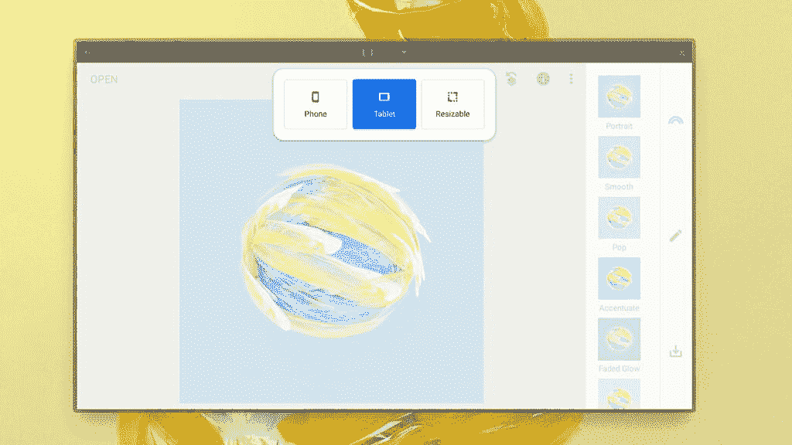

# Chrome OS 93 推出了对手提包功能的改进

> 原文：<https://www.xda-developers.com/chrome-os-93-rollout-tote-improvements/>

紧随面向手机和个人电脑的 Chrome 93 发布之后，谷歌开始为 T2 的 Chromebooks 推出 Chrome OS 93。最新版本的 Chrome OS 对 Tote、手写笔电池水平、更好地处理不兼容的 Android 应用程序、重新设计的键盘语言设置以及大量较小的变化进行了改进。

在 Chrome OS 87 中，谷歌推出了 [Tote，这是一个内置在 Chromebook 书架](https://www.xda-developers.com/chrome-os-phone-hub-new-features/#:~:text=These%20files%20will%20then%20show%20up%20in%20Tote%2C%20a%20new%20space%20that%20keeps%20important%20files%20on%20your%20Shelf.%20Tote%20will%20also%20display%20your%20recent%20downloads%20and%20pinned%20files.)中的新功能，可以让 Chromebook 用户快速访问重要文件。在随后的更新中，Tote 获得了几个新的技巧，如显示扫描的文件，保存的 pdf 文件，以及快速访问重要文件的能力。现在，[变得更好了](https://blog.google/products/chromebooks/chromebook-keeps-important-files-at-your-fingertips/)。

从 Chrome OS 93 开始(via[*Android Police*](https://www.androidpolice.com/2021/09/07/chrome-os-93-is-heading-to-your-chromebook-today-and-its-all-about-the-details/))，书架现在将显示最近拍摄的截图和下载的三个预览圈，而无需打开 Tote。您可以通过右键单击这些预览圆并选择隐藏预览选项来隐藏它们。今年晚些时候，谷歌计划在 shelf preview 和 Tote 中添加文件下载进度状态。

新更新中的另一个新变化是手写笔的电池状态。当您从状态栏打开手写笔设置时，您现在可以看到当前的电池电量。

 <picture></picture> 

Image courtesy: *Android Police*

虽然 Chrome OS 多年来一直支持原生 Android 应用程序，但许多应用程序仍然无法在大屏幕上运行或表现良好，因为它们是为手机和平板电脑设计的。为了解决这个问题，Chrome OS 93 现在将应用程序窗口锁定在原生布局，而不是在自由形式、可调整大小的窗口中打开应用程序。对于没有针对 Chromebooks 进行优化的应用程序，用户将在应用程序标题栏的中心看到一个新菜单，点击后会显示三个布局选项:手机、平板电脑和可调整大小。

 <picture></picture> 

Image courtesy: *Android Police*

Chrome OS 93 还让你直接从系统偏好设置中定制键盘输入，从而使定制键盘输入的过程变得更加容易。最重要的是，更新还为键盘 UI 添加了新的材料设计外观。

除了上面提到的变化，还有几个小的全面改进。这包括画中画窗口放弃了锐角，转而采用圆角，在运行 Android 10 和更高版本的设备上改进了 RAM 管理，为拼写和语法检查设置提供了新的用户界面，等等。

Chrome OS 93 已经开始在稳定频道推出，应该很快就可以在你的 Chromebook 或其他 Chrome OS 驱动的设备上下载了。如果你连接到 Wi-Fi 网络，你的 Chromebook 会自动下载更新，当它准备好安装时，你会收到通知。