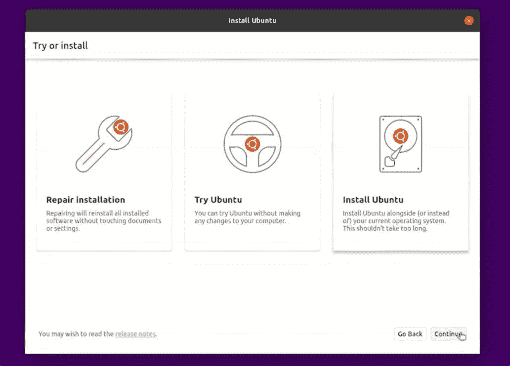
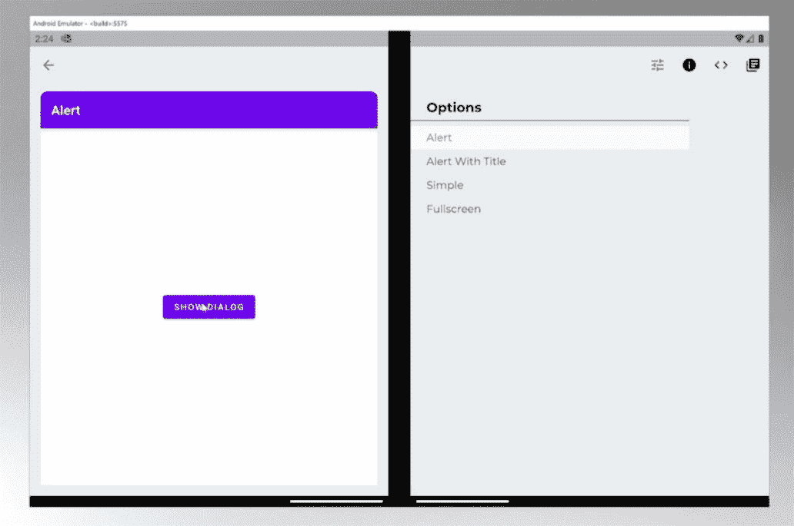

# Flutter 2.0 支持在可折叠和双屏手机上构建应用

> 原文：<https://www.xda-developers.com/flutter-2-0-stable/>

现在是 3 月 3 日，Flutter 2.0 来了！与 Flutter 1 相比，这个版本有很多变化，本文将重点讨论桌面和移动版本的变化。

## 桌面

一段时间以来，Flutter for Desktop 一直处于 alpha 阶段，这意味着要改变 API、bug 和性能问题。随着 Flutter 2.0 的推出，谷歌已经将其地位提升到了测试版和稳定版之间。那是什么意思？嗯，它在 Flutter 2.0 稳定版中可用，但谷歌认为它还没有完全完成。对于生产使用来说应该是没问题的，但是这里或那里可能有一个 bug。

Flutter for Desktop 还应该对键盘快捷键有适当的支持，让它感觉更像是 Windows、Linux 或 macOS 上真正的原生应用。如果你不相信它的稳定性，Canonical(Ubuntu 背后的公司)已经开始在 Flutter 中重新制作 Ubuntu 安装程序，并决定在未来的所有应用程序中使用 Flutter。

 <picture></picture> 

The Ubuntu installer is now written in Flutter.

## 移动的

由于 Flutter 最初是一个跨平台的移动框架，所以这里没有太多要说的。在很大程度上，Flutter 已经成为移动设备的完整功能有一段时间了，除了一点:可折叠。由于微软的贡献，Flutter 2.0 现在支持可折叠显示器。Flutter 现在知道如何处理这种外形因素，并让开发人员按照自己的意愿设计应用程序。

 <picture></picture> 

Building apps for [the Microsoft Surface Duo](https://www.xda-developers.com/microsoft-surface-duo-review/) and other dual-screen devices with Flutter.

现在 Flutter 2.0 中有了一个新的 TwoPane 小部件，顾名思义，它可以让你显示两个窗格。第一个窗格将显示在任何设备上，而第二个窗格将显示在可折叠显示器的右半部分。对话框还可以让你选择它们应该显示在可折叠显示屏的哪一边。

可折叠显示器上的折痕或铰链是作为一个显示功能(像一个凹口)暴露给开发人员的，因此如果他们愿意，应用程序仍然可以扩展到整个可折叠显示器，或者考虑铰链的位置并相应地显示。

最重要的是，谷歌已经将其移动广告 SDK 插件转移到测试版。这是一个用于 Android 和 iOS 的 SDK，可以让你在手机应用程序中显示 AdMob 广告。目前，没有桌面支持，但现在你应该能够使用 Flutter 制作相对稳定的带广告的移动应用程序。

* * *

这些是 Flutter 2.0 中关于桌面和移动平台的重大变化。你如何看待 Flutter 作为桌面和移动开发的框架？让我们知道！