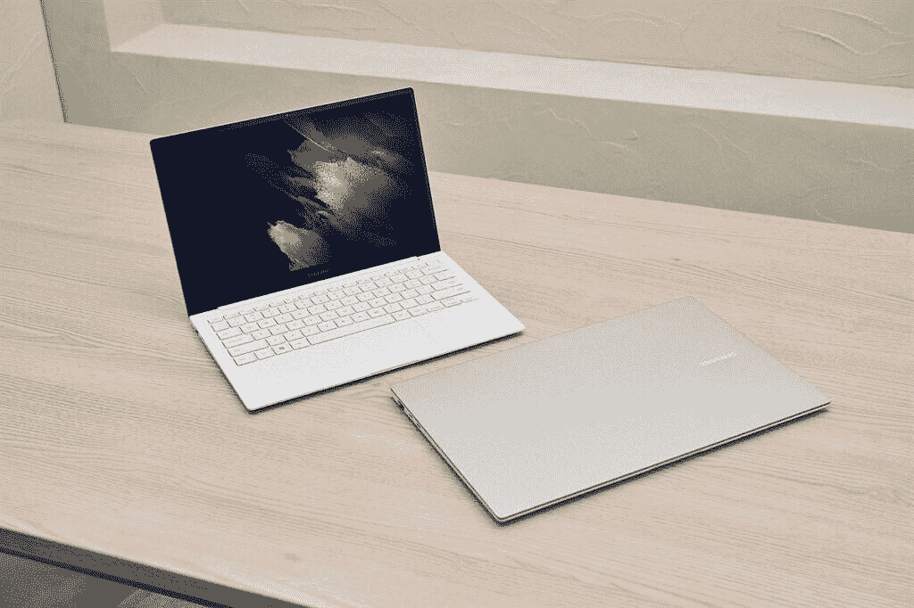
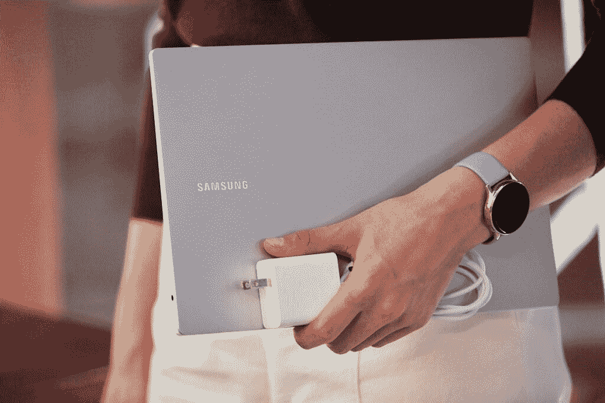
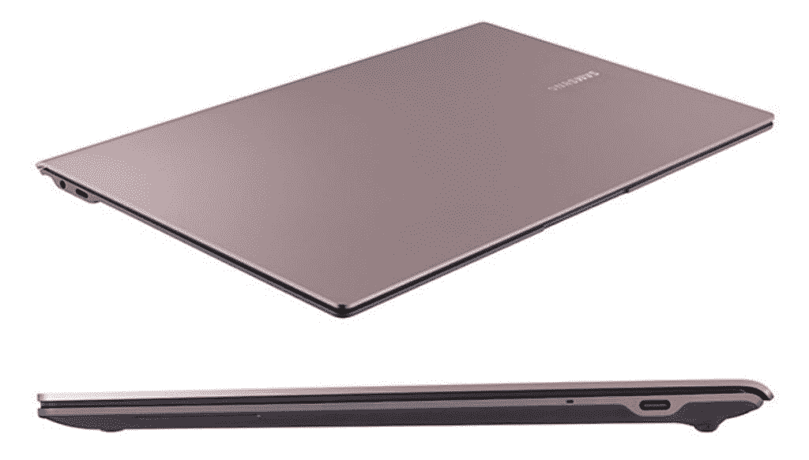
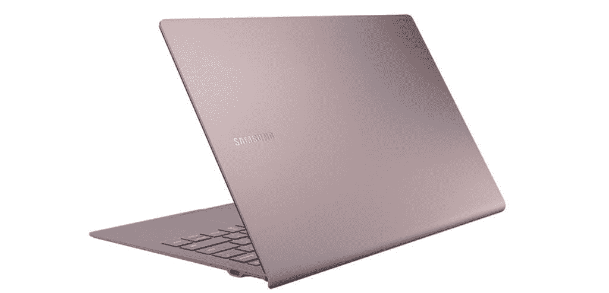
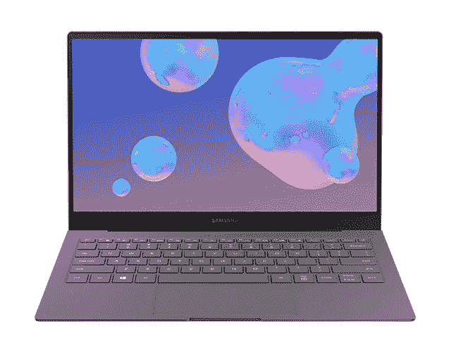
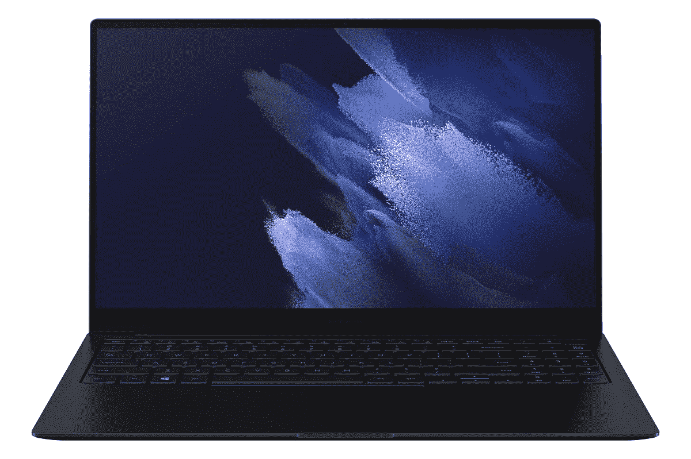

# Galaxy Book S vs Galaxy Book Pro:三星笔记本电脑哪个好？

> 原文：<https://www.xda-developers.com/galaxy-book-s-vs-galaxy-book-pro/>

三星 Galaxy Book S 和 Galaxy Book Pro 是三星的两款超轻日用[笔记本电脑](https://www.xda-developers.com/best-laptops/)。Galaxy Book S 于 2020 年推出，而 Galaxy Book Pro 则于今年上市。通过这些笔记本电脑，该公司瞄准了希望笔记本电脑具有出色移动性能的消费者。如果你在市场上寻找一款超轻笔记本电脑，并对 Galaxy Book S 和 Galaxy Book Pro 感到困惑，我们可以满足你的需求。在本文中，我们将深入探讨这两款笔记本电脑的规格和功能，以帮助您决定哪一款适合您。

## 三星 Galaxy Book S vs Galaxy Book Pro:显示器

三星 Galaxy Book S 配备了 13.3 英寸全高清(1920 x 1080 像素)液晶触摸屏，而该公司为 Galaxy Book Pro 提供了两种选择——13.3 英寸全高清 AMOLED 和 15.6 英寸全高清 AMOLED。与任何 LCD 或有机发光二极管显示器一样，Galaxy Book Pro 的屏幕能够提供令人惊叹的画面质量，并将成为欣赏电影和其他视觉内容的一大享受。三星还声称，Galaxy Book Pro 的屏幕比标准液晶显示器产生的蓝光更少。

 <picture></picture> 

Samsung Galaxy Book Pro

Galaxy Book S 上的 LCD 的一个积极方面是它将变得更亮，三星表示它在正常模式下可以提供高达 350 尼特的亮度，在户外模式下可以提供高达 600 尼特的亮度。因此，如果你打算在户外经常使用笔记本电脑，并且需要一个触摸屏，Galaxy Book S 是一个更好的选择，而 Book Pro 则是你消费大量多媒体内容的最佳选择。

* * *

## 三星 Galaxy Book S vs Galaxy Book Pro:设计

虽然三星 Galaxy Book S 和 Galaxy Book Pro 看起来都像相当标准的 Windows 10 笔记本电脑，但该公司真的试图将它们瘦身，并将重量保持在最低水平。令人惊讶的是，这两款笔记本电脑都非常轻。Galaxy Book S 的厚度仅为 11.8 毫米，重量为 2.09 磅(950 克)。

 <picture></picture> 

Samsung Galaxy Book S

另一方面，13 英寸的 Galaxy Book Pro(又名 Galaxy Book Pro 13)仅厚 11.2 毫米，重 1.94 磅(880 克)，而 15 英寸的 Galaxy Book Pro(又名 Galaxy Book Pro 15)厚 11.7 毫米，重 2.31 磅(1.05 千克)。该公司还提供了 Galaxy Book Pro 15 的独立显卡版本，厚度为 13.3 毫米，重量为 2.53 磅(1.15 千克)。三星没有在美国销售独立 GPU 变种。

对于机箱，三星在 Galaxy Book S 上使用了铝制机箱，而 Galaxy Book Pro 则采用了铝镁合金，这也是 Galaxy Book Pro 13 比 Galaxy Book S 更轻的原因。

这两款笔记本电脑还在电源按钮上安装了背光键盘和指纹传感器。虽然 Galaxy Book Pro 有一个全尺寸键盘，但 Galaxy Book S 的键盘去掉了数字键盘，给按键更多的呼吸空间。

总的来说，在设计方面，这两款三星笔记本电脑没有太大的区别。这两个你都不会错，至少考虑到它们的设计，除非很明显你需要一个全尺寸键盘。

 <picture></picture> 

Samsung Galaxy Book Pro comes with a 65W USB Type-C charger in the box

* * *

## 三星 Galaxy Book S vs Galaxy Book Pro:内部

有趣的是 Galaxy Book S 和 Galaxy Book Pro 的内部硬件。Galaxy Book S 使用英特尔的“Lakefield”芯片，即酷睿 i5-L16G7，配有板载 UHD 显卡。这是英特尔的混合处理器，专为像这台笔记本电脑这样的超轻设备设计。它结合了一个强大的 CPU 内核和四个低功耗内核，总共有五个内核和五个线程。三星早些时候曾提供 Galaxy Book S 的高通版本，但现在几乎在所有地方都缺货。

Galaxy Book Pro 使用第 11 代英特尔“Tiger Lake”酷睿 i5-1135G7 和酷睿 i7-1165 G7 CPU，搭配美国板载 Iris X 显卡。一些市场将会看到带有 UHD 显卡的酷睿 i3 变体。

在内存和存储方面，Book S 只有一个版本，配有 8GB LPDDR4x 内存和 256GB eUFS 存储。但对于 Galaxy Book Pro 型号，你将获得高达 16GB 的内存和高达 512GB 的 NVMe 固态硬盘，这取决于你选择的屏幕尺寸。

 <picture></picture> 

Samsung Galaxy Book S ports

在连接选项和端口方面，Book S 包括 Wi-Fi 6、蓝牙 5.0、两个 [USB](https://www.xda-developers.com/usb-standards-explained/) Type-C 端口、一个 3.5 毫米音频端口和一个 microSD 读卡器。Book Pro 型号配有 Wi-Fi 6、蓝牙 5.1、一个 [Thunderbolt 4](https://www.xda-developers.com/best-thunderbolt-4-laptops/) 端口、一个 USB Type-C 端口、一个 USB 3.2 端口、一个 3.5 毫米音频插孔和一个 microSD 读卡器。15 英寸的型号还包含一个额外的 [HDMI](https://www.xda-developers.com/hdmi-standards-specs-explained/) 端口。

在其他规格中，你还将获得 100 万像素网络摄像头、42Wh 电池、杜比 Atmos 支持、Windows 10 Home 和 AKG 音频调谐的四声道立体声扬声器，如 Galaxy Book S 上的[Galaxy Buds Pro](https://www.xda-developers.com/samsung-galaxy-buds-pro/)。Galaxy Book Pro 配有 720p 网络摄像头、63Wh 电池(15 英寸机型上为 68Wh)、杜比 Atmos 支持和 Windows 10 Home。该公司还为 Book S 捆绑了一个 25W 的 USB Type-C 充电器，而 Book Pro 则获得了一个更快的 65W USB Type-C 充电器。

 <picture></picture> 

Samsung Galaxy Book Pro ports

总体而言，在性能方面，Galaxy Book Pro 是一个更好的选择，因为 Core i5-1135G7 和 Core i7-1165G7 都是比 Core i5-L16G7 更强大的 CPU。此外，Galaxy Book Pro 将为您提供更多存储空间以及更多内存选择。此外，你可以升级 Book Pro 中的固态硬盘，因为它配有一个额外的 NVMe 固态硬盘插槽，这是 Book S 所不可能的。Book Pro 上更大的电池是另一个优势，因为它可以帮助你在更长的时间内远离插头。

因此，如果你寻求性能和电池寿命，Galaxy Book Pro 显然击败了 Book S。

### 颜色和定价

 <picture></picture> 

Samsung Galaxy Book S in Earthy Gold

三星在美国为这两款笔记本电脑提供了两种颜色。Galaxy Book S 有汞灰色和大地金色两种颜色，起价为 749 美元(早前为 949 美元)。另一方面，Galaxy Book Pro 有神秘银和神秘蓝两种颜色，起价为 999 美元(13 英寸)和 1099 美元(15 英寸)。

## 结论:三星 Galaxy Book S 还是 Galaxy Book Pro？

虽然三星 Galaxy S 和 Galaxy Book Pro 都是超便携笔记本电脑，但它们有许多不同之处。Galaxy Book S 是消费者的一个好选择，他们希望触摸屏笔记本电脑能够提供良好的电池续航时间和体面的移动性能。这对于较轻的工作负载来说没问题，但是重度用户会失望的。

另一方面，Galaxy Book Pro 非常适合追求卓越性能、超长电池续航时间和卓越显示屏的消费者。这款笔记本电脑还包括比 Galaxy Book S 更好的端口选择，在几乎所有方面都有更多的选择，包括显示器尺寸、RAM、SSD 和处理器。

显然，在选择这两款笔记本电脑中的一款时，您的预算也会起到很大的作用。如果你的预算有点紧张，Galaxy Book S 比 Book Pro 便宜 250 美元。但如果你能支付 1000 美元或更多，Galaxy Book Pro 会更好，它也在我们的最佳三星笔记本电脑名单中。

你打算买哪一个？请在评论区告诉我们。同时，如果你正在寻找内置蜂窝连接的笔记本电脑，不要忘记查看我们关于市场上[最佳 5G 笔记本电脑](https://www.xda-developers.com/best-5g-laptops/)和[最佳 4G LTE 笔记本电脑](https://www.xda-developers.com/best-4g-lte-laptops/)的指南。

 <picture></picture> 

Samsung Galaxy Book S

##### 三星 Galaxy Book S

三星 Galaxy Book S 是三星的一款超便携笔记本电脑。它配备了英特尔“莱克菲尔德”酷睿 i5 处理器和 13.3 英寸全高清显示屏。

 <picture></picture> 

Samsung Galaxy Book Pro

##### 三星 Galaxy Book Pro

三星 Galaxy Book Pro 是三星的一款超便携笔记本电脑。它最高配有英特尔“老虎湖”酷睿 i7 处理器和 13.3 英寸全高清 AMOLED 显示屏。