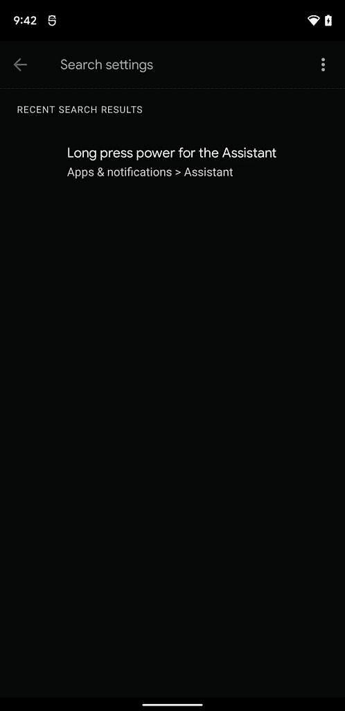

# 谷歌可能很快会为安卓手机推出另一个辅助触发器

> 原文：<https://www.xda-developers.com/google-app-launch-google-assistant-power-button/>

谷歌助手已经在 Android 手机上支持了相当多的触发器。你可以通过说“好的谷歌”或“嘿谷歌”唤醒词，长按 home 键，或者如果你使用全屏手势，从底部角落滑动来召唤它。一些谷歌 Pixel 设备还允许你挤压两侧来触发助手，而诺基亚和 LG 的一些手机具有专用的助手按钮。在 [Android 12](https://www.xda-developers.com/android-12/) 中，谷歌还将引入一个[双击后退手势](https://www.xda-developers.com/android-12-prepares-double-tap-back-gesture-pixel-5/)来召唤助手，以及一个额外的[电源按钮触发器](https://www.xda-developers.com/android-12-beta-features-leak/#android12leakpowerbuttonassistant)。虽然双击返回手势可能不会在今年晚些时候发布的 Android 12 中推广到所有手机，但新的电源按钮助手触发器可能会比预期更早到达设备。

APK 拆卸通常可以预测应用程序未来更新中可能出现的功能，但我们在这里提到的任何功能都可能不会出现在未来的版本中。这是因为这些特性目前还没有在实时构建中实现，并且可能会被开发人员在未来的构建中随时引入。

最新谷歌应用程序版本(12.18.6.29)的拆解揭示了新的字符串，这表明谷歌已经开始为该应用程序添加新的电源按钮助理触发器。正如你在下面提到的字符串中看到的，新的触发器将让你通过长按电源按钮来召唤助手。一些中国原始设备制造商已经在他们定制的 Android 皮肤上提供了这个手势，很高兴看到谷歌最终将它构建到谷歌应用程序中。

```
 <string name="assistant_android_settings_long_press_power_summary">To talk to your Assistant, touch and hold power button, then release</string>
<string name="assistant_android_settings_long_press_power_title">Long press power for the Assistant</string> 
```

一旦手势在未来的谷歌应用程序更新中推出，你应该能够通过导航到手机上的助手设置来打开它。在 Android 12 设备上，新选项应该出现在设置应用程序的应用程序部分。在运行 Android 11 或更低版本的设备上，该选项将显示在设置应用程序的应用程序和通知部分。

XDA 的米莎尔·拉赫曼[通过在设置应用中搜索，在他运行 Android 12 DP3 的 Pixel 3 XL 上找到了这个新选项](https://twitter.com/MishaalRahman/status/1391948037551964161)。然而，他无法启用它，因为“助理”设置页面一直崩溃。不过，这一设置在运行 Android 11 的 Pixel 4 上没有显示出来。

 <picture></picture> 

New "Long press power for the Assistant" option on Pixel 3 XL running Android 12

随着新的电源按钮助理触发器，拆卸出土的字符串与另一个正在开发的功能相关。正如你在下面提到的字符串中看到的，这项新功能将使你在手机连接到 Android Auto 或解锁时更容易授权支付。这项功能基本上可以让你在手机连接到 Android Auto 或解锁时绕过密码或安全码进行支付。

```
 <string name="assistant_settings_payments_enabled_android_auto_hands_free_description">Skip entering your password or security code when your phone is connected to Android Auto.</string>
<string name="assistant_settings_payments_enabled_android_auto_hands_free_title">Pay through Android Auto</string>

<string name="assistant_settings_payments_enabled_unlocked_device_hands_free_description">"Skip entering your password or security code when your phone is unlocked. Anyone with your phone might pay on your behalf, so it's a good idea to keep your phone locked if you choose this option."</string>
<string name="assistant_settings_payments_enabled_unlocked_device_hands_free_title">Pay when unblocked</string> 
```

字符串还提到了使用这个新特性的一个重要注意事项。由于它将绕过密码或安全码，任何人在手机解锁或连接到 Android Auto 时访问你的手机，都将能够进行支付，而不需要任何认证。因此，如果你经常让手机无人看管，那么启用它可能不是一个好主意。

上面提到的两个功能目前都在开发中，它们没有出现在最新的谷歌应用测试版中。一旦他们开始在稳定频道播出，我们会通知你的。