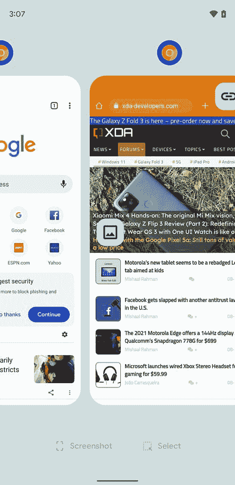

# Android 12 将让你像在 PC 上一样打开多个谷歌浏览器窗口

> 原文：<https://www.xda-developers.com/google-chrome-multiple-windows-android-12/>

根据平台的不同，Chrome 标签可以有不同的组织方式。在桌面上，你可以将标签放入一个或多个窗口的组中，然后你可以使用操作系统的窗口管理器重新排列。在 Android 上，你也可以将标签页分组，但你不能像在桌面上那样打开 Chrome 的多个实例。然而，随着即将到来的 Android 12 更新和新版本的谷歌 Chrome，这种情况将会改变，因为谷歌正在努力为 Android 的 Chrome 带来多实例支持和窗口管理器。

在过去的几周里，标记为“[多实例](https://chromium-review.googlesource.com/q/hashtag:multi-instance+(status:open%20OR%20status:merged))的多个代码变更被提交给 Chromium Gerrit。这些代码变化[在谷歌 Chrome 的上下文菜单中添加了](https://chromium-review.googlesource.com/c/chromium/src/+/3088812)一个“新窗口”按钮，只要设备进入分屏模式。点击“新窗口”会在屏幕的另一半打开一个新的 Chrome 实例。一旦打开第二个 Chrome 实例，上下文菜单就会更新为一个“管理窗口”按钮，列出所有活动窗口、哪个窗口是焦点窗口、每个窗口中活动标签的标题以及每个窗口中打开了多少个标签。您最多可以打开 5 个窗口，尽管每个窗口中可以打开的标签数量没有限制。最后，每个实例的状态都存储在 Google Chrome 的 SharedPreferences 中，允许 windows 在重启后保持不变。

由于每个谷歌 Chrome 窗口都是 Chrome 的一个新实例，这意味着每个窗口在最近应用概览中都是一个单独的列表。Android 的长期用户可能记得，Android 5.0 Lollipop 在最近的应用概述中混合了 Chrome 标签和应用，但随着 Android 6.0 棉花糖的发布，该功能被删除。对于那些喜欢旧标签管理系统的人来说，谷歌 Chrome 在 Android 12 上的新多窗口支持将是一个受欢迎的补充。

 <picture></picture> 

With multiple instance support, more than one Chrome window can appear in Android 12's recent apps overview.

今天早些时候，运行 Android 12 的设备默认启用实例切换器标志的代码更改被合并到 Chromium Gerrit 中。添加实际功能标志的[代码更改](https://chromium-review.googlesource.com/c/chromium/src/+/2992777)最初是在 6 月下旬合并的，该标志可以在 Chrome 93 或更高版本中找到。如果你现在有兴趣在你的 Android 12 设备上尝试这个功能，你需要安装 Chrome Beta、Dev 或 Canary，并启用实例切换标志。否则，你需要等待未来的 Chrome 版本，它将默认启用实例切换器标志。

如果你的设备不运行 Android 12，你想并排打开两个 Chrome 窗口，有一个办法可以做到。打开 Chrome，导航到任何网站，在分屏模式下启动 Chrome，打开上下文菜单，选择“移动到其他窗口”这将打开一个新的 Chrome 实例，但需要注意的是，当你退出分屏模式时，你不能打开任何其他窗口，所有标签都将合并到一个窗口中。