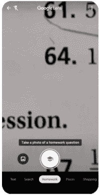

# 谷歌专注于印度语，在地图上有简单的语言切换，双语搜索切换等等

> 原文：<https://www.xda-developers.com/google-l10n-event-indic-language-maps-search-lens-muril/>

印度是一百种语言的国度，一个每 100 公里方言就发生变化的地方。在英语主导的科技世界里，这些地方语言和方言发现自己无法在互联网上提供有意义的体验。在今天的谷歌 L10n 虚拟活动中，谷歌正在通过谷歌搜索的简单语言切换、谷歌搜索中更好的双语结果显示、谷歌地图中的简单语言切换、通过谷歌镜头的印地语家庭作业帮助，以及一个名为 MuRIL 的多语言人工智能模型，使计算机更容易理解不同的人类语言，让印度的多语言用户更容易在印度获得丰富的体验。

## 背景

在发布公告之前，这里有一些背景资料，向我们的国际观众解释一下背景。印度的很大一部分是双语和多语言国家，在印度超过 12 亿的人口中，只有 0.02%的人将英语作为第一语言。总人口中只有 10.6%的人会说英语。相比之下，43.63%的人口将印地语作为第一语言，而总体而言，57.1%的人口会说印地语(尽管分为不同的次方言)。其他语言紧随其后，但比例较小——孟加拉语、马拉地语和泰卢固语分别占 8.9%、8.2%和 7.8%。总之，将英语作为唯一的访问媒介使技术远离大量用户，否则他们会发现技术绝对有用，甚至可能比那些已经通过其他方式获得技术的人更需要它。

正如我在我的 [Google Nest 音频评论](https://www.xda-developers.com/google-nest-audio-review/)中提到的，即使像智能扬声器这样的东西在多语言环境中也不如在说英语的家庭中有用。混合语言中的命令不能被很好地识别(比如带有一些印地语单词的主要是英语的命令)，并且设置[双语仍然限于某些组合](https://www.xda-developers.com/google-assistant-messages-integration-actions-android-go/)(印地语+乌尔都语，或者任何两种印度语都不是有效的组合，但是印地语+英语是)。现在的情况比几年前要好，但是还有很长的路要走。

谷歌知道这一点，这为今天 L10n 活动(本地化的有趣缩写，L 和 n 之间有 10 个字母)上的[公告奠定了基础。](https://india.googleblog.com/2020/12/l10n-localisation-breaking-down.html)

## 谷歌 L10n 活动 2020 公告

### 在谷歌搜索中，英语和印度语之间的切换很容易

谷歌一直在提供通过谷歌搜索中的芯片/标签在英语和印地语结果之间快速切换的能力，在印度有大量印地语人口的各邦。该芯片将印度的印地语查询量提升了 10 倍。

同样的做法现在正扩展到更多的印度语。谷歌搜索现在可以在英语和泰米尔语/泰卢固语/孟加拉语/马拉地语之间切换搜索结果。

### 谷歌搜索中出现更好的双语结果

印度的用户，包括我自己，更喜欢用英语打字，即使结果应该是用当地语言。事实上，将印地语音译成英语就产生了 Hinglish，即用英语字母表书写的印地语。

谷歌搜索正在拯救这些双语者的搜索查询。下个月，搜索将在适当的时候开始以支持的印度语言显示相关内容，即使查询已被音译为英语，除了英语作为主要语言之外，还会出现更多语言的双语搜索结果。中学支持的印度语言有印地语、孟加拉语、马拉地语、泰米尔语和泰卢固语。

### 谷歌地图中简单的语言切换

Google Assistant 和 Discover 能够切换到不同于系统的语言，允许用户根据自己的特定偏好使用这些工具。在印度，超过 50%的 Google Discover 内容是用印度语言浏览的，三分之一的 Google Assistant 用户使用的是印度语言。

在应用程序中改变语言的能力现在扩展到了谷歌地图。用户现在只需打开应用程序，进入设置，点击“应用程序语言”即可从多达 9 种语言中进行选择。这将使用户更容易搜索地点，获得方向，并在此任务中以他们的首选语言导航。

### 通过谷歌镜头提供印地语家庭作业帮助

谷歌眼镜已经允许你[解决数学问题](https://www.xda-developers.com/google-lens-adds-homework-mode-help-kids-solve-math-problems/)来帮助你的孩子做作业。你可以拍一张数学题的照片，然后就可以看到一步一步的解答指南。但是这份指南主要是用英文展示的。

谷歌现在在谷歌镜头中引入了作业帮助的印地语解决方案。

### MuRIL -帮助计算机系统大规模理解印度语言的多语言人工智能模型

围绕人工智能和机器学习的许多对话都围绕着理解人类和人类语言。但是当语言有一百种形式时，这种对话就变成了一项艰巨的任务，比以前更加艰巨。这就是穆里尔的用武之地。

Multilingual Represtantions 是印度语言的缩写，MuRIL 是一个跨语言的多语言模型。除了其他好处之外，它还提供了对音译文本的支持，比如在使用罗马字母书写印地语时。穆里尔还擅长确定音译句子的情感。MuRIL 支持 16 种印度语言以及英语，这使得它在同类公开可用的模型中对印度语言的覆盖率最高。

MuRIL 已经开源，可以从 TensorFlow Hub 免费下载[。](https://tfhub.dev/google/MuRIL/1)

* * *

很高兴看到公司将对话引向更广泛地接受不同的语言。我们希望为其他语言和其他地区继续这方面的努力。