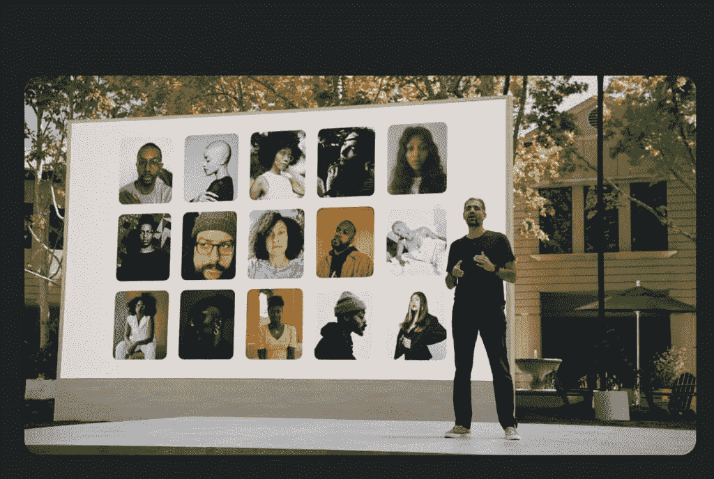

# 谷歌 Pixel 6 相机将被设计为更好地拍摄不同的肤色

> 原文：<https://www.xda-developers.com/google-pixel-6-camera-designed-to-better-shoot-diverse-skin-tones/>

谷歌的计算摄影能力已经得到了很好的证明，因为它的 Pixel 系列手机一直提供移动领域最好的相机体验之一，尽管使用的相机硬件相对较差。无论是将光线带入漆黑的房间，还是在不需要第二个镜头的情况下产生奶油状的散景，谷歌一次又一次证明了软件的卓越是移动摄影最重要的方面。通过谷歌 Pixel 6，该公司开始了一项崇高的事业:让相机更智能地拍摄各种肤色，尤其是深色肤色。

在谷歌 I/O 上，Android 和 Google Play 的副总裁 Sameer Samat 直言不讳地说:“对于有色人种来说，摄影并不总是以我们希望的方式看待我们，即使是在我们自己的一些谷歌产品中。”

他说，为了改变这种情况，谷歌一直在与一个多元化的专家团队合作，打造“一款更准确、更包容的相机”。

 <picture></picture> 

Google's Sameer Samat on stage at Google I/O talking about building a more inclusive camera.

谷歌表示，该团队已经拍摄了数千张图像来多样化他们的数据集，以帮助提高自动白平衡和自动曝光算法的准确性。本质上，谷歌正在训练其计算摄影人工智能，以理解肤色的许多深浅，并做出相应的调整。

谷歌的 Samat 表示，谷歌正在对其算法进行修改，以了解何时拍摄较暗的肤色，并通过算法减少杂散光，以呈现棕色肤色，并防止较暗的肤色过度明亮。

最重要的是，相机的算法也将更智能地理解不同的头发类型，包括，根据 Samat 的说法，“卷曲或波浪头发”这意味着 Pixel 6 的人像模式应该更好地识别不同的头发类型，并围绕传统的非洲发型产生自然的散景。

Samat 承认，在解决这个“长期存在的问题”方面还有“许多工作要做”，他说谷歌工程师正在努力将所有这些功能引入谷歌 Pixel 6。最重要的是，他说谷歌致力于与“整个 Android 生态系统”分享他们所学到的东西，这听起来像是其他手机品牌可以在需要时使用这些算法。萨马特补充道:“我们可以一起制造出对每个人都公平的相机。”