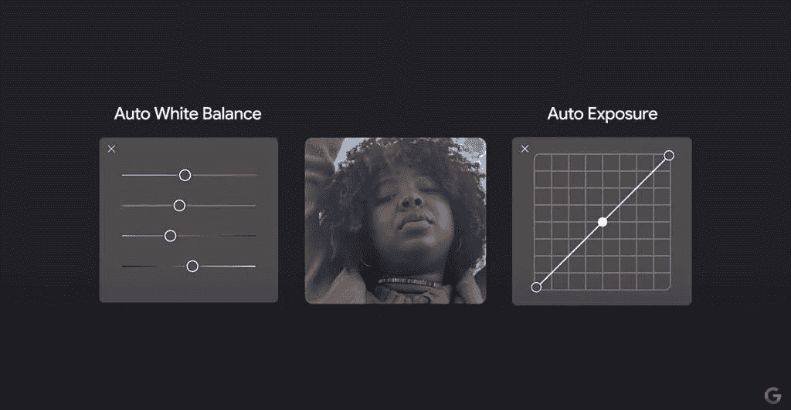

# 独家:以下是谷歌 Pixel 6 Pro 相机的功能

> 原文：<https://www.xda-developers.com/google-pixel-6-camera-features-revealed/>

对于许多消费者来说，摄像头是智能手机中最重要的硬件。因此，谷歌将摄像头作为 Pixel 的招牌功能也就不足为奇了。虽然 Pixel 手机从未配备顶级相机硬件，但谷歌的图像处理管道和谷歌相机应用程序一直将 Pixel 提升到智能手机相机排行榜的首位。通过今年的 [Pixel 6](https://www.xda-developers.com/google-pixel-6/) 系列，谷歌正在[以 Pixel 手机前所未有的方式改进相机硬件](https://www.xda-developers.com/exclusive-pixel-6-pro-leak/)，并且通过新的、[定制芯片](https://www.xda-developers.com/exclusive-google-tensor-specs-in-pixel-6/)，该公司对图像处理有了更多的控制权。现在，由于我们的消息来源提供了一个未发布的谷歌相机应用程序的内部版本，以及来自我们消息来源的进一步见解， *XDA* 可以透露一些将利用这一升级硬件的可能相机功能。

为了保护我们消息来源的匿名性，我们不能分享来自 Pixel 6 Pro 的任何照片或视频样本。

* * *

## 可能的 Pixel 6 系列相机规格

### 照片

作为背景，下面是我们迄今为止对 Pixel 6 相机的了解:

*   **后方**
    *   50MP 三星 GN1 主电源
    *   12MP 索尼 IMX386 超广角
    *   48MP 索尼 IMX586 4X 变焦长焦( **Pixel 6 Pro only** )
*   **前方**
    *   12MP 索尼 IMX663 ( **Pixel 6 Pro** )
    *   800 万像素(**像素 6** )

### 广角前置摄像头

虽然 Pixel 6 Pro 已经传闻在分辨率方面有更好的前置摄像头，但可能还有另一个区别。如果设备是 Pixel 6 或 6 Pro，位于`ConfigPixel2021`类(负责定义在谷歌相机应用中启用哪些功能的类)中的一行内容是:

```
 gcaConfigOverride.override(GeneralKeys.CAM_ULTRA_WIDE_FRONT_ENABLED, deviceProperties.isPixelRaven()); 
```

读取该属性以确定当前置摄像头处于活动状态时是否显示缩放选项，只有当手机的代号与“raven”匹配时才是真的，此前已确定“raven”是 Pixel 6 Pro 的代号。(常规像素 6，作为参考，代号为“黄鹂”。)

深入挖掘代码，我们发现一个名为`frontSupportedSingleUWDefaultToggleBarZoomRatioMap`的值，它定义了缩放比率。在代码的其他地方，还有另一个名为`frontSupportedUWDefaultToggleBarZoomRatioMap`的值，用于 Pixel 3 和 3xl——谷歌仅有的配有*专用*超广角自拍相机的手机。第一个值名称中的“单个”，以及 Pixel 6 Pro 显然只有一个前置摄像头的事实，让我们相信 Pixel 6 Pro——而不是普通的 Pixel 6——可能有一个超广角前置摄像头镜头。

在不知道视野的情况下，我们不知道 Pixel 6 Pro 的前置摄像头实际上有多宽。然而，我们的消息来源证实，Pixel 6 Pro 上的自拍相机提供了两个预定义的变焦级别:0.7 倍和 1.0 倍。

### 显像记录

和 Pixel 4a 5G、Pixel 5、Pixel 5a with 5G 一样，Pixel 6 Pro(大概还有 Pixel 6)支持 4K60 视频录制。然而，我们的消息来源告诉我们，他们的 Pixel 6 Pro 只支持主摄像头的 4K60 视频，而不支持超宽或长焦摄像头。通过超宽、长焦和自拍相机进行视频录制显然仅限于 4K30。

根据代码和我们的消息来源，以 4K60 或 1080p60 录制时的最大缩放级别设置为 7X。当从 Pixel 5 录制 4K60 视频时，这无疑是对最大 5X 变焦水平的改进。根据我们的消息来源，4K30 或 1080p30 的录制可以实现高达 20 倍的缩放级别。20 倍变焦也是照片的最大变焦。

当在 4K30 上录制视频时，我们的消息来源告诉我们，您可以在主镜头、超广角镜头和长焦镜头之间无缝切换，而无需停止录制。由于 Pixel 6 Pro 不支持通过长焦或超广角相机拍摄 4K60，因此在以那种质量录制时，它显然无法无缝切换到那些镜头。

Pixel 6 系列的两款手机预计都支持音频缩放，这一功能在 Pixel 4 系列和 Pixel 5 系列中也有。使用麦克风，摄像机聚焦于记录用户当前放大的方向上的音频。

* * *

## Pixel 6 系列相机的可能特性

当查看谷歌相机应用程序中为 Pixel 6 系列定义的其他功能时，我们有一些有趣的发现。可悲的是，我们发现的一些特性被代码名称掩盖了，许多逻辑和处理隐藏在闭源库中，因此很难确定它们是做什么的。尽管如此，我们发现的代号提出了许多关于 Pixel 6 相机功能的令人兴奋的问题。

### 手动白平衡调整

在过去的几个月里，谷歌一直致力于为谷歌相机应用添加手动白平衡用户界面。我们第一次发现这一点是在 7 月份，当时添加了一个名为“变色龙 _ui”的布局，但这个功能似乎还没有准备好。

 <picture></picture> 

The Pixel 6 will be able to accurately capture more diverse skin tones. Source: Google.

这一功能可能与谷歌努力提高其[手机捕捉不同肤色的能力](https://www.xda-developers.com/google-pixel-6-camera-designed-to-better-shoot-diverse-skin-tones/)有关。谷歌表示，它正在训练其计算摄影模型，以更好地理解不同的肤色，并相应地调整白平衡。这种手动白平衡调整功能可能只是一个开发者功能，但我们希望该公司将向寻求更专业相机体验的用户公开该功能。

### 魔法橡皮擦

我们在新的谷歌相机应用程序中发现的最有趣的代号之一是“瑞士”，它与一个叫做“魔法橡皮擦”的功能相关联。这项功能在 Pixel 6 系列上是启用的，至少根据 Pixel 2021 配置文件是这样，而且它似乎也通过谷歌张量芯片中的 TPU 进行了加速。“魔法橡皮擦”似乎是一种后处理效果，虽然我们不确定它到底是做什么的。根据名称，我们认为该功能可以让您从刚刚拍摄的照片中删除对象或人物。也许谷歌照片中的[长期被放弃的物体移除功能](https://www.xda-developers.com/what-happened-google-photos-object-removal/)正在 Pixel 6 中卷土重来？

 <picture></picture> 

Google was working on an object removal feature for Photos, but they abandoned the idea. The feature would have been able to remove objects like fences.

### 面部去模糊

谷歌公开确认的为数不多的 Pixel 6 相机功能之一是 face deblur。该公司向像[*【The Verge】*](https://www.theverge.com/2021/8/2/22605094/google-pixel-6-pro-tensor-processor-specs-ai-ml)这样的出版物展示了该功能的演示，它从高层次上描述了该功能是如何工作的。基本上，Pixel 6 像以前的 Pixel 设备一样，从主传感器拍摄多张照片，并将它们组合成一张 HDR 图像。然而与此同时，这款手机还将使用超广角摄像头来快速捕捉更清晰的图像。然后，TPU 使用超广角图像中的面部细节来消除 HDR 图像中面部的模糊。

在谷歌相机应用中，这项功能似乎是由两组相关的标志控制的:`FACE_DEBLUR`和`HDR_PLUS_DEBLUR_FUSION`，对于 Pixel 6 系列，它们都被设置为 true。`FACE_DEBLUR`正如所料，标志在 HDR+后处理管道中被引用。代码表明，脸部去模糊功能目前是由 GPU 加速的，而不是 TPU。代号为“猎鹰”的`HDR_PLUS_DEBLUR_FUSION`功能有几个属性，包括提示您可以保存拍摄前/后的属性。

### 场景锁定

谷歌相机 7.5 包括一个神秘的代号“火影忍者”，这给我们留下了许多疑问，因为当时，该应用的代码没有提供任何关于它做什么的线索。谢天谢地，我们现在知道了“火影忍者”的代号属于一个叫做“场景锁定”的功能。然而，我们不确定这种“场景锁定”功能与谷歌相机应用程序中已经存在的自动对焦/自动曝光锁定有何不同。

### “前火炬？”

有一个令人困惑的特性叫做“`FRONT_TORCH`”，在类似“`SelfieFlashIlluminationController`”的类中被引用。Pixel 6 Pro 上看起来不像有物理前置 LED 闪光灯，而且根据我们的消息来源，在自拍时打开闪光灯的唯一情况是谷歌相机 UI 变成米色。这可以利用智能手机显示屏发出的光照亮手机前面的任何东西，但显然没有专用 LED 闪光灯那么强大。[这个功能也不是什么新功能](https://www.theverge.com/2017/8/11/16131056/google-camera-update-selfie-flash-tap-to-zoom)，但也许谷歌正在努力调整这个功能，在我的消息来源可以访问的谷歌相机应用程序版本中是看不到的。

 <picture></picture> 

Another close-up of the cameras on the Pixel 6 Pro.

### 蓝牙麦克风支持

该应用程序支持在视频录制过程中使用蓝牙麦克风，但目前我们的来源无法使用。早在 2018 年，谷歌相机应用程序就添加了对外部(*有线*)麦克风[的支持，但似乎该应用程序也准备添加对蓝牙麦克风的支持。该功能代号为“sapphire”，似乎并不局限于特定的蓝牙音频产品，像](https://www.xda-developers.com/google-camera-6-1-supports-external-microphones/)[谷歌自己的 Pixel Buds A](https://www.xda-developers.com/google-pixel-buds-a-review/) 。

```
 <string name="external_bluetooth_mic_connected">Bluetooth mic connected. Tap arrow to change.</string>
<string name="external_bluetooth_mic_disconnected">Bluetooth disconnected. Mic updated to phone.</string>
<string name="external_mic_connected">Mic input updated. Tap arrow to change.</string> 
```

### 计时器灯

我们已经发现了谷歌相机应用程序的另一个可能的新功能，再次，我们的来源不可用。这项功能的字符串称为“定时器灯”，它会在拍照前的相机应用程序倒计时时闪烁背面的 led 灯。这将让用户知道手机何时要拍照，否则他们看不到屏幕上的倒计时。

```
 <string name="pref_countdown_indicator_summary">Flashes the back camera light during the timer countdown.</string>
<string name="pref_countdown_indicator_title">Timer light</string> 
```

### 运动模糊

在谷歌相机 7.5 中，我们还发现了代号“千层面”，GCam 的修改者认为这是一个运动模糊功能。多亏了新版本的谷歌相机应用程序，我们现在可以确认运动模糊功能正在开发中。该功能将为您的照片添加“创造性的模糊效果”我们来源的 Pixel 6 Pro 上没有出现运动模糊模式，但我们可能会在未来版本的应用程序中看到它。

```
 <string name="motion_blur">Motion blur</string>
<string name="motion_blur_description">Adds creative blur effects to your photos</string> 
```

### “尼玛美学”

Pixel 6 系列似乎启用了一个名为“尼玛美学”的新功能，尽管我们不确定它到底是做什么的。这似乎与谷歌相机中现有的 Top Shot 功能有关，该功能使用机器学习在连拍捕捉中挑选最佳图像。Top Shot 是与 Pixel 3 一起推出的[，但似乎谷歌正在通过推出 Pixel 6 系列来增强该功能。“尼玛美学”，像其他一些新功能一样，似乎是由谷歌张量芯片中的 TPU 进行硬件加速的。](https://www.xda-developers.com/google-pixel-3-google-pixel-3-xl-specs-features-pricing-availability/)

### “婴儿模式”

[我们之前报道过](https://www.xda-developers.com/exclusive-pixel-6-pro-leak/),谷歌正在开发一项名为“婴儿模式”的新相机功能虽然我们还不能确认许多细节，但谷歌相机应用程序的拆卸表明，该功能是 Pixel 6 系列独有的(至少目前如此)，因为它需要 2021 像素的相机库。在与“智能捕获”特性相关的一个类中，我们发现了以下常量:`BABY_ACTIVITY_VALUE`、`BABY_VALUE`、`PLAY_WITH_BABY_VALUE`。在同一个类别中列出了许多其他“活动”，所有这些似乎都是谷歌相机自动捕捉功能的触发器(以前称为“ [photobooth](https://www.xda-developers.com/google-camera-photobooth-motion-tracking-google-lens-pixel-2/) ”)。这表明自动捕捉功能将能够识别周围玩耍的婴儿，并自动为他们拍照，以及其他新识别的活动。

### 常见面孔 v2

与 Pixel 4 系列一起推出的[相机的一个特点是“频繁的面孔”当您启用该功能并拍摄集体照时，谷歌相机应用程序会自动聚焦于您经常拍摄的人。似乎 Pixel 6 系列将在某些方面改进 frequent faces 功能，因为 2021 Pixel 配置将`FREQUENT_FACES_V2`列为启用的功能。](https://www.xda-developers.com/google-pixel-4-specs-features-pricing-availability/)

### 人像聚光灯？

在 2021 Pixel 5a 和 Pixel 6 系列的配置文件中，名为“`PORTRAIT_SPOTLIGHT_ENHANCE_ENABLED`”的功能被设置为真。代号为“`gouda.spotlight`”的人像聚光灯，似乎与代号为“`gouda.firefly`”的人像重光截然不同谷歌照片应用中的现有 Pixel 手机可以使用后一个功能[。](https://www.xda-developers.com/google-pixel-5-portrait-light-feature-rolls-out-older-pixel-phones/)

* * *

## 2022 像素 7 的提示

展望明年，2022 Pixel——出于显而易见的原因，我们暂时称之为 Pixel 7——将出现在尚未发布的谷歌相机应用程序中。`DeviceProperties`类确认 2022 像素的代号为“pipit ”,指的是鸟类。谷歌手机的代号过去指的是鱼类物种，但随着 Pixel 6 和 6 Pro 的代号分别为“黄鹂”和“渡鸦”，这种情况似乎发生了变化。谷歌可能已经改变了其 Pixel 手机的代号惯例，以表明芯片组制造商从高通转移到该公司的内部团队。

有趣的是，在`isPixel2022`下只有一个代号。这表明，在 2022 年的 Pixel 产品线中，只有一款手机，但现在判断 Pixel 7“Pro”型号是否存在还为时过早。现在判断`ConfigPixel2022`类是否准确描述了明年像素 7 的相机特征还为时过早，因为该类继承了像素 6 系列的许多配置。

不过，有一点很清楚，明年的 Pixel 7 也将拥有谷歌制造的 SoC 和许多(如果不是全部)与 Pixel 6 系列相同的相机软件功能。根据我们对代码的解读，Pixel 7 可能会像 Pixel 6 系列和它之前的 Pixel 4a 5G/5/5a 一样，拥有超广角摄像头，但没有提到长焦镜头。再说一次，现在说这个版本的谷歌相机应用程序是否准确列出了 Pixel 7 的相机功能还为时过早，因为我们距离它的发布还很远。

* * *

这就是我们对 Pixel 6 系列相机的所有了解。鉴于新版本的谷歌相机应用程序中有多少新代码，我们可能错过了一些新功能。我们将继续挖掘该应用程序，看看我们能否了解更多信息，因此请务必[关注本页](https://www.xda-developers.com/tag/google-pixel-6/)了解所有最新详情。

*感谢 PNF 软件为我们提供了使用* *[JEB 反编译](https://www.pnfsoftware.com/?aid=xdadev)* *的许可，这是一款针对 Android 应用的专业级逆向工程工具。*

*本文于美国东部时间晚上 7:31 更新，澄清 Pixel 3 系列上的辅助前置摄像头是超广角，并添加了拍照时最大数码变焦级别的信息。*