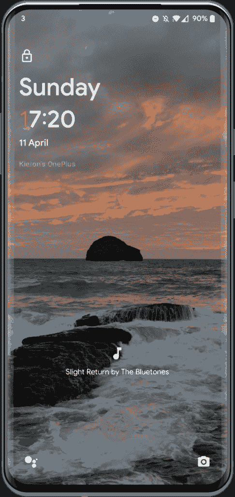

# 谷歌 Pixel 的 Now Playing 已经移植到其他 Android 设备上

> 原文：<https://www.xda-developers.com/google-pixel-now-playing-feature-ported/>

谷歌[在 2018 年推出了 Pixel 2 系列的 Now Playing](https://www.xda-developers.com/how-google-pixel-2-now-playing-works/) 功能，从那以后它一直是 Pixel 阵容中不可或缺的一部分。该功能结合了板载硬件、软件和谷歌的机器学习魔法，可以识别背景中播放的歌曲。现在，播放本来是一个像素专属的功能，但定制 ROM 开发商设法[让它在 AOSP 代码库](https://www.xda-developers.com/google-pixel-2-now-playing-feature-ported/)上工作，并提出[自己对该功能的看法](https://www.xda-developers.com/pixel-experience-now-playing-oneplus-6/)，这只是时间问题。

现在，XDA 公认的开发者/公认的贡献者 Quinny899 更进一步。他提出了一种混合的 Xposed 和 Magisk mod，称为“环境音乐 mod”，它完全将谷歌最初的 Now Playing 功能移植到其他 Android 智能手机上。它是[免费和开源的](https://github.com/KieronQuinn/AmbientMusicMod)，并已被证实可以在一些一加设备上工作，如一加 7T Pro。

就像谷歌 Pixel 手机一样，环境音乐模式可以让你的手机自动识别周围播放的音乐，并在锁屏上显示当前播放的歌曲和艺术家的名字。该功能还保留了每首已识别歌曲的历史列表，以便您可以随时返回查看它们。虽然 Now Playing 的一些早期重新实现依赖于活跃的互联网连接来完成工作，但 Ambient Music Mod 在设备上本地处理一切，因此不需要互联网或太多电池。毕竟，它是谷歌 Pixel 手机功能的完整移植，所以它的工作方式基本上与它在这些设备上的工作方式相同。

## 环境音乐模式功能

*   全面的环境音乐支持，包括在设备空闲或使用时从 Google Music recognition 下载最新的数据库(排除适用，请参阅常见问题了解更多详细信息)
*   现在播放历史内置，并支持第三方历史应用程序
*   使用辅助功能覆盖服务在锁定屏幕上显示当前正在播放的曲目的能力
*   环境音乐调制应用程序中的按需手动识别
*   控制放大的设置，识别应该触发的频率，是否在小 CPU 内核上运行，以及当歌曲识别通知被点击时做什么
*   通过曲目列表选项查看本地下载数据库中所有可识别的曲目

如前所述，Ambient Music Mod 是 Xposed 和 Magisk mod 的混合，这意味着你需要在手机上安装这两个框架。Magisk 是在你的设备上获得 root 权限所必需的，而 Xposed 框架允许 mod 挂钩到高通骁龙设备的声音触发驱动程序。

您的手机还必须配备支持声音触发 2.1 平台或更高版本的骁龙处理器。mod 依靠声音触发服务(语音助手用于语音激活的相同服务)来听你周围播放的音乐，并捕捉 8 秒钟的音频记录。然后，该应用程序对这个小音频片段运行 K 近邻(KNN)机器学习模型，以在本地存储的曲目数据库中找到精确的匹配。

## 如何在您的设备上下载环境音乐模式:

1.  确保您的设备安装了带有 Magisk 和 Xposed*框架的解锁引导程序。(查看我们的安装指南 [Magisk](https://www.xda-developers.com/how-to-install-magisk/) 。)
2.  从开发者的 [GitHub 页面](https://github.com/KieronQuinn/AmbientMusicMod/releases)下载环境音乐 Mod 的最新 APK。
3.  该应用程序将运行一些测试来检查您的设备是否兼容。
4.  如果您的设备符合要求，请单击底部的“构建安装程序”按钮。
5.  构建完成后，打开 Magisk 管理器应用程序并安装该模块。
6.  打开 Xposed app，搜索环境音乐 Mod 模块，启用。
7.  重启你的设备。下次背景播放音乐时，您应该会在锁定屏幕上看到曲目信息。

 <picture></picture> 

Ambient Music Mod displaying the currently playing track on the lock screen of a OnePlus 7T Pro running Oxygen OS 11.

开发者在这个模块上做了很多测试，并提出了一个常见问题列表，如果你有任何问题，你应该[在这里](https://github.com/KieronQuinn/AmbientMusicMod/blob/main/app/src/main/assets/faq.md)查看。FAQ 回答了诸如如何测试 Now Playing 是否工作，它能识别多少首歌曲，当你在 Google Play 上看到“Pixel Ambient Services”更新时该怎么办(剧透:不要更新)，使用什么放大级别等等问题。

虽然开发人员可以确认该功能可以在运行 OxygenOS 11 的一加 7T Pro 上运行，但测试人员报告说，它无法在运行 ZenUI 的华硕 ROG 手机 3 上运行。因此，您的里程可能会有所不同。要给开发者反馈，请点击下面的链接查看 XDA 论坛的环境音乐模块。

**[环境音乐 Mod —像素环境音乐端口 XDA 线程](https://forum.xda-developers.com/t/module-magisk-xposed-17-04-ambient-music-mod-pixel-ambient-music-port-for-other-compatible-devices.4260761/)**

###### *值得注意的是，Xposed 框架的原始开发者自[其 Android 8.1 Oreo 兼容版本](https://www.xda-developers.com/xposed-framework-for-android-oreo-beta/)以来就不再支持该项目。当开发者(以及我们论坛上的其他人)提到 Xposed 时，他们指的是 Xposed 框架的非官方继任者，这些继任者与 9 到 12 的 Android 版本兼容。这些后继者包括“EdXposed”和最近的“LSPosed”，它们都提供了一个艺术挂钩框架。这些框架还要求安装“Riru”，它修改了 Android 的 zygote 进程，允许模块运行自己的代码。你不需要知道这些是如何工作的，但是你需要至少安装一个 Magisk + Riru + EdXposed 或 Magisk + Riru + LSPosed 的组合来启动和运行环境音乐模式。