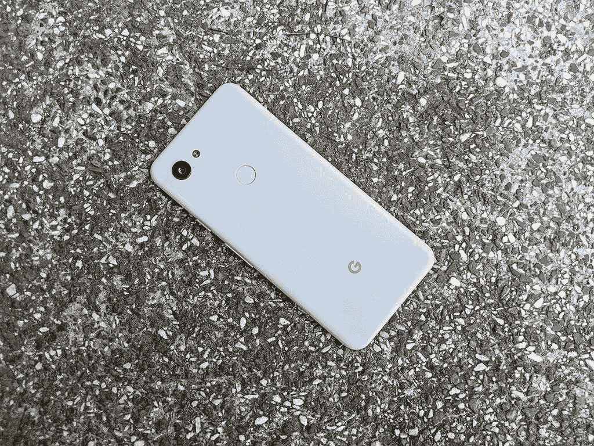
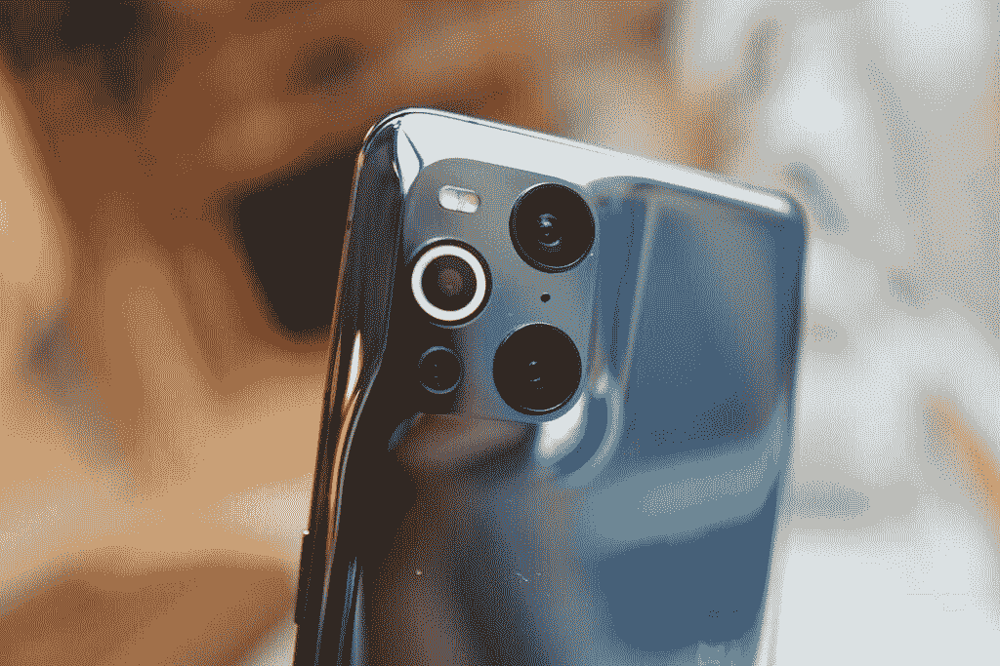

# 这是我们对谷歌 Pixel Ultra 的愿望清单！#梦幻像素

> 原文：<https://www.xda-developers.com/google-pixel-ultra-wishlist/>

如果你问一个来自改装社区的智能手机爱好者，他们过去对手机的一些美好回忆，很有可能会包括 Nexus 设备。Nexus 系列描绘了谷歌对 Android 的愿景，并提供了简洁的体验。谷歌没有在硬件上发力，而是专注于他们擅长的方面——软件——并将硬件外包给其他原始设备制造商。这使他们能够专注于开发和改进新版 Android，Nexus 用户在它冲击其他设备之前就已经尝到了甜头。

然而在 2016 年，谷歌出人意料地扼杀了 Nexus 系列，转而支持 Pixel。虽然 Nexus 更适合发烧友，但 Pixel 走了一条不同的路线。除了运行最新版本的安卓系统，Pixel 系列还展示了谷歌在各个部门的软件实力。无论是只有一个摄像头的令人惊叹的人像模式拍摄，还是从任何地方让光线进入你的照片的夜视，离线转录的录音机，甚至是可以使用人工智能为你接听电话的谷歌双工。

多年来，Pixel 与 Nexus 的区别在于它更加专注于大众市场。然而，至今仍有一个方面困扰着谷歌手机——它们不愿意对硬件做出有意义的改变。虽然随着谷歌自己透露的 [Pixel 6](https://www.xda-developers.com/google-pixel-6/) 系列的发展，这种情况将会改变，但谷歌做出的硬件选择经常引发争议。无论是在竞争对手有多达四个不同镜头的情况下坚持使用单个摄像头，还是决定在 Pixel 5 上安装一个中端芯片，归根结底，谷歌很少在舒适区之外做一些事情。

然而，有传言称，一款全能的旗舰 Pixel 手机将与 Pixel 2 一起推出，据称将被命名为“Pixel Ultra”。然而不幸的是，Pixel Ultra 从未实现。随着谷歌今天庆祝其 23 岁生日，我们所有技术书呆子深入想象并希望一个像素能够真正与当今世界的旗舰竞争的时机已经成熟。

所以，你猜怎么着，我们真的做到了！在谷歌 23 岁生日之际，如果 Pixel Ultra 今天发布，或者我们称之为 ~~#teampixel~~ #DreamPixel，我们希望它会是什么样子！

## 把摄像头放大一倍。

你不能谈论一个像素而不首先解决相机的问题。从第一代 Pixel 开始，谷歌就在相机输出方面建立了一个遗产，这要归功于一个主要组成部分——它的软件辉煌。最初的 Pixel 配备了一个后置摄像头，这在手机刚刚开始配备双摄像头的时候是可以理解的。然而，这种使用单个摄像头的趋势持续了两年，当时 Pixel 2 和 Pixel 3 的背面都有单个摄像头。

即使只有一个镜头和完全相同的传感器，谷歌也设法用这些手机的摄像头输出创造了一些奇迹。Pixel 2 拥有所有手机中最好的人像模式，而且只会变得更好，Pixel 3 革新了夜视弱光摄影。所有这些突破都归功于谷歌的计算摄影算法。谷歌能够利用他们的软件专长来弥补硬件的不足，这种专长非常有效。然而，你只能用软件做到这一步。

 <picture></picture> 

Pixel 3a with a single camera

当竞争品牌拥有超宽和长焦相机来捕捉不同的视角时，Pixel 只能做到一个。Pixel 4 确实有一个长焦镜头，然后在 Pixel 5 上换成了超宽镜头，但即使这样，相机设置也没有 Galaxy S21 Ultra 甚至 Mi 11 Ultra 上的那么全面。

我们不都喜欢看到一个像素额外增加一个潜望镜摄像头来实现 10 倍无损变焦吗？当你使用谷歌的数字变焦算法和更大的传感器时，你只能想象在 100 倍混合变焦下，手机拍摄的月球照片会有多好！潜望镜相机已经存在了一段时间，我们看不出谷歌有什么理由将它排除在旗舰产品之外。

 <picture></picture> 

Periscope zoom cameras

虽然由一个主摄像头、一个超宽镜头和一个潜望镜摄像头组成的三摄像头设置应该能满足大多数人的需求，但既然我们谈论的是一部想象中的手机，为什么不在其中添加第四个摄像头呢？我很想在 Pixel 上看到一个微距相机，在你质疑我作为科技记者的职业之前，不，我不是指那些糟糕的 2MP 传感器。

Oppo Find X3 Pro 拥有一个出色的显微镜摄像头，可提供高达 60 倍的放大倍率。虽然你可能找不到它的很多实际使用案例，但它肯定是一个有趣的传感器，如果我想在手机上安装第四个摄像头，这是我会选择的一个。

 <picture></picture> 

Microscope camera on the OPPO Find X3 Pro

因此，我们在相机硬件方面给了 Pixel 一个急需的提升，但如果没有一些软件的改变，这是不完整的。虽然 Pixel 在拍摄静态照片方面一直是冠军，但当你将其与 iPhone 等产品进行比较时，视频在很大程度上仍然是 meh。谷歌真的需要提升它在这方面的游戏，并允许用户从所有相机拍摄高达 4K 60fps 的视频，包括我们稍后将谈到的前置相机。

## 真正的全屏显示

当无边框显示屏的趋势开始兴起时，谷歌仍然坚持在其设备上使用厚边框。现在，有些人可能会认为这样做是为了保留优秀的前置立体声扬声器，但绝对没有理由在显示器顶部放置一个浴缸。

即使是 Pixel 4，谷歌对 Soli 项目的实验也意味着这款手机必须有一个厚的顶部边框，因此与其他原始设备制造商的手机相比显得过时。虽然他们用 Pixel 5 解决了这个问题，并像 2020 年任何理智的 OEM 一样打了一个孔，但这仍然不是完美的全屏体验。

 <picture></picture> 

Mix 4 with UDC vs a punch-hole camera

我们已经看到带有下显示摄像头的手机有一段时间了，我同意这项技术并不完美。中兴的实施非常糟糕，三星在 Galaxy Z Fold 3 上的实施也非常糟糕。这些手机上显示不足的相机的主要问题是，自拍相机的照片看起来很糟糕，因为相机需要透过额外的像素层。

让自拍看起来更好的唯一方法是使用强大的软件算法，一旦照片被捕获，就可以优化照片的外观。例如，[小米 Mix 4](https://www.xda-developers.com/xiaomi-mix-4-hands-on/) 实际上在这方面做得相当好。

考虑到谷歌的软件专业知识和他们使用 Pixel Visual Core 优化图片的能力，我们可以想象 Pixel Ultra 上的显示器下摄像头将非常适合。正面将是真正的全屏，没有令人赏心悦目的缺口或切口，自拍也很好看。当我们谈到这个话题时，一个带有 LTPO 面板的 120Hz QHD+ AMOLED 显示屏将是观看内容的一种享受。

## 更好的软硬件集成

我们经常把*生态系统*这个词和苹果联系在一起。这主要是因为他们所有的产品都可以互相交流，并且配合得非常好。这是购买 iPhone 的人会考虑购买 Apple Watch 而不是 Fitbit，Mac 而不是 Windows 机器等等的一个重要原因。这不仅仅是关于生态系统。苹果公司制造 iPhone 的硬件和软件，这也是他们合作得如此好的原因。苹果的软件优化充分利用了板载硬件。

不过，在安卓方面，一个品牌生产芯片，另一个品牌生产软件。这不允许像苹果公司多年来一直强调的那样无缝的硬件-软件集成。随着 Pixel 6 系列的推出，谷歌最终宣布他们将使用名为 [Tensor](https://www.xda-developers.com/google-pixel-6-teaser/) 的定制芯片。虽然我们还没有体验到这种定制芯片将带来的变化和改进，以及谷歌的软件与它的配合有多好，但这肯定是朝着正确的方向迈出的一步。芯片只会越来越好，谷歌将能够定制他们的软件，以尽可能最好的方式利用芯片组。

 <picture></picture> 

Pixel 6 series with Tensor

除了原始性能的提高，这种集成还将有助于延长电池寿命。你可能已经意识到，与大多数安卓手机相比，iPhone 的电池容量要低得多。虽然 Android 设备已经突破了 5000 毫安时的大关，但由于苹果公司进行的软件优化，只有 3500 毫安时电池的 iPhone 也能发挥类似的作用。这种无缝集成正是我希望 Pixel Ultra 实现的。

## 更多软件功能和定制

多年来，Android 在一个特别的方面蓬勃发展——定制。启动器、部件、模块等等。然而，你在 Pixel 上得到的 UI 在很大程度上仍然是基本的。甚至像[滚动截图](https://www.xda-developers.com/android-12-finally-adds-scrolling-screenshots-natively/)这样的重要功能也是最近才在 [Android 12](https://www.xda-developers.com/android-12/) 中引入的。原生屏幕录制去年才在 Android 11 中推出。这些功能在定制用户界面和皮肤上已经存在了很长时间，只是提高了手机的实用性。

双应用程序、原生应用程序锁定、铃声的自定义步骤以及系统导航的多个选项等功能是现代智能手机的必备功能。我的梦想 Pixel Ultra 甚至可以实现类似三星 DeX 的桌面模式，将手机插入外部显示器可以将它变成 Chromebook。说到电脑，谷歌可以与微软合作，无缝集成和协调 Android 手机与 Windows 电脑，就像 iPhone 如何链接到 Mac 电脑一样。

 <picture></picture> 

AirDrop on iPhone and Mac

是的，有一个 [*你的手机*](https://play.google.com/store/apps/details?id=com.microsoft.appmanager&hl=en_IN&gl=US) 应用程序做类似的事情，但它远不及你在 iOS 和 Mac 上得到的。例如， [Airdrop](https://www.xda-developers.com/airdrop/) 可以在几秒钟内将大型视频文件从 iPhone 传输到 Mac 电脑。虽然谷歌确实以 Nearby Share 作为回应，但它目前只能在 Android 设备之间工作，而不能在手机和 PC 之间工作。移交和连续性也是很好的功能，让您可以跨设备继续工作。这些都是我希望 Pixel Ultra 具备的功能。

与 iOS 相比，Android 落后的另一个领域是无缝备份和恢复功能。有什么比在 Pixel Ultra 上更好的方式将它带到 Android 上呢？当你购买新的 Pixel Ultra 时，你应该能够在登录所有帐户的情况下，从现有的智能手机中直接传输应用程序、应用程序数据、主屏幕布局、保存的密码等所有数据。这个过程应该像在你的新像素上输入你的 PIN 码一样无缝，瞧，你所有的数据在几分钟内就被传输了。

这些软件元素可以被引入到 Pixel 上，以使用户体验更加高效，并确保用户界面不会受到限制。当现代 SOC 拥有如此强大的马力时，为什么还要浪费它呢？有人可能会说，其他用户界面已经提供了这些功能，所以在 Pixel Ultra 上提供所有这些功能，会使用户体验更加混乱。但这并不完全正确，因为 Pixel UI 的核心美学和体验可以保持，并且这些可以作为高级功能添加给高级用户。

## 额外奖励

如果谷歌同时制造硬件和软件，他们也有优势在更长的时间内支持设备。2015 年推出的 iPhone 6S 仍在进行软件更新，并将支持 iOS 15，这是一件大事。Pixel Ultra 五年的 Android 更新将非常好，并将确保手机在很长一段时间内运行良好。如果谷歌建立一个产品生态系统，与 Pixel Ultra 智能手机很好地集成，那也将是一件好事。是的，Pixel Buds 已经存在，但是传闻中的 Pixel Watch 仍然不见踪影。

当你考虑到定制芯片的优化因素时，一个 5000 毫安时的大电池会很棒。65W 的 PD 充电将非常适合大电池。大多数充电速度快的智能手机都依赖于 VOOC、Warp 等专有标准。这需要也支持该标准的定制充电砖。支持快速 PD 充电意味着你可以使用任何支持 USB-PD 的[通用充电器。](https://www.xda-developers.com/best-usb-pd-fast-charger/)

剩下的就很简单了——至少 12GB 内存和 256 GB ufs 3.1 存储空间。现有像素的彩色电源按钮保持不变，但我想增加一个像 iPhone 或一加设备的静音开关。包含一个耳机插孔和一个良好的 DAC 将意味着您可以享受无损音频的所有宣传，无线充电和 IP68 等级将完成 Pixel Ultra 的包装。

最后，我希望所有这些都能够像 Pixel 5 一样集成到便携式设备中。Pixel 5 的尺寸非常适合操作，既不太大也不太小。别忘了，谷歌手机在全球的可用性一直不稳定。大多数 Pixel 手机只在少数几个选定的国家推出，我相信这是基于市场研究。但如果谷歌真的想巩固其在智能手机行业的主导地位，他们必须让 Pixel Ultra 在全球范围内可用。

* * *

让我们现实一会儿。完美的手机是不存在的，Pixel Ultra 目前还只是幻想。每种设备都有自己的缺陷，这些缺陷可能会也可能不会以不同的方式困扰不同的人。不过，想象一下理想的手机应该是什么样子也无妨，尤其是 Pixel 6 系列即将推出。我试图让我的期望尽可能地现实，并没有过分地说我想要八个摄像头，一个 32 核处理器和一个 10，000mAh 电池，带 200W 无线充电功能，价格为 200 美元的 iPhone 12 mini。不，这不是这个愿望清单的重点。

重点是让你想知道如果谷歌/三星没有取消该程序，Play Edition Galaxy S21 Ultra 会是什么样子。它可能会满足我在这里提到的大多数参数，这是我对我的梦想 Pixel Ultra 的期望，至少在硬件方面是如此。这让我回到了最初的观点——谷歌并没有真正在他们的设备上做太多的硬件，这可能是为什么他们在任何硬件领域都不是领导者。有人会认为他们收购 HTC 的智能手机部门会改变事情，但这种改变并没有真正实现。

对我们来说幸运的是，Pixel 6 系列看起来像是朝着这个方向迈出的一步。这似乎是谷歌的第一款手机，具有大胆的设计语言和一些显著的改进，如更多功能的摄像头，别忘了，定制芯片。它会是我们一直期待的像素吗？只有时间能证明一切。在那之前，请在下面的评论中告诉我们你梦想中的 Pixel Ultra 是什么样子。