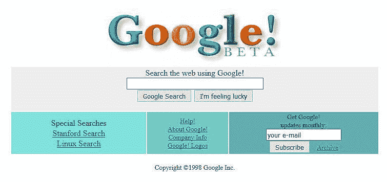
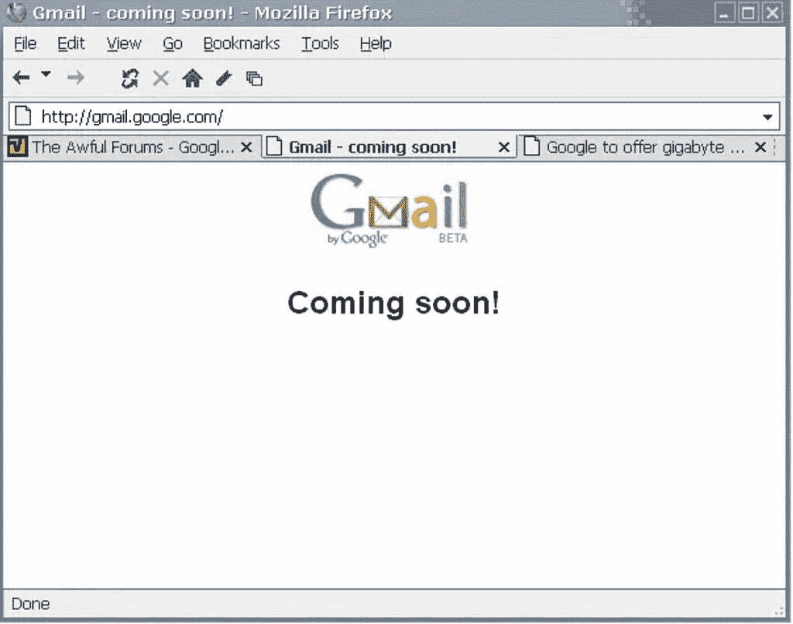
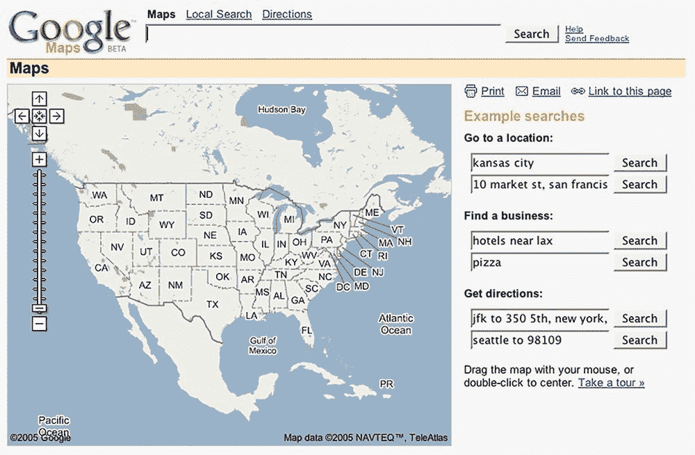
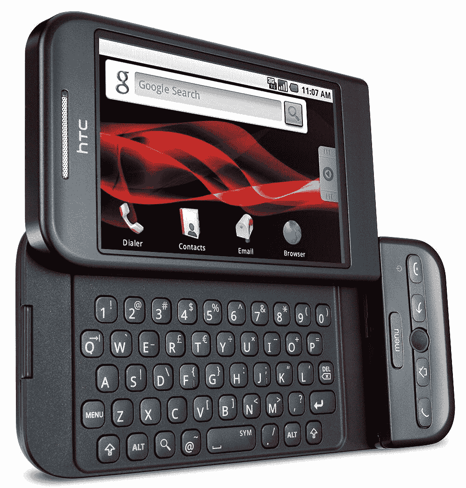

# 谷歌在 23 年里从一个简单的网页变成了无处不在的互联网巨头

> 原文：<https://www.xda-developers.com/google-simple-webpage-ubiquitous-internet-giant/>

知识就是力量，在这个现代数字时代，有一家公司比其他任何公司都更能塑造整个世界的知识——谷歌。根据研究公司 Statista 的数据，除了谷歌被禁的 mainland China，全球超过 87%的台式电脑和 94%的移动设备使用谷歌的搜索引擎。

谷歌在网络搜索领域的绝对统治地位颠覆了整个行业及其运作方式，这一点怎么强调都不为过。对于大多数网站来说，很大一部分流量来自搜索结果，研究表明，谷歌搜索的前五六个结果获得了超过 60%的点击量。换句话说，谷歌的搜索结果可以创造或破坏一个网站的流量，进而影响整个数字业务，如在线媒体或电子商务网站。

这就是为什么谷歌上的广告如此有利可图——这家科技巨头在 2020 年获得了 1500 亿美元的广告收入，占该公司总收入的 80%。今天，谷歌价值一万亿美元。它影响哪个网站被显示的绝对优势已经导致[国内外立法者的审查](https://www.xda-developers.com/us-government-antitrust-charges-google/)。

想想看，1998 年 9 月 4 日，谷歌作为一个不起眼的、看起来有些普通的网站成立。今天，谷歌迎来了它的 23 岁生日，在这个时刻，我们回顾一些里程碑，看看这家公司是如何成为今天这个不可避免、无处不在、无处不在的巨人的。

## 1996 年 8 月:拉里·佩奇和谢尔盖·布林推出 Goo...哦...背部按摩

我们今天所知的互联网巨头谷歌[始于当时的斯坦福大学博士生拉里·佩奇的一篇大学论文](https://about.google/our-story/)，他想探索互联网的数学特性，特别是链接结构是如何工作的。利用大学研究论文经常必须列出引用的想法，佩奇设计了一个系统，奖励经常被“引用”的网站，也就是被链接的网站。

斯坦福大学的学生谢尔盖·布林(Sergey Brin)很快加入了这个项目，两人开发了 PageRank 算法，不仅根据引用网站的链接数量，还根据这些链接的质量对网站进行排名。两人给这个搜索引擎起了一个不幸的名字“BackRub ”,当时它仍然只在斯坦福的服务器上运行。

事情是这样的，BackRub 不是第一个互联网搜索引擎。雅虎也是由斯坦福校友创立的，当时已经很活跃，占据主导地位。但佩奇和布林的想法是，使用自动算法搜索整个互联网，并根据反向链接的质量和数量对页面进行排名，这比雅虎的方法要有效得多，雅虎使用物理员工来列出网站索引。当然，当时没有人知道谷歌的方法要优越得多。

## 1998 年 9 月:谷歌正式上市

 <picture></picture> 

How Google's homepage looked in 1998\. Source: [Web Design Museum](https://www.webdesignmuseum.org/gallery/google-1998)

佩奇和布林在 1997 年的某个时候将 BackRub 的名字改为 Google(在数学术语“googol”之后，意思是 1，后面跟着 100 个零)，并在 1997 年 9 月 17 日正式注册了 Google.com，但直到第二年的 9 月 4 日，Google 才成为一家正式的公司。因此，包括 XDA 在内的大多数媒体都将 9 月 4 日作为谷歌的官方生日。

## 2000 年 6 月:雅虎承认谷歌的搜索解决方案更好

尽管雅虎在 2000 年仍有很高的价值，并在搜索引擎市场份额上领先于谷歌，但雅虎高管意识到，他们基于索引的方法无法跟上快速增长的庞大互联网。2000 年 6 月 26 日，雅虎宣布将使用谷歌的搜索引擎。

但是雅虎没有接受失败。在雅虎努力重建自己的搜索引擎之际，谷歌只是将与谷歌的合作视为暂时的。

## 2002 年夏天:谷歌拒绝了雅虎以 30 亿美元彻底收购该公司的提议

据 [*连线*](https://www.wired.com/2007/02/yahoo-3/) 报道，雅虎 CEO 特里·塞梅尔(Terry Semel)在 2002 年夏天出价 30 亿美元完全收购谷歌。谷歌拒绝了这一提议。当时，雅虎仍然是“更大”的公司，当年的年收入为 8.37 亿美元，而谷歌为 2.4 亿美元。

## 2004 年 4 月 1 日:谷歌发布 Gmail

 <picture></picture> 

Google's Gmail homepage on March 31st, 2003 -- a day before Gmail launched

当谷歌[推出其电子邮件服务](https://time.com/43263/gmail-10th-anniversary/)与微软的 Hotmail 和雅虎的服务竞争时，许多人认为这是一个笑话——毕竟它是在愚人节宣布的。但是有空前的 1GB 免费存储空间。当时，免费电子邮件服务只提供几兆字节的存储空间。事实上，雅虎对 Gmail 1GB 的回应是提供 100 兆字节——这表明雅虎不知道如何像谷歌那样吸引互联网用户。

## 2004 年 4 月 29 日:谷歌上市

对谷歌来说，2004 年 4 月将是繁忙的一个月。公司[于 4 月 19 日提交了 IPO](https://www.wsj.com/articles/SB108302617400094273) (首次公开募股)，到 4 月 29 日，公司正式公开上市，估值 270 亿美元。

## 2005 年 2 月 8 日:谷歌发布地图

 <picture></picture> 

How Google Maps looked in 2005

如果你不是苹果生态系统的忠实拥护者，也不住在 mainland China，谷歌地图很可能是你日常生活中不可或缺的工具。地图服务始于 2005 年初，当时只是一项桌面服务，但直到智能手机变得无处不在，谷歌地图才成为今天的必备服务。据《卫报》 [*，*](https://www.theguardian.com/technology/2015/feb/08/google-maps-10-anniversary-iphone-android-street-view) 报道，乔布斯亲自打电话给谷歌，共同努力确保该应用程序与第一代 iPhone 一起推出。

## 2005 年 7 月:谷歌收购安卓——“有史以来最划算的交易”

到 2005 年中期，谷歌已经全速运转。在过去的一年里，谷歌的搜索引擎市场份额已经超过雅虎，成为美国头号搜索引擎(2005 年 6 月，谷歌在美国搜索市场的份额为 36.7% 对雅虎的 30.4%)；该公司开始做科技巨头做的事情——收购有前途的初创企业，吸收其技术和创新。

那年 7 月，谷歌收购了一家名为 Android，Inc .的无线软件初创公司。收购数字没有披露，但谷歌公司发展副总裁大卫·劳威(David Lawee)当时称之为[“有史以来最好的交易】](https://venturebeat.com/2010/10/27/google-exec-android-was-best-deal-ever/)。今天，Android 是遥遥领先的最大移动平台，也是谷歌搜索在超过 90%的移动设备上占据主导地位的主要原因。如果 Android 不存在，我们 XDA 的许多人就不会有很多工作要做，所以，是的，“有史以来最好的交易”看起来并不夸张。

## 2006 年 10 月 9 日:谷歌收购 YouTube

是的，另一项收购，另一项服务，在谷歌的指导和资源下，现在已经成为全球范围内无处不在的服务(在 mainland China 之外，它是被禁止的)。据好莱坞贸易报纸 [*Variety*](https://variety.com/2021/digital/news/youtube-q2-revenue-google-alphabet-earnings-1235028413/) 报道，仅 2021 年，YouTube 就为谷歌在 Q2 带来了 70 亿美元的广告收入。

## 2007 年 4 月 14 日:谷歌收购 DoubleClick

谷歌此时已经是一个广告巨头，但它并没有使用基于 cookie 的跟踪，直到它以 31 亿美元收购了专注于展示广告的在线广告公司 DoubleClick。谷歌收购了该公司的软件，并开始基于 cookie 跟踪广告用途。

## 2008 年 10 月 22 日:首款安卓手机发布

 <picture></picture> 

The HTC Dream/T-Mobile G1

HTC Dream(在美国称为 T-Mobile G1)于 2008 年 9 月发布，并于 2008 年 10 月上市。它没有当时已经推出的 iPhone 3G 优雅，但它向世界介绍了 Android，这是一个与谷歌服务深度集成的开源移动操作系统。

## 2015 年 8 月 10 日:谷歌重组，成为 Alphabet Inc。

到 2010 年代中期，谷歌已经成为一家庞大的扩张型公司，联合创始人佩奇和布林决定对公司进行重组。这两人将负责一个更大的实体，名为 Alphabet Inc .，谷歌本身将归其管辖，由桑德尔·皮帅领导。这种重组可能改变了谷歌内部和业务方面的现状，但对消费者来说，没有什么真正改变。谷歌搜索是默认的搜索引擎选择，谷歌地图，YouTube 等几乎是必须使用的服务。

为了庆祝重组，谷歌确实推出了一个看起来与旧标志非常相似的新标志。

## 2016 年 10 月 20 日:谷歌凭借 Pixel 进军硬件领域

尽管谷歌 Pixel 手机的销量从未达到被视为热门甚至主流的水平，但它的推出仍然是谷歌历史上的一个关键时刻，因为它标志着软件巨头首次真正涉足硬件。当然，谷歌之前在 Nexus 系列中也曾考虑过这个想法，但 Pixel 应该是谷歌版的 iPhone——一款由谷歌制造硬件和软件的设备。当然，最初的几个像素并不完全如此，因为硬件是由台湾手机制造商 HTC 制造的。

尽管如此，Pixel 可以说是智能手机计算摄影时代的先驱，因此它应该在这个名单上占有一席之地。

## 2018 年 1 月 30 日:谷歌收购 HTC

2017 年 9 月宣布，但直到 2018 年第一个月的才最终确定，谷歌收购 HTC 意味着它获得了 HTC 的所有硬件工程团队，因此谷歌终于可以说他们制造自己的智能手机硬件。

## 2020 年 12 月 18 日:谷歌的搜索优势激怒了美国政府

我们已经在这篇文章的开篇提到了谷歌今天已经变得多么大。如果谷歌突然停止提供搜索、地图、YouTube、Gmail 等主要服务，我们许多居住在 mainland China 以外的人的整个数字生活(甚至可能是我们的实际收入)都会受到影响。

一家公司应该有这么大的权力吗？世界各地的监管机构开始说“不”。在欧盟委员会(European Commission)和澳大利亚政府在 2010 年代末对谷歌的反垄断行为进行审查后，美国共和党议员去年 12 月跟进，对谷歌提起了三起反垄断诉讼。这些指控称，谷歌正在实施反竞争策略，以阻止竞争对手的搜索引擎迎头赶上。

问题是，要证明谷歌的行为不道德几乎是不可能的，因为谷歌在搜索领域的主导地位要归功于互联网搜索工作方式的独特性。正如这篇出色的 [*纽约时报*专题](https://www.nytimes.com/2020/12/14/technology/how-google-dominates.html)中所解释的，搜索引擎依赖于算法，而算法需要数据。使用谷歌搜索的人越多，谷歌收集的数据就越多，它的算法就变得越智能，它就能为用户提供更多的效用，并获得更多的人气。

换句话说，谷歌在网络搜索领域的主导地位是一种滚雪球效应:人们希望使用它，因为它比其他搜索引擎更好，使用它的人越多，谷歌在搜索引擎性能方面的领先优势就越大。

## 2021 年 8 月 2 日:谷歌宣布推出自己的智能手机芯片

 <picture></picture> 

Google Pixel 6 leaked render. Source: OnLeaks/ 91Mobiles

谷歌上个月展示了其即将推出的 Pixel 6 智能手机，虽然这款手机看起来很漂亮，但此次发布的重大消息是，它将运行谷歌自己的 SoC Tensor。虽然不知道谷歌是否制造了 SoC 的所有部件，但可以肯定的是谷歌至少从头开始设计了它。

这是一个大消息，因为理论上它应该给 Pixel 带来硬件-软件-SoC 的协同效应，只有苹果，在某种程度上，三星，现在才享有这种效应。随着 LG 退出移动市场，中国品牌仍基本缺席，Pixel 在美国仍有增长空间。

谷歌已经是目前最强大的软件公司。想象一下如果它也钉住硬件会发生什么。

## 谷歌的下一步是什么？

虽然监管机构可能最终会迫使谷歌允许竞争对手迎头赶上，但这种情况真的会发生吗？在不久的将来，什么样的潜在平台会取代 YouTube？即使是苹果，这个少有的拥有与谷歌相匹敌的资金和资源的公司，尽管尝试了近十年，仍在努力建立一个与谷歌一样好的地图系统。

可以肯定地说，谷歌很可能不会很快去任何地方。我们在 XDA 对即将到来的 Pixel 6 特别兴奋，因为它最终可能是一款具有主流吸引力的 Pixel 手机。

这并不是说谷歌接触的所有东西都能变成金子。正如我们在另一篇庆祝谷歌成立 23 周年的文章中所报道的，谷歌也有失败的时候。在二十年多一点的时间里，谷歌从一个简单的网页发展成为一个我们离不开的数字巨头，这是非同寻常的。如果你在任何一个平常的日子看[www.google.com](https://www.google.com/)，你仍然会看到一个看似简单普通的网页。