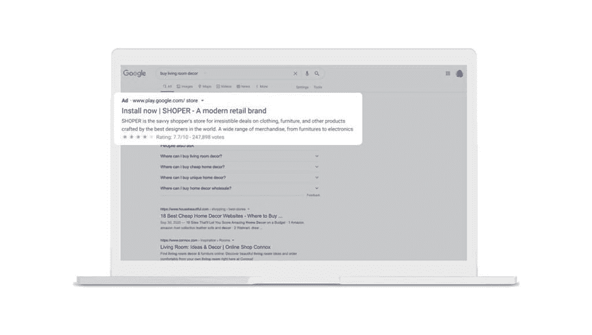

# 美国 36 个州起诉谷歌涉嫌垄断 Play Store

> 原文：<https://www.xda-developers.com/google-sued-play-store-monopoly/>

美国犹他州、纽约州、北卡罗来纳州和田纳西州正在牵头一项由美国其他 32 个州签署的诉讼，指控谷歌从事垄断行为，以维持通过谷歌 Play 商店购买的数字内容的安卓应用分发和支付处理的主导地位。

该诉讼于今天在美国加州北区地方法院提起，指控谷歌违反了谢尔曼法案第一和第二部分。原告州试图阻止谷歌在用户试图下载应用程序时施加“技术障碍或不准确的警告”，禁止原始设备制造商预载竞争应用程序商店，禁止开发者使用 Google Play 分发应用程序或帮助在谷歌 Play 商店以外分发应用程序的应用程序商店，以在 Google Play 上放置应用程序为条件访问谷歌应用程序活动， 从付钱给三星或其他原始设备制造商，让他们放弃与应用程序开发者的关系或缩减建立竞争应用程序商店的规模，到付钱给应用程序开发者，阻止他们提供 Google Play 之外的应用程序，等等。 完整的诉讼可以在这里[阅读](https://s3.documentcloud.org/documents/20985134/utah-v-google-complaint-redacted.pdf)，但是我们已经总结了下面提出的论点和证据，所以你不必读完全部 144 页(尽管我仍然建议你读完)。)

## 谷歌是否垄断了应用分发和支付处理？

鉴于 Android 允许用户下载应用程序，原始设备制造商能够预装他们自己的应用程序商店，谷歌是否垄断了 Android 应用程序分发仍有待讨论。然而，该诉讼指出(令人遗憾的是，经过编辑的)谷歌内部数据显示，支持侧装的用户数量和替代应用商店的市场覆盖面非常非常有限。例如，美国的谷歌 Play 商店分发了“美国超过 90%的安卓应用。没有一家竞争对手的安卓应用商店拥有超过 5%的市场份额。”因此，不参与谷歌 Play 商店的应用程序将无法访问美国大约 1.3 亿台 Android 设备，至于侧装，诉讼称谷歌设置了令人讨厌的障碍和警告信息，吓走了用户，使他们无法利用该功能。

此外，该诉讼认为，没有谷歌 Play 商店，Android 设备实际上就没有市场。由于 Android 是“移动设备制造商向美国消费者营销和销售其设备的唯一可行的操作系统”，谷歌“在市场上拥有持久的垄断力量，并对移动设备制造商和 Android 应用程序开发商具有相当大的影响力。”该诉讼提到，“即使是资源丰富的进入者，如微软和亚马逊，也未能”创造一个“可许可的移动操作系统”。Android 只是“名义上的开源”，因为谷歌认证的 Android 操作系统几乎支持所有当前的 Android 设备。事实上，截至 2020 年 7 月，“超过 99%”运行授权移动操作系统的手机都是由谷歌的安卓系统驱动的。

因此，该诉讼称，谷歌符合被视为受美国反垄断监管的垄断企业的标准。

## 谷歌涉嫌垄断如何伤害用户？

接下来，诉讼指出了美国 36 个州的消费者和应用程序开发者因谷歌涉嫌 Play Store 垄断而受到损害的几种方式。

根据该诉讼，消费者受到了伤害，因为他们不得不为应用程序和内容支付更多费用(谷歌的“超竞争委员会”，正如诉状所称)。他们还受到“支付处理商之间竞争的损失，这可能会提供低得多的佣金，以及增强的支付功能、客户服务和数据安全”的伤害。该诉讼指出，PayPal 和 T2 的 Braintree 的收费明显低于 Google Play 的收费。交易额的 2.9%外加固定的 30 美分。

与此同时，当“一些潜在消费者...放弃应用内购买，导致利润损失。”Google Play 计费进一步将应用程序开发人员从他们的客户中“去中介化”，阻止他们“在关键的客户互动上提供定制的客户服务，如支付历史和退款请求。”最后，谷歌 Play 商店和 Google Play 计费之间的强制联系“阻碍了开发者研究、开发和向市场推出创新的新应用，导致他们进一步损失利润，减少了消费者的创新和选择。”

## 谷歌是如何维持其所谓的垄断地位的？

诉讼的大部分内容列出了谷歌涉嫌参与的行为，以维持其在 Android 应用分发和 Play Store 支付处理方面的主导地位。

首先，每当用户从 Google Play 购买应用程序、数字内容或订阅服务时，谷歌都会获得高达 30%的资金，尽管对于收入低于 100 万美元的用户，这一比例最近被降至 15%。更成问题的是，据说该公司如何使用反竞争做法来“收集和维持这种奢侈的佣金”

投诉集中在“谷歌阻碍安卓应用分发和应用内购买竞争的五类反竞争行为。”诉状认为，如果没有这种行为，Android 应用内支付处理市场将出现“激烈竞争”，谷歌的“应用分销垄断可能会被打破。”

1.  首先，谷歌制造并强加障碍来“关闭安卓应用分发生态系统”。他们通过“对应用和应用商店的直接下载施加不必要的广泛限制”(即 sideloading)，利用与 Android 设备制造商的移动应用分发协议(MADAs)阻止他们修改操作系统以规避这些对侧装的限制，阻止竞争对手的应用商店在 Google Play 上分发，阻止非 Play 应用商店和应用在 YouTube 和 Google Search 上购买广告。应用活动仅适用于在 Google Play 上列出其应用的开发者。<picture></picture>

    一个谷歌应用活动，展示了谷歌 Play 商店上一款安卓应用的促销活动。

    T12
2.  第二，谷歌使用“胡萝卜加大棒的方法”来阻止来自唯一可能挑战其应用分发地位的实体(原始设备制造商和运营商)的竞争。胡萝卜是收入分成协议(RSA ),而大棒是迫使原始设备制造商预装谷歌 Play 商店(MADAs)的合同，防止它被卸载，并确保没有其他应用商店可以更突出地显示。有时，RSA 已经“彻底禁止”预加载竞争应用商店，OEM 或运营商品牌商店除外。
3.  第三，谷歌试图“收买三星”来限制来自 Galaxy 商店的竞争。除此之外，据报道，谷歌希望将 Galaxy 商店变成 Play 商店的“白色标签”，因为三星将使用 Google Play 的后端——包括 Google Play 计费——同时保留 Galaxy 商店的品牌。
4.  第四，据说谷歌推出了激励计划，与较大的应用程序开发者分享利润，以防止他们转移到竞争对手的商店或创建自己的商店。我们不知道这场诉讼到底是在谈论哪些激励计划，但这个概念并非闻所未闻。
5.  第五，谷歌要求所有应用内购买使用 Google Play 计费。

然后，该诉讼用具体的例子详细阐述了每一点。当谈到侧装时，诉讼认为谷歌对用户关于侧装的警告“严重夸大了风险”即使谷歌定期用 Play Protect 扫描应用程序，即使一个应用程序已经被成千上万的其他用户下载(并因此上传到 Play Protect 进行分析)，谷歌仍然警告用户不要下载应用程序，诉讼认为这是“误导和排斥性的”。该诉讼指出，谷歌是如何高调宣称 Android 是“安全的核心”,但仍然公开警告不要侧装。根据诉讼引用的 2018 年谷歌白皮书，由于 Play Protect，下载应用程序的风险可以忽略不计。白皮书发现，“只有 0.08%的专门使用 Google Play 的设备”和“0.68%的安装了 Google Play 以外应用的设备”上存在潜在有害应用(PHA)"

谷歌的“胡萝卜加大棒的方法”在诉讼中有更详细的定义。具体来说，希望预装谷歌移动服务(GMS)——一套包括谷歌 Play 商店的谷歌应用——的原始设备制造商必须签署一份反碎片化协议(AFA)，或者最近签署一份安卓兼容性承诺(ACC)。ACC 的第一个关键条款被修订，但第二个条款据称迫使原始设备制造商同意限制制造和销售运行 Android 分叉版本的设备。这意味着原始设备制造商不能销售谷歌授权的 Android 设备，也不能销售运行 Android 分叉版本的设备。据称，这些标准还要求原始设备制造商执行谷歌关于侧装的限制和警告。

一旦 OEM 签署了 AFA 或 ACC，他们就必须与谷歌签署移动应用分发协议(MADA ),迫使他们捆绑多个谷歌应用(多达 30 个),如果他们希望能够预载 Google Play 服务，该服务提供了许多应用所依赖的推送通知和位置服务等关键 API。诉讼称，由于许多应用依赖于 Google Play 服务，原始设备制造商不得不接受 MADA 的条件，即同时预装 Play Store，并防止其他应用商店占据主导地位，从而进一步巩固 Play Store 的统治地位。

与此同时，开发者必须签署一份[开发者分发协议](https://play.google.com/about/developer-distribution-agreement.html) (DDA)，防止他们在 Google Play 上分发应用程序，这些应用程序“[促进]在 Google Play 之外的 Android 设备上使用的软件应用程序和游戏的分发。”这一条款阻止了 Epic 在 Play Store 上发布其 [Epic 游戏商店应用](https://www.xda-developers.com/epic-games-launching-android-game-store/)。

有趣的是，诉讼指出了谷歌如何感受到三星与 Epic 合作将堡垒之夜带到 Galaxy 商店的威胁，因为三星也允许 Epic Games 应用程序分发其他应用程序。此外，一旦三星开始寻求与其他受欢迎的应用程序开发商达成“独家交易”，并“表明其意图”将 Galaxy Store 放在新设备的主屏幕上，谷歌就开始“先发制人”地消除不断增长的 Galaxy Store 的威胁。它发起了一项未命名的倡议，据称旨在巩固流行手机游戏对 Google Play 的依赖，并说服三星放弃其与 Galaxy Store 的合作。据报道，谷歌向三星提供了“无数的利益和让步”来阻止 Galaxy 商店的扩建。

虽然据说谷歌提供激励计划，与大型应用开发商分享利润，但这种努力似乎未能吸引大型音乐和视频流媒体服务。然而，从 2021 年 11 月开始，音乐和视频的订阅流媒体服务“要么必须服从谷歌的约束，要么拒绝消费者从他们的 Android 应用程序购买订阅。”这也适用于“订阅服务，包括求职、约会、健身和其他应用程序。”如果一个应用程序选择不遵从，它只能提供一个“仅流媒体”(非交易)版本的应用程序，甚至不能通知消费者他们可以在其他地方购买订阅或被引导到应用程序之外进行支付。这意味着像 Spotify 这样的服务(如果它走“仅流媒体”路线)将无法将免费音乐听众转化为付费用户。关于 Google Play 迫使更多应用程序使用 Google Play 计费的趣闻在去年就已披露，但关于“仅流媒体”条款的信息是该诉讼披露的新内容。

最后，该诉讼认为，即使面对应用程序分发的小幅涨价或质量下降，特定消费者也“极不可能”离开 Android 转而使用 iOS。这有多种原因，包括购买设备的巨额财务投资，无法访问购买的数字内容，以及无法访问存储在该设备或应用程序上的数据。当消费者在同一个生态系统中拥有多种设备(例如平板电脑、智能手表或智能家居设备)时，这种不愿意切换的情况会进一步加剧。许多美国人还根据设备分期付款计划支付设备，由于合同协议，很难离开。最后，设备运行什么操作系统只是消费者在选择新设备时考虑的众多因素之一。

## 谷歌的回应是什么？

在一篇简短的博客文章中，谷歌概述了它认为该诉讼没有法律依据的原因。首先，谷歌指出，由于 Android 操作系统是开源的，任何人都可以定制和构建带有 Android 操作系统的设备，尽管诉讼反驳说，Android 只是“名义上的开源”，因为必须发布 GMS，从而遵守谷歌的条款。谷歌继续表示，任何人都可以从竞争对手的应用商店或直接从开发者的网站下载应用，Android 不像某些竞争对手的移动操作系统(iOS)那样阻止侧装。

谷歌表示，该诉讼忽视了 Google Play 面临的来自苹果应用商店的竞争，而且移动应用商店的大部分收入都来自 iOS。该诉讼至少解决了前一点，提到了生态系统锁定、应用程序不兼容和其他因素如何意味着 Play Store 并没有真正与苹果应用商店竞争。

接下来，谷歌提到了设备制造商和运营商如何在 Google Play 的同时预装竞争对手的应用商店，以及亚马逊 Fire 平板电脑等受欢迎的 Android 设备甚至没有 Google Play。前者是一个争论点，看看谷歌如何据称对一加等原始设备制造商采取行动，因为他们试图预装 Epic Games 商店，以及据说该公司如何针对三星试图建立 Galaxy 商店。至于后一点，值得指出的是，诉讼提到了有多少应用程序已经依赖于 Google Play 服务，阻碍了应用程序支持其他应用程序商店。

谷歌接着谈到了应用开发者。首先，它指出，开发者可以与应用程序以外的客户沟通，了解竞争对手的应用程序商店中更低成本的产品或可用性。然而，值得注意的是，开发者不能在应用程序内或 Play Store 列表中进行交流，这实际上使大多数用户看不到这些选项。接下来，谷歌表示，Play Store 不会抑制开发者的成长能力；截至 2020 年 2 月，开发者通过 Google Play 获得了超过 800 亿美元的收入，Android 应用经济和 Google Play 帮助创造了近 200 万个美国就业岗位。这起诉讼并没有真正量化谷歌所谓的垄断给用户和应用开发者带来了多大的伤害，所以谷歌在这一点上是有道理的。

谷歌继续提到它如何投资资源来构建应用程序，降低成本和发展业务，包括制作工具来帮助开发人员减轻测试负担，进行 beta 测试，并大规模监控他们的应用程序。谷歌还指出了它在安全方面的投资；Google Play Protect 每天扫描超过 1000 亿个应用程序，并在 2019 年阻止了 19 亿次恶意软件安装。然而，诉讼确实提到了谷歌一名高管如何在内部承认 Google Play 计费的劣质性，但由于细节被编辑，尚不清楚该声明是何时发表的。该诉讼还指出，谷歌的安全声明与他们对侧装危险的警告是多么不一致。

谷歌的博客文章接下来谈到了它的支付处理服务。该公司指出，在 Google Play 上只有 3%的开发者销售数字产品或内容，他们需要支付前 100 万美元的 15%的累进服务费，然后是 100 万美元以上的 30%。此外，谷歌表示，这起诉讼只是“代表那 0.1%的开发者”，他们需要支付 30%的服务费(即..年收入超过 100 万美元的公司。)“这场诉讼不是为了帮助小人物，也不是为了保护消费者。谷歌在其博客帖子中表示:“这是为了促进少数几个主要应用程序开发商的发展，他们希望免费享受 Google Play 的好处。

最后，谷歌提到，这起诉讼没有提到许多其他应用商店也收取类似的费用，集中计费系统可以保护消费者免受欺诈，并让他们在一个地方轻松跟踪购买情况。