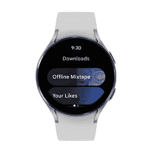

# 谷歌重新设计的 Wear OS 3 应用首次出现在 Galaxy Watch 4 上

> 原文：<https://www.xda-developers.com/google-wear-os-3-apps/>

今天在其 Galaxy Unpacked 活动上，三星发布了 [Galaxy Watch 4](https://www.xda-developers.com/samsung-galaxy-watch-4/) 和 Watch 4 Classic，这是首款运行 Wear OS 3 的智能手表，Wear OS 3 是三星和谷歌共同开发的 Wear OS 的新版本。为了配合三星新硬件的发布，谷歌今天发布了在 Galaxy Watch 4 系列上首次亮相的智能手表应用程序的更新版本。

回到 5 月份的谷歌 I/O 开发者大会，该公司[宣布](https://www.xda-developers.com/samsung-and-google-just-are-rebuilding-wear-os-to-challenge-the-apple-watch/)已经与三星合作，从头开始重建 Wear OS——基于 Android 的智能手表操作系统。新的操作系统结合了三星智能手表 Tizen OS 和谷歌 Wear OS 的最佳功能，形成了一个“统一的智能手表平台”。新操作系统的官方名称是 Wear OS 3，它首次出现在三星的 Galaxy Watch 4 系列上，但最终将通过对一些现有智能手表的更新在[推出。不过，Galaxy Watch 4 系列没有运行 stock Wear OS 3，这就是为什么它们的操作系统被官方称为“三星支持的 Wear OS”。此外，智能手表还在操作系统上配备了一个名为“](https://www.xda-developers.com/will-my-smartwatch-get-wear-os-3/) [One UI Watch](https://www.xda-developers.com/one-ui-watch-samsung-new-os-smartwatches/) 的定制界面，但值得注意的是，这两款智能手表仍然运行着一些当前和未来智能手表将运行的相同的底层操作系统。

这就是为什么谷歌今天的声明恰逢三星新产品的发布 Galaxy Watch 4 是谷歌更新软件的英雄设备。在其博客文章中，谷歌强调了 Galaxy Watch 4 系列上首次亮相的五种新的 Wear OS 3 体验。其中包括更新版本的谷歌地图、谷歌消息和谷歌支付；YouTube 音乐应用的发布；以及对多个流行的第三方应用程序的更新，这些应用程序支持 Tiles API。

## 谷歌用你的素材刷新其智能手表应用

谷歌地图、谷歌消息和谷歌支付的智能手表版本已经存在，但它们正在涂上一层新的油漆，以匹配 Wear OS 3 中[系统的新 UI 设计](https://www.xda-developers.com/new-wear-os-update-hands-on/)。这些应用程序的重新设计版本遵循了谷歌为智能手表设计的 [Material You](https://www.xda-developers.com/material-you/) 语言。

像以前一样，谷歌地图应用程序支持从你的手机向你的手表发送路线指引，与你手机上的地图应用程序同步，并将显示你的家庭和工作地址以及你最近的搜索，以便于访问。同样，谷歌应用程序的 Messages 可以让你在不需要拿出手机的情况下发送和接收信息，它还可以同步手机和手表之间的对话。Google Pay 也没有任何新功能，不过更新后的版本通过加大你存储的信用卡的尺寸，让刷信用卡变得更加容易。

这三款应用都可以从你的手表或手机上的 Google Play [下载，不过如果你住在美国、韩国或日本以外的地方，Messages 应用会预装在 Galaxy Watch 4 上。尽管 Google Pay 的可用性仍然有限，但几乎每个国家都可以使用信息和地图应用。然而，谷歌正在将支付支持扩展到 16 个新的国家，包括比利时、巴西、智利、克罗地亚、捷克共和国、丹麦、芬兰、香港、爱尔兰、新西兰、挪威、斯洛伐克、瑞典、台湾、乌克兰和阿拉伯联合酋长国。](https://www.xda-developers.com/google-play-redesign-wear-os-remote-install/)

## YouTube 音乐来穿 OS...最后

当谷歌去年关闭 Play Music 时，他们还没有准备好 YouTube Music 的智能手表应用程序——谷歌 Play Music 的替代品。在今年的 I/O 大会上，谷歌证实[计划在 Wear OS 上推出一款 YouTube 音乐应用](https://www.xda-developers.com/google-youtube-music-app-wear-os/)，它终于来了。

YouTube Music for Wear OS 是一款独立的智能手表应用程序，允许 YouTube Music Premium 订户下载音乐以供离线收听。该应用程序带有“智能下载”功能，当手表充电并连接到 Wi-Fi 时，它会刷新你下载到手表的歌曲。该应用程序没有预装在 Galaxy Watch 4 系列上，但可以从 Google Play 下载。

 <picture></picture> 

YouTube Music

## 第三方应用现在有磁贴

磁贴本质上相当于 Wear OS 的小工具，尽管由于主屏幕空间有限，它们可以通过从右侧滑动来访问。自 2019 年年中以来， [Tiles 功能](https://www.xda-developers.com/google-wear-os-tiles-feature/)一直由谷歌和原始设备制造商的平台应用独占，但今年早些时候，当谷歌[为第三方开发者发布 Tiles 库](https://www.xda-developers.com/wear-os-third-party-custom-tiles/)时，这种情况发生了变化。今天，谷歌强调了许多受欢迎的第三方 Wear OS 应用程序的更新，包括 Calm、Komoot、MyFitnessPal、Period Tracker、Sleep Cycle、Spotify 和 Strava。从今天开始，这些第三方应用程序中的许多都将更新为支持 Tiles API。

在另一篇博客文章中，谷歌表示，开发者可以通过下载 [Jetpack Tiles API](https://developer.android.com/jetpack/androidx/releases/wear-tiles) 的 Alpha 版本来创建一个定制的磁贴。完成后，他们可以将更新后的应用程序上传到 Google Play，让用户开始看到这些磁贴。他们还可以附上一张截图，显示他们的应用程序在 Play Console 中的磁贴。

## 现有的 Wear OS 2 智能手表会有什么变化？

谷歌表示，现有的运行 Wear OS 2 的智能手表也将支持谷歌新版本的 Messages，Google Pay 中扩大的国家可用性，以及未来几周第三方开发者的更新应用，但谷歌的帖子遗憾地没有提到支持新的谷歌地图版本或 YouTube 音乐推出到现有的智能手表。