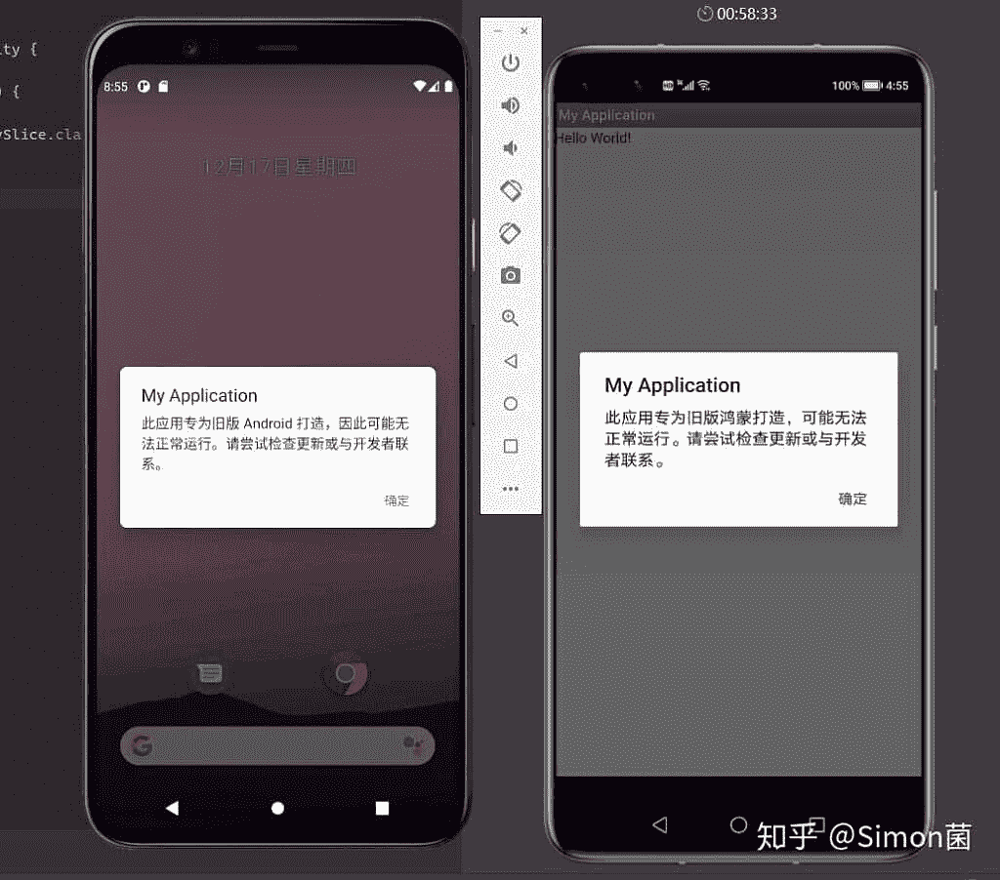

# 华为的鸿蒙系统 2.0 测试版似乎基于安卓系统

> 原文：<https://www.xda-developers.com/harmony-os-2-0-initial-version-based-on-android/>

**更新 1 (02/02/2021 @ 03:18 PM ET):** 一份详尽的报告概述了华为的鸿蒙系统 2.0 测试版与 Android 有多么相似。[点击这里了解更多信息。](#update1)文章发表于 2020 年 12 月 26 日，下面保留。

鸿蒙系统是华为自己的第一方操作系统，旨在接管该公司的控制权，因为该公司目前的无 GMS 安卓软件被证明不足以推动该公司的智能手机前景。华为最近开始了远离无 less Android 的长期转型，推出了针对特定智能手机和平板电脑的第一个鸿蒙系统 2.0 测试版。尽管一个独立的操作系统听起来对整个移动生态系统来说，脱离苹果 iOS 和谷歌 Android 的双头垄断是一件好事，但鸿蒙系统 2.0 的首次发布似乎仍然是基于 Android 的。

[一名开发人员](https://www.bilibili.com/video/av585643478)开发了一个简单的“Hello World”应用程序，目标是旧版本的 Android——特别是 kit kat 4 . 4 . 4——发现该应用程序在 Android 和鸿蒙系统的虚拟设备上抛出了一个*非常*相似的错误信息。

 <picture></picture> 

Left: An Android virtual device in Android Studio running a "Hello World" app. Right: A Harmony OS virtual device in DevEco Studio running the same app.

左边的截图显示了安装在基于较新 Android 版本的虚拟设备上的应用程序，基本上抛出了一个错误，即该应用程序是为旧版本的 Android 构建的，可能无法在新版本上正常工作。右边的截图显示了安装在基于鸿蒙系统 2.0 测试版的虚拟设备上的应用程序，错误信息几乎相同，不同之处只是简单地将“安卓”替换为“鸿蒙系统”。

XDA 资深成员 [hikari_calyx](https://forum.xda-developers.com/m/hikari_calyx.7601808/) ，以解锁诺基亚手机的引导程序而闻名，编译并安装了著名的[超级用户应用](https://github.com/koush/Superuser)到鸿蒙系统 2.0 测试版虚拟设备上。事情是这样的:

此外，您可以使用 ADB (Android Debug Bridge)将指令传递给 HOS 虚拟设备。在这样做的过程中，一名开发人员设法从虚拟设备中提取了大部分系统分区，揭示了构建包含 Android 框架。

所有这些给出了一个有趣的结论:鸿蒙系统 2.0 的第一个测试版显然仍然基于 Android。

现在，这里有一些解释。有人可能会认为鸿蒙系统 2.0 只是 Android 的一个更名，并打算保持这种状态，但我们认为，虽然这可能是正确的，但不会永远如此。根据之前的演示，华为确实提到了使用 AOSP 将作为建立其期望的鸿蒙系统体验的过渡步骤，本质上是一种弥合用户和应用开发者之间差距的方式。利用现有的 AppGallery 和 HMS 生态系统带来了动力，因此这样的过渡步骤正是鸿蒙系统全速上路所需要的。

我们也可能是错误的，因为这个版本比我们所知道的有更多的细微差别。华为发布鸿蒙系统 2.0 测试版的新闻稿没有提到 Android 或 AOSP，但我们无法阅读所有文档或观看华为上传的所有开发者视频，因为它们都是普通话。我们已经联系了华为进行评论，如果收到他们的回复，我们会更新这篇文章。

* * *

## 更新 1:鸿蒙系统和安卓之间“没有明显的区别”

虽然我们对鸿蒙系统是否仅仅是安卓的调查还没有定论，但是 [*ArsTechnica*](https://arstechnica.com/gadgets/2021/02/harmonyos-hands-on-huaweis-android-killer-is-just-android/?comments=1&start=120) 得出了一个更有说服力的答案。在一份详细的报告中，该出版物表示，“华为的‘全新’操作系统和安卓系统之间没有明显的区别。”正如我们之前提到的，华为没有让我们轻松访问鸿蒙系统 2.0 测试版。该模拟器在华为的服务器上运行，只有华为批准的开发人员才能访问，所有文档都是中文的。此外，华为的注册流程要求您披露一些敏感的个人信息(公平地说，这可能是由于中国对国际业务的规定)，因此我们在撰写原始报告时，不得不依赖中国开发商的第三方账户和不完整的固件转储。 *ArsTechnica* 的罗恩·阿玛迪奥突破了这些障碍，近距离观察了鸿蒙系统，让他得出结论，这个操作系统本质上只是引擎盖下的 Android。

ArsTechnica 强调了鸿蒙系统 2.0 界面与华为的 EMUI Android 皮肤有多么相似，华为称这只是因为他们将 EMUI 的外观和感觉移植到了鸿蒙系统。然而，在引擎盖下，有许多 Android 系统组件，包括“鸿蒙系统系统”应用程序。这款应用被标为“版本 10”，很可能是指 Android 10，T2 ArsTechnica 声称华为的操作系统实际上是基于 Android 的版本。用华为的 SDK 构建的示例应用程序应该与 Android APK 文件相似，因为它们可以像 ZIP 文件一样解压缩，具有相似的内部结构，并且可以用标准的 Android 反编译工具解码。该出版物进一步指出，与谷歌的 Fuchsia 或三星的 Tizen 等其他正在开发的操作系统相比，测试版的功能似乎更加完善。即使在“对鸿蒙系统进行了数小时的调查”之后， *ArsTechnica* 也无法“指出与 Android 相比有任何实质性的变化” *Ars* 声称，如果华为的计划是从“安卓”转变为“非安卓”，那么考虑到他们计划[在今年晚些时候与鸿蒙系统合作推出一款手机](https://www.xda-developers.com/huawei-harmony-os-smartphones-expected-beta-sdk-late-2020/)，他们怎么会有足够的时间来完成这些呢？

由于谷歌拥有 Android 的商标，所以在鸿蒙系统没有一处提及它也就不足为奇了，但是 Ars 指出在任何官方开发者文档中没有提及 Android 是多么奇怪。正如我们注意到的，文档并没有透露太多关于操作系统基础的信息。事实上，它提出的问题比它回答的更多。

华为实际上实现了从基于 Android 的 EMUI 到鸿蒙系统的近乎无缝的迁移，而我们仅仅触及了表面，这有可能吗？当然，这是可能的。在本文最初发表之前，我们曾联系过华为，但我们没有收到任何关于鸿蒙系统 2.0 的架构、内核、ARK 编译器或 Android 运行时如何融入其中的具体细节。一些用户[在我们的评论](https://www.xda-developers.com/harmony-os-2-0-initial-version-based-on-android/#comment-5202130132)中对鸿蒙系统 2.0 的“安卓性”给出了可能的解释，但我们还没有看到证实这一点的文档或代码。