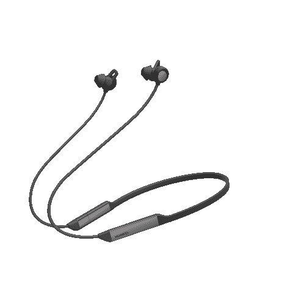

# 华为 FreeLace Pro 是 FreeBuds Pro 的绝佳替代品

> 原文：<https://www.xda-developers.com/huawei-freelace-pro-review/>

华为 FreeLace Pro 在 HDC 2020 上与一系列其他华为产品一起发布。我很喜欢在那次活动中发布的华为 FreeBuds Pro，并将其评为[我用过的最好的 TWS 耳机](https://www.xda-developers.com/huawei-freebuds-pro-review/)。几周前，华为非常友好地给我们寄来了一双 FreeLace Pro 供我们评测，它们听起来一样好。FreeLace Pro 和 FreeBuds Pro 都提供 40dB 主动噪音消除功能。在欧洲，€119 的起价比 FreeBuds Pro 便宜得多。

*关于本次评审:我们在 11 月中旬收到了来自华为英国的华为 FreeLace Pro 进行评审。华为对此次评估的内容没有意见。*

* * *

## 规格概述

华为 FreeLace Pro 在很多方面与华为 FreeBuds Pro 非常相似；但是顾名思义，免费的 Lace Pro 采用了领口设计，而免费的 T2 Buds Pro 则是真正的无线耳塞。有趣的是，它们并没有封装相同的芯片组。事实上，华为还没有说明这里使用的是什么芯片组，所以不太可能是麒麟 A1，它不仅已经进入了 FreeBuds Pro，还进入了华为最新的可穿戴设备。有蓝牙 5.0(这里没有蓝牙 5.2)，一个可以插到手机上的 USB-C 充电接口，每个耳机都配有 14.2mm 的驱动。FreeBuds Pro 实际上只有一个 11 毫米的驱动器，更大的驱动器通常意味着更多的低音。不过驱动设计其实比尺寸更重要，这也是为什么 FreeBuds Pro 虽然尺寸更小却能取得类似的成绩。

FreeLace Pro 采用颈带设计，也就是说，它们环绕在你的脖子上，颈带本身设计成坐在你的肩膀上。它们轻便舒适，让人忘记它们就在那里，这是一个设计意图，因为它们更适合那些想要一副无线耳机用于跑步或其他体育活动的人。与真正的无线耳机相比，这些耳机不太可能掉落在地上，而且耳塞本身比 FreeBuds Pro 中的任何其他耳塞都更舒适。

颈部带的右侧是按钮控制，而左侧是 USB-C 连接器，可以用来给耳机充电。您可以通过任何 USB-C 端口为耳机充电，包括您的智能手机。事实上，将耳机连接到华为或 Honor 设备会自动将其与该设备配对。它们从你的智能手机上充电相对较快，尽管我发现集成的 Type-C 连接器非常方便，也非常不方便。如果你想在外出时给耳机充电，这非常简单。事实上，华为表示，智能手机充电 5 分钟，可以播放 5 小时。当你想在其他地方充电时，问题就来了，因为你需要在另一个设备上找到一个 USB-C 端口。盒子里有一个附带的 USB-C 到 USB-A 适配器，这样你就可以在任何普通的 USB 端口上为它们充电，但为了方便起见，需要额外携带一根电缆。就我个人而言，这没什么大不了的，但我能理解这可能会让一些人望而却步。

在 USB-C 端口的同一侧是控件。它们发出咔嗒声，有触觉，尽管它们可能有点笨拙，因为它们的感觉都一样。双击电源按钮也可以连接到之前连接的设备。

如果有的话，我对 Huwaei FreeLace Pro 最大的不满是缺乏自动播放检测。当你把耳机从耳朵上拿下来再放回去时，它们不会自动暂停音频并再次播放，而是会继续播放，直到你把两个耳塞磁性地重新连接在一起。同样，要打开和关闭 ANC，或启用透明模式，您只需在左耳机戴在耳朵上时按住它，即可在三种模式之间循环。

* * *

## 设计和舒适度

华为 FreeBuds Pro 的设计很有趣，因为耳机本身比我见过的其他无线耳机更突出。我有的是深绿色的，老实说，我不太喜欢这种颜色。除了个人喜好，每个颈带末端闪亮的金属是一个很好的触摸，正如已经提到的，颈带佩戴起来非常舒适。很容易忘记你戴着它，耳机本身长时间戴在耳朵里很舒服，不用担心让你的耳朵不舒服。它们是非常独特的设计，我不在乎，但我知道很多人都在乎。盒子里还有其他类型的提示，所以如果预装的不适合你的耳朵，你可以混合搭配来找到适合你的。

* * *

## 华为 free lace Pro–音频质量，主动降噪

这是任何音频评论中最重要的部分，很多内容都会重复我在 FreeBuds Pro 评论中提到的观点。对于€119 无线耳机来说，这是非常棒的。你得不到真正无线的便利或麒麟 A1 的好处，这就是为什么这些更便宜，但华为肯定没有在音频质量上吝啬。正如我一直说的，一副昂贵的无线耳机很可能会被任何一副像样的有线耳机所取代。还记得我说过车手大小不重要吗？这并不完全正确，因为一个*大得多的*驱动程序(如我的索尼 WH-1000XM3 中的 40 毫米驱动程序)将会把任何小得多的东西撞出公园。当我们在几毫米的范围内时，驱动程序*的设计*当然更重要。

华为 FreeLace Pro 是一对非常豪华的无线耳机，正如无线耳机的情况一样，它们有一个特殊的用例。你是否在旅途中听了很多音乐，你是否足够活跃，以至于真正的无线耳机会变得令人讨厌？华为 FreeLace Pro 将留在你的耳朵里，它们在所有情况下听起来都非常好。这些耳机足以满足日常使用，但是，当我回家时，我会立即换回我的索尼无线耳机。这并不是对 FreeLace Pro 的轻视——这只是为了让你了解耳机和耳塞之间的效用差异。

舒适度、噪音消除和音频质量都非常出色。如果你想看看我在测试华为 FreeLace Pro 时一直在听的播放列表，你可以在这里查看。像*郊区*和*指挥家*这样的歌曲听起来一如既往的好听，低音强劲却干净利落。总的来说，我是这些音频的忠实粉丝。

就像 FreeBuds Pro 一样，ANC 是辉煌的，但无论好坏都是一样的体验。对于初学者来说，它在消除周围声音的方式上有些激进。如果你不熟悉 ANC，它基本上是一种分析你周围声音的技术，然后创建一种“反向”声音，抵消麦克风检测到的声波。当我在火车或汽车上时，当它试图抵消音频时，它会变得非常暴力，结果音频会“抖动”。我通常将噪声消除设置为“动态”，让耳机决定哪个 ANC 选项效果最好。我发现，在火车或汽车等情况下，将它从动态改为“舒适”很好，并消除了大部分(但不是全部)的抖动。除此之外，我真的没有注意到不同 ANC 模式之间的任何差异。

不过音频编解码器和硬件一样重要，在 Android 和 Windows 上，华为 FreeBuds Pro 将默认使用 SBC 音频编解码器进行流媒体播放。虽然我能够在手机的蓝牙设置中将编解码器切换到 AAC，但较低的质量还是很明显的。不过，在 Windows 上，你无法切换到 AAC。

* * *

## 华为 FreeLace Pro 的电池续航时间

华为表示，一次充电后，FreeLace Pro 应该可以持续播放大约 22 小时的音乐。这显然会因 ANC 是开还是关而不同，也会因您正在播放的媒体的音量而不同。这个音乐播放的额定时间是在 ANC 关闭**的情况下**的，随着它的开启，从我的测试来看，你仍然可以看到大约 12-14 小时的播放时间。这大约是额定电池寿命的一半，但它仍然足以让你度过一天，特别是当你可以从智能手机上快速充电时。如果有的话，电池寿命在这里更不重要，因为你可以在必要时快速充电。USB C 端口现在在智能手机上很常见，所以你不会花太多时间离开你的音乐。

* * *

## 结论-华为 FreeLace Pro 是非常棒的无线耳机

正如我所料，华为 FreeLace Pro 与真正的无线产品一样好。当然，你失去了一套真正无线耳机的一些便利，但华为以更便宜的价格和有用的功能弥补了这一点。在 90%的时间里，几乎可以在任何地方用智能手机充电是非常有用的，与 FreeBuds Pro 上短得多的 3-4 小时相比，电池寿命非常出色。华为 FreeLace Pro 的出色给我留下了深刻的印象，对于€119 来说，它们是任何不想真正无线化的人的绝佳选择。

 <picture></picture> 

Huawei FreeLace Pro

##### 华为 FreeLace Pro

华为 FreeLace Pro 是一套出色的无线耳机，具有主动降噪功能和舒适但实用的设计。