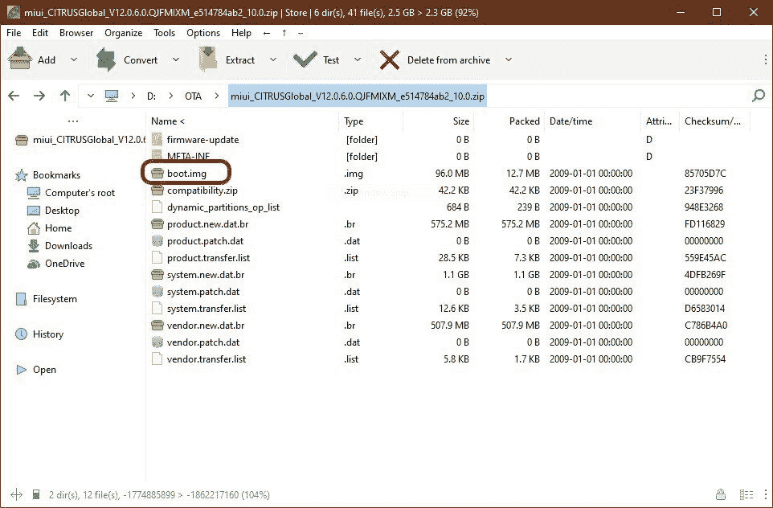
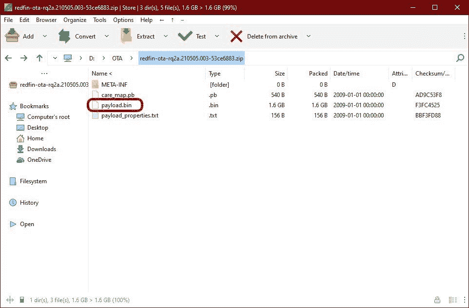
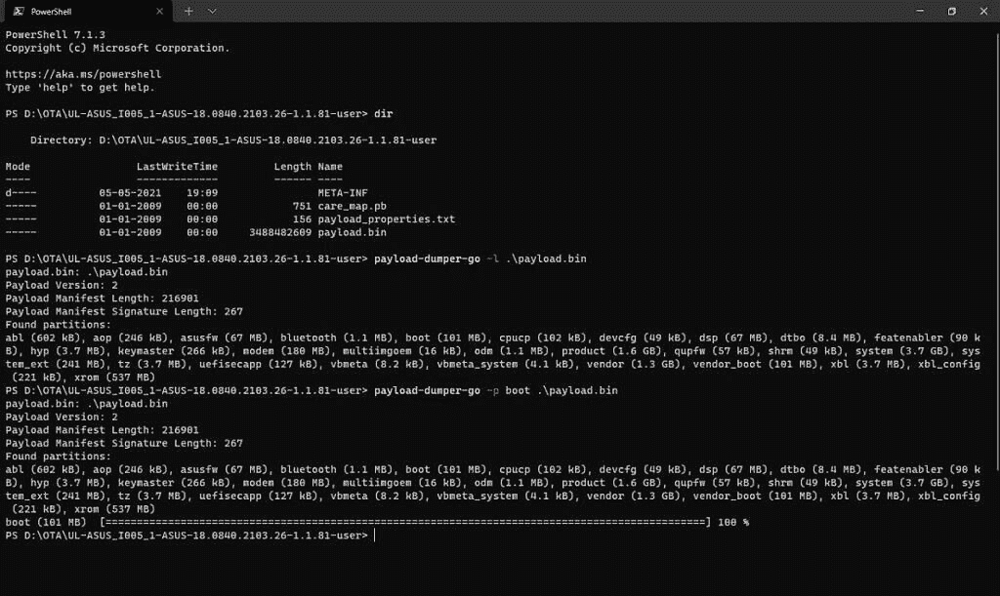
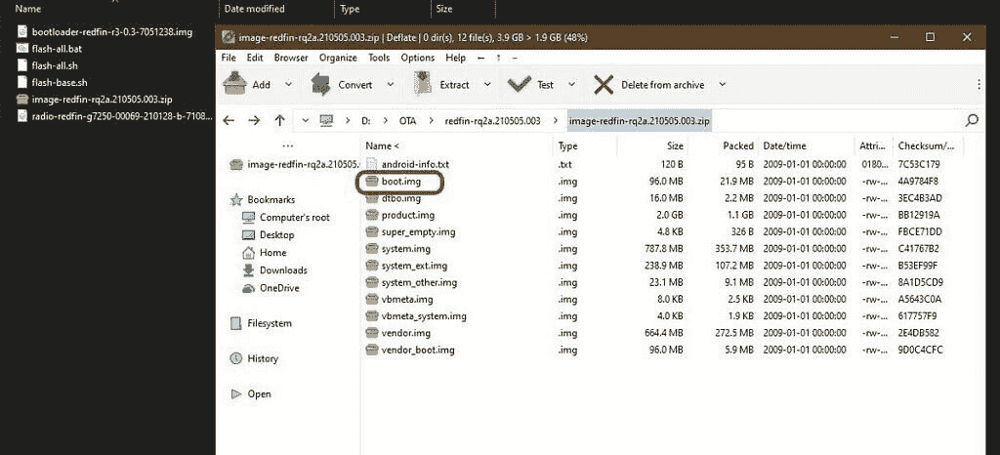

# 如何扎根你的安卓智能手机:谷歌、一加、三星、小米等等

> 原文：<https://www.xda-developers.com/i-am-groot/>

如果你不能想象在没有 root 权限的情况下使用 Android，那么你来对地方了。在这里，你可以在 XDA 论坛上找到大多数设备的根教程。了解如何对任何 Android 设备进行 root，包括[最佳 Android 手机](https://www.xda-developers.com/best-android-phones/)！如果你没有看到你的设备列表，或者你看到一个错误的链接，给作者发一条消息(论坛上的[斯坎达](https://forum.xda-developers.com/m/skandah.5301049/))告诉他设备的详细信息。

## 什么是根？

对于那些刚接触根的人来说，获得根访问权限实质上是授予您更高的权限。通过 root 访问，您可以更改或替换系统应用程序和设置，运行需要管理员级别权限的专门应用程序，或者执行普通 Android 用户无法访问的其他操作。通过代理，您还可以访问某些“隐藏”的设备功能或以新的方式使用现有功能，例如通过[暴露模块](https://www.xda-developers.com/best-xposed-modules/)或 [Magisk 模块](https://www.xda-developers.com/best-magisk-modules/)。

**免责声明:**对设备进行 root 可能会导致设备保修无效。这也可能使设备不稳定，或者如果处理不当，可能会完全阻塞设备。XDA 或作者对您的设备不承担任何责任。根在你自己的风险，只有当你明白你在做什么！

## 如何对一款流行的安卓智能手机进行 root

我们可以继续谈论 root 访问*的优点，但我们现在会停下来，因为我们可以感觉到你对 root 访问的前景以及一旦获得 root 后你可以用你的设备做什么垂涎三尺。前往以下部分开始旅程。您应该可以从下面的每个主要 OEM 找到针对最新旗舰机型的设备特定的根指南。*

### 华硕

对于其他华硕设备，请查看我们论坛的[华硕部分](https://forum.xda-developers.com/c/asus.12032/)。你应该可以在设备分论坛中找到类似的微调指南。你也可以遵循本教程中的通用生根指南。

### Fairphone

| 

没有。

 | 

设备

 | 

代号和设备论坛

 | 

根导轨

 |
| --- | --- | --- | --- |
| 1. | 公平电话 4 | [fp4](https://forum.xda-developers.com/f/fairphone.2756/) | [点击这里](https://forum.xda-developers.com/t/4376421/) |

对于其他微软 Surface 设备，请查看我们论坛的 [Fairphone 部分](https://forum.xda-developers.com/c/fairphone.12401/)。你应该可以在设备分论坛中找到类似的微调指南。你也可以遵循本教程中的通用生根指南。

### 谷歌

对于其他谷歌设备，请查看我们论坛的[谷歌版块](https://forum.xda-developers.com/c/google.11976/)。你应该可以在设备分论坛中找到类似的微调指南。你也可以遵循本教程中的通用生根指南。

### 微软

| 

没有。

 | 

设备

 | 

代号和设备论坛

 | 

根导轨

 |
| --- | --- | --- | --- |
| 1. | 微软 Surface Duo | [ε](https://forum.xda-developers.com/c/microsoft-surface-duo.9341/) | [点击这里](https://forum.xda-developers.com/t/4393369/) |

对于其他微软 Surface 设备，请查看我们论坛的[微软版块](https://forum.xda-developers.com/c/microsoft.11982/)。你应该可以在设备分论坛中找到类似的微调指南。你也可以遵循本教程中的通用生根指南。

### 摩托罗拉

对于其他摩托罗拉设备，请查看我们论坛的[摩托罗拉部分](https://forum.xda-developers.com/c/motorola.11990/)。你应该可以在设备分论坛中找到类似的微调指南。你也可以遵循本教程中的通用生根指南。

### 诺基亚（总部设在芬兰）

对于其他诺基亚设备，请查看我们论坛的[诺基亚部分](https://forum.xda-developers.com/c/nokia.12020/)。你应该可以在设备分论坛中找到类似的微调指南。你也可以遵循本教程中的通用生根指南。

### 没有任何东西

| 

没有。

 | 

设备

 | 

代号和设备论坛

 | 

根导轨

 |
| --- | --- | --- | --- |
| 1. | 无电话 1 | [太空战](https://forum.xda-developers.com/f/nothing-phone-1.12585/) | [点击这里](https://www.xda-developers.com/how-to-bootloader-unlock-root-magisk-nothing-phone-1/) |

你也可以遵循本教程中的通用生根指南。

### 英伟达

| 

没有。

 | 

设备

 | 

代号和设备论坛

 | 

根导轨

 |
| --- | --- | --- | --- |
| 1. | Nvidia Shield TV & Shield TV Pro 2019 | [mdarcy](https://forum.xda-developers.com/c/nvidia-shield-tv-shield-tv-pro-2019.9577/) | [点击这里](https://forum.xda-developers.com/t/4524873/) |

对于其他 Nvidia 设备，请查看我们论坛的 Nvidia 部分。你应该可以在设备分论坛中找到类似的微调指南。你也可以遵循本教程中的通用生根指南。

### 一加

对于其他一加设备，请查看我们论坛的[一加部分](https://forum.xda-developers.com/c/oneplus.11993/)。你应该可以在设备分论坛中找到类似的微调指南。你也可以遵循本教程中的通用生根指南。

### 真我

对于其他 Realme 设备，请查看我们论坛的 [Realme 部分](https://forum.xda-developers.com/c/realme.12009/)。你应该可以在设备分论坛中找到类似的微调指南。你也可以遵循本教程中的通用生根指南。

### 三星电子

对于其他三星设备，请查看我们论坛的[三星部分](https://forum.xda-developers.com/c/samsung.11975/)。你应该可以在设备分论坛中找到类似的微调指南。你也可以遵循本教程中的通用生根指南。

### 索尼

对于其他索尼 Xperia 设备，请查看我们论坛的[索尼部分](https://forum.xda-developers.com/c/sony.12026/)。你应该可以在设备分论坛中找到类似的微调指南。你也可以遵循本教程中的通用生根指南。

### 小米

对于其他 Mi、Redmi 和 Poco 品牌的设备，请查看我们论坛的[小米版块](https://forum.xda-developers.com/c/xiaomi.12005/)。你应该可以在设备分论坛中找到类似的微调指南。你也可以遵循本教程中的通用生根指南。

## 如何对任何 Android 设备进行 root

如今， [Magisk](https://www.xda-developers.com/how-to-install-magisk/) 是事实上的根解决方案，通过保持系统分区不变并修改引导分区，您可以获得根访问权限。这就是它被称为“无系统”根方法的原因。

在开始使用 Magisk 之前，请确保:

*   您可以访问安装了 [adb 和 fast boot](https://www.xda-developers.com/install-adb-windows-macos-linux/)的 PC/Mac。
*   目标 Android 设备的引导加载程序已解锁。
    *   对于三星设备，解锁引导加载程序会使 KNOX 跳闸。

### 步骤 1:识别启动映像包的类型

从项目的 GitHub 库下载最新版本的 Magisk 应用[。由于 Magisk 的 APK 位于谷歌 Play 商店之外，你可能需要先允许从未知来源下载应用程序，然后](https://github.com/topjohnwu/Magisk/releases/latest)[手动安装下载的软件包](https://www.xda-developers.com/sideload-apps-how-to/)。

安装后，打开 Magisk 应用程序。您应该会看到这样的屏幕:

现在，我们需要记下以下参数的值:

### 步骤 2:定位启动映像包

为了给你的设备打补丁，你需要从官方的固件包中提取它。如果你使用的是像 [LineageOS](https://www.xda-developers.com/five-reasons-xda-loves-lineageos/) 这样的定制 ROM，那么闪存 ZIP 文件包含启动映像。

**案例 1:您可以访问可恢复闪存 ZIP 文件**

如果您的设备仍然使用 A-only 分区方案，那么您可以在可恢复的 flash ZIP 文件中找到 boot.img。只需使用合适的归档程序提取它。

 <picture></picture> 

Notice the boot.img file inside POCO M3's recovery ZIP

但是，如果您的设备使用 A/B 分区方案，那么引导映像和其他分区映像会进一步打包在名为 *payload.bin* 的文件中，如下所示。

 <picture></picture> 

The recovery ZIP of the Google Pixel 5 contains a payload.bin file

在这种情况下，您必须首先提取 payload.bin 文件，然后使用一个社区开发的 payload.bin 解包器从其中取出 boot.img。我们强烈建议您选择用 Go 编写的[提取器，因为它是跨平台的，并且已经由](https://forum.xda-developers.com/t/tool-a-quick-android-ota-payload-dumper.4173271/)[积极开发](https://github.com/ssut/payload-dumper-go)。

这个分支被称为“payload-dumper-go ”,它甚至允许最终用户提取单个分区映像，而无需打开整个 payload.bin，这对于这个使用场景特别有用。

 <picture></picture> 

Extracting the boot.img of the ASUS ROG Phone 5 from its payload.bin

**案例 2:您可以访问快速启动可闪存映像**

谷歌和小米等少数原始设备制造商为他们的设备提供快速启动可刷新的工厂图像。如果您设法获得了这样一个包，那么可以很容易地从归档文件中提取出原始的 boot.img。

 <picture></picture> 

The location of the boot.img inside the Google Pixel 5's Fastboot firmware

**特例:三星**

三星 Galaxy 设备没有传统的快速启动接口，因此它们的出厂映像打包方式不同。

*   使用[三星固件下载器](https://www.xda-developers.com/download-samsung-software-updates-samsung-firmware-downloader/)为您的型号下载出厂映像。
*   解压缩解密的包，并在您的设备上找到 AP tar 文件。它通常被命名为 AP _[设备型号软件版本].tar.md5。

### 步骤 3:修补启动映像包

现在我们已经有了启动映像，我们应该继续打补丁了。

**情况 1:参数“Ramdisk”的值为“Yes”**

*   将启动映像复制到您的设备。事实上，您可以在不同于目标设备的其他 Android 设备上对其进行修补，但您也需要在辅助设备上安装 Magisk 应用程序。
*   按下 Magisk 卡中的*安装*按钮。
*   选择*在*方法*中选择并修补一个文件*，选择股票引导镜像。

*   Magisk 应用程序会将映像修补到**[内部存储]/Download/Magisk _ patched _[random _ strings]。img** 。

请记住，可以通过像 TWRP 这样的自定义恢复，在具有 boot ramdisk 的传统设备上动态修补启动映像，但在现代设备上不再推荐这种方法。话虽如此，如果你有一部旧手机，并想坚持定制回收路线，步骤如下:

*   下载 Magisk APK。
*   重命名。APK 文件扩展名为。ZIP(例如 Magisk-v 23.0 . apk→Magisk-v 23.0 . ZIP)。
*   Flash 压缩文件就像任何其他普通的可 flash 压缩文件。

*   注意，模块的 sepolicy.rule 文件可能存储在缓存分区中，所以不要清除它。
*   检查是否安装了 Magisk 应用程序。如果没有自动安装，请手动安装 APK。

**情况 2:参数“Ramdisk”的值为“否”**

在这种情况下，您需要从设备的出厂映像中找到 recovery.img 文件，而不是 boot.img 文件。这是因为 Magisk 需要安装在恢复分区中，这意味着每次需要 root 访问权限时，您都必须重新启动到恢复模式。

在这个阶段，有三种可能的情况:

*   正常启动:您将没有 Magisk，即没有 root 访问权限。
*   恢复键组合→闪屏→释放所有按钮:系统应该以 Magisk 和完全 root 权限启动。
*   恢复键组合→闪屏→持续按音量键:进入库存恢复模式。

**特例:三星**

### 第四步:验证

最后一步是验证一切工作正常。找到新安装的 Magisk 应用程序并打开它。我们希望在“Installed”参数旁边看到一个版本号。这意味着您已经成功获得了 root。干得好！

## 2022 年的一键 Root 方法:Kingroot、KingoRoot 和其他

几年前，一些通用的根方法(如 Kingroot、KingoRoot 和其他方法)作为“一次单击根”方法而广受欢迎，它们承诺根和相关的好处，只需最少的步骤和用户所需的知识。然而，随着 Android 的成熟，这些一键 root 方法在 2022 年对现代智能手机和 Android 设备不再有效。

我们强烈反对使用这些通用的根方法，因为它们要么无效，要么更糟，包含恶意软件，可以极大地危害您的设备并导致您的损失。几乎所有这些方法都不再被推荐。对于大多数 Android 设备，您应该按照上面列出的步骤来获得有效的根解决方案。

* * *

我们希望这份指南不仅能为你指出为你的设备找到根的正确思路，还能提供适用于大多数 Android 设备的通用根指令。我们将更新本指南，为特定手机提供更多指南的链接，请稍后再来查看。