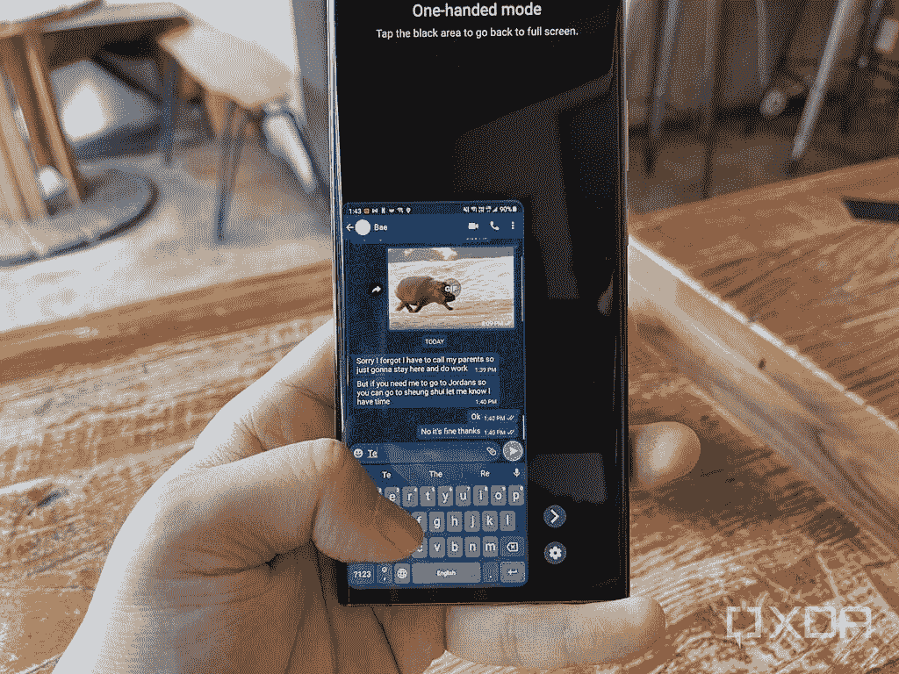

# iPhone 12 Pro Max 很难单手使用是因为 iOS，而不是屏幕尺寸

> 原文：<https://www.xda-developers.com/iphone-12-pro-max-review/>

如果你使用 iPhone，或者和 iPhone 用户相处的时间够长，你可能会成功，或者在下面的 gif 中看到其他人这样做。这种“松开握持，将手滑向手机，以便拇指可以触及屏幕顶部”的动作，就像向上滑动以回家一样，是 iPhone 用户肌肉记忆的一部分。我所有拥有 iPhones 的朋友都这么做。我在苹果的活动中见过苹果的工作人员这样做。Heck - *我这样做，*因为我时不时会用 iPhone。对于像 [iPhone 12 Pro Max](https://www.xda-developers.com/apple-iphone-12-pro-max-hands-on-preview/) 这样的大苹果手机，我这样做的次数比我想象的要多得多。

我已经知道一些 iPhone 用户在想什么“好吧，如果你选择使用大屏幕的手机，那么你必须牺牲人体工程学。”

但是如果我告诉你事情不一定是这样的呢？三星 Galaxy Note 20 Ultra(T1)、T2 LG Wing(T3)和 T4 华为 Mate 40 Pro(T5)与 iPhone 12 Pro Max 一样大，在某些情况下更高，但我不需要做手部体操来做一些基本的重复性工作，比如拉下通知遮光板。我仍然可以毫无问题地单手使用这三部手机。

它们更长/更窄的长宽比和弯曲的侧面当然有所帮助，但不仅仅如此。我能用单手操作 Galaxy Note 20 Ultra 或 LG Wing 的最大原因是，我无法用 iPhone 12 Pro Max 操作它们，因为它们有针对更大屏幕进行调整的软件。

问题是，正如文章标题已经剧透的，iOS。

## iPhone 12 Pro Max 屏幕只是一个超大的 iPhone 12 迷你屏幕

iPhone 12 Pro Max 配备了 6.7 英寸的显示屏，而 iPhone 12 Mini 配备了 5.4 英寸的屏幕。尽管尺寸差异巨大，两款手机的用户界面却完全相同。你不能在 Max 主屏幕上放置比 Mini 更多的应用程序。你不能有更多的部件。一切都是一样的，除了它们变大了——通常是不必要的变大。

想想这有多荒谬。我们有多少空间**来放东西，不管是实体的还是虚拟的*通常是我们如何组织东西的首要因素。空间(或空间不足)决定了我们如何在客厅摆放家具；我们如何整理书桌；我们在电脑屏幕上打开了多少个窗口；诸如此类。***

 ***不知何故，苹果认为没有必要为其有史以来最大的 iPhone 调整用户界面。主屏幕网格仍然锁定你最多有四个横向应用，导致滑稽的大应用图标。PIN pad 也放在屏幕中央，间隔很大，就像过去几年里的其他 iPhone 一样。虽然这种 PIN pad 的位置对大多数 iphone 来说都很好，但在 Max iPhones 上这完全是对用户的敌意，因为我的拇指在不松开手和伸出手的情况下无法够到第一行(1-3)键。在这个戴面具的时代，我每天需要使用 iPhone 上的密码键盘大约 50 次。

回到文章开头提到的第一个问题 iPhone 用户不得不大幅调整他们的手柄来拉下导航遮光板或“控制中心”的原因是因为 iOS 仍然需要你从屏幕的最顶部滑动来访问任一菜单。几乎所有的安卓品牌都允许你从屏幕上的*任何地方向下滑动*来拉下通知阴影，这样你就不用去够最上面了。下面的视频显示我在 6.8 英寸的 LG Wing 上访问通知阴影，然后在 6.7 英寸的 iPhone 12 Pro Max 上访问通知阴影。

## iOS 缺乏真正免费的主屏幕

但像密码键盘的位置这样的事情并不是我最大的不满，因为我可以看到这只是 iOS 工程师的一个无害的疏忽——毕竟，Face ID 在面具之前的时代工作得如此之好，以至于密码键盘很少被需要。

相反，我对 iOS 最大的不满是其限制性的主屏幕网格，它仍然迫使用户将应用程序放置在自上而下、从左至右的系统中。我仍然可以单手使用 6.9 英寸 Galaxy Note 20 Ultra 屏幕的主要原因是我将所有应用程序都放在主屏幕的底部。我见过一些人把应用程序完全放在屏幕的左侧或右侧，以便于拇指够到。关键是，我们可以完全自由地将我们的应用放在哪里，我们也可以使用更紧密的网格来将更多的应用放入 dock 或 bottom row。这些应用程序构成了设备体验的基石，从图标打开它们是所有用户每天最常见的操作之一。

看看下面的照片，告诉我哪个主屏幕更容易单手操作。

我已经知道一些借口——因为我以前在社交媒体上发泄过，也听到过同样的话——“只要用更多的应用和小工具填充主屏幕，并将你最需要的应用推到屏幕底部。”

那个“用不必要的东西填满你的主屏幕”的解决方案真的不应该成为回应的理由，但是我还是要给出一个答案:我不想用东西填满我的主屏幕。我喜欢能够看到我的壁纸；我喜欢我的主屏幕只有必需品。在 2020 年，当操作系统和应用程序生态系统早已成熟稳定时，想要主屏幕上的空白空间并不是一个大问题。

## iOS 上的可达性没有合适的单手模式好

三星 Galaxy Note 20 Ultra 和华为 Mate 40 Pro 更容易单手使用的另一个原因是，它们都提供了“单手模式”，可以纵向和横向缩小屏幕。触发单手模式只需要一个简单的手势，一旦进入，我就可以像使用 4 英寸的屏幕一样打字了。

 <picture></picture> 

One-hand mode on the Samsung Galaxy Note 20 Ultra

iPhone 12 Pro Max 也有单手模式，苹果称之为“可达性”，但它的效果远不如 iPhone 12 Pro Max。与许多 Android 品牌的实现方式一样，Reachability 不会无限缩小屏幕的高度和宽度，而是只缩小屏幕的高度，而且是一次性的操作:一旦你点击屏幕的一部分，它就会恢复到全尺寸。

## iOS 上“返回”导航的方法不一致

Android 的用户界面和 iOS 的用户界面之间的一个核心根本区别是，Android 几乎总是有一个一致的按钮或手势来“返回”——以前是物理按钮，然后是屏幕按钮，现在大多数情况下是从侧面扫入的手势。Android 的“返回”操作是通用的——无论你使用什么应用程序，它都会返回上一级，如果你这样做的次数足够多，你就可以一直回到主屏幕。

与此同时，iOS 有一套更宽松的规则。在大多数应用程序中，尤其是原生的 iOS 应用程序，你可以通过从侧面滑动来返回，但一些第三方应用程序不支持这一点，而是需要你点击通常位于左上角的按钮来返回上一级。一些应用程序，甚至是原生的 iOS 应用程序，在某些部分支持向后滑动手势，但在其他部分不支持。例如，在照片应用程序中，如果你在浏览相册，从侧面滑动会返回到一个层，但一旦你进入相册，侧面滑动就会循环浏览照片，你需要向下滑动才能返回。

一旦你返回到应用程序的基础层，你的返回操作就不再起作用了。然后，你必须向上滑动，或者在旧款 iPhones 上按 home 键，才能退出应用程序。如果这是一个你不熟悉 UX 的应用程序，在没有尝试几次失败的扫入的情况下，你可能很难判断出你何时到达了向上滑动手势的点。下面的视频显示了我用一个手势退出 Instagram 中的多个层，一直到 Android 上的主屏幕，而 iOS 要求改变动作。

十多年来，用户界面导航的不一致性一直是 iOS 的一个问题，但在较小的设备上更容易管理。在 iPhone 12 Pro Max 上，它只是导致更多的握持重新调整。

## iPhone 12 系列的长宽比和四四方方的外形

正如我在开始时提到的那样，iPhone 12 Pro Max 更宽的 19.5:9 宽高比相比竞争对手 Android 手机至少 20:9 的宽高比也是一个因素，因为手机的宽度比高度在手机的手感中起着更重要的作用。因此，虽然 LG Wing 甚至比 iPhone 12 Pro Max 更高，但 LG Wing 更窄的 20.5:9 纵横比意味着我的手指可以更容易地环绕设备。

iPhone 12 Pro Max 的额外周长与其新的硬边方形设计相结合。我知道曲面屏不是每个人都喜欢的，但我想我们都同意框架上的圆形侧面和边缘比边缘相对锋利的方形侧面更容易拿在手上。

但最终，iPhone 12 Pro 的硬件设计并不是最大的促成因素。问题最终还是出在 iOS 及其严苛的规则上。

好消息是，有一个第三方应用程序可以帮助缓解这个问题。Clear Space 是一款售价 2 美元的应用，它基本上允许我们在 iOS14 上放置不可见的(透明)小工具，然后可以将我们最常用的应用推到屏幕底部，同时给人一种更干净、间隔开的主屏幕的错觉。

## 说“只买小一点的 iPhone”给了苹果公司一张糟糕软件决策的免费通行证

我明白，对于一些读者来说，这篇文章有点吹毛求疵，因为根据你的生活方式或位置，你可能不需要经常单手使用手机。我十几岁的时候曾在离苹果总部不远的北加州生活过四年，因此我知道北加州的生活远比纽约、伦敦或香港要悠闲得多。北加州有足够的空间。每个人都有自己的车，所以没有太多的步行作为出行的方式。如果你过着那样的生活方式，你可能总是有空闲的第二只手来点击左上角的按钮，或者从屏幕的右上角滑动。

但我住在香港，这是世界上人口最稠密的地方之一，也是一个大多数市民依赖步行和公共交通的城市。当我站在拥挤的火车上，一只手拿着杂货，试图回复一条短信时，我需要经常单手拿着手机；或者也许我正走在拥挤的街道上，一只手在打电子邮件，另一只手拿着咖啡。我知道在其他拥挤的大城市，从伦敦到迪拜，从东京到上海，人们都过着相似的生活方式。对我们来说，单手可用性很重要。

XDA 的执行主编阿米尔·西迪基也有同样的想法。他最近换了 iPhone 12(不是大的 Max ),尽管如此，与尺寸更大的一加 8 Pro 相比，他发现适应在 iOS 系统中导航所需的手操很不协调。

告诉我们“只买较小的 iPhone”——这是我在社交媒体上经常得到的回应，当时我哀叹 Max iPhones 难以使用——不是正确的回应。既然我已经说明了我的理由，事情就不必这样了。屏幕在 6.6 英寸以上的大手机仍然可以针对单手使用进行优化。苹果就是不在乎。但如果我们中有足够多的人指出这一点，也许会的。***