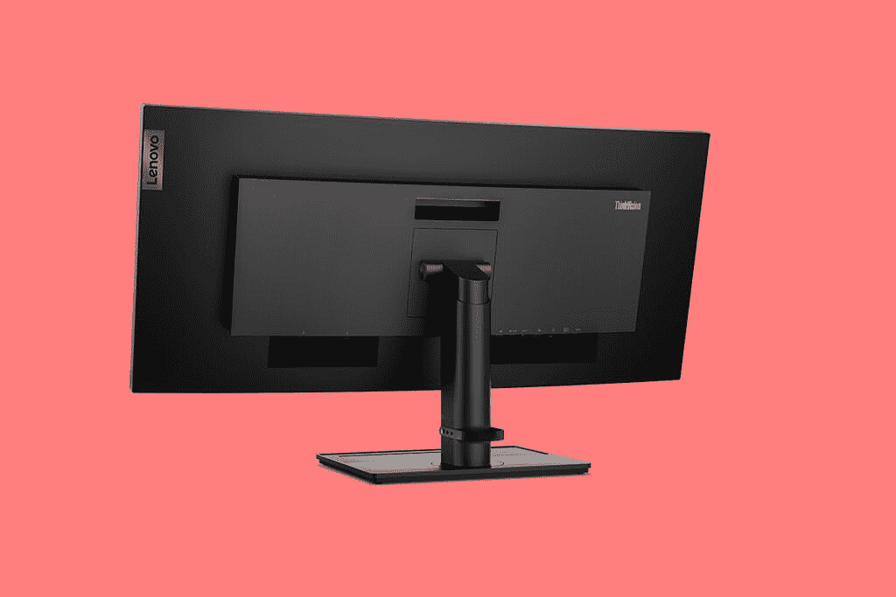
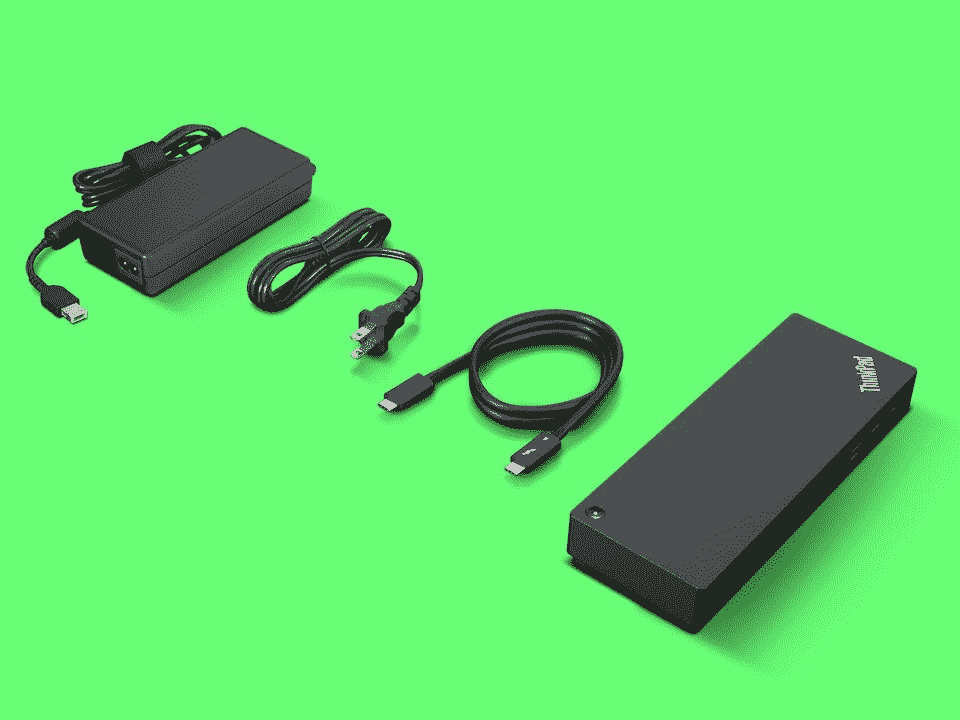

# 联想的新 ThinkPad P1 仍然很薄，但它比以往任何时候都更强大

> 原文：<https://www.xda-developers.com/lenovos-thinkpad-p1-gen-4-still-thin-powerful/>

今天，联想宣布了其最新的移动工作站系列，包括 ThinkPad P15 和 ThinkPad P17 的第二代型号，以及 ThinkPad P1 的第四代型号。从 ThinkPad P15 和 P17 开始，这些大多是规格凸起。

 <picture></picture> 

ThinkPad P17

它们现在都配备了英特尔第 11 代酷睿或至强 CPU，以及高达 16GB GDDR6 的英伟达 RTX A5000 显卡。如果你得到 15 英寸的模型，你也可以得到一个 4K 有机发光二极管显示器。

新的联想 ThinkPad P1 第四代更令人兴奋。当然，它现在配备了 45W 英特尔酷睿或至强处理器，这是您完全期待的升级。但是现在，你可以使用高达 16GB GDDR6 的 NVIDIA GeForce RTX 3080 或 RTX A5000，而不是其前身中可用的低级 Quadro T1000 显卡。

联想 ThinkPad P1 及其兄弟产品 ThinkPad X1 Extreme 的设计初衷是轻薄、功能强大。P1 是工作站类的 X1。它们是第一批配备 15.6 英寸屏幕的 X1 设备，今年，P1 将配备 16 英寸的 16:10 显示屏。它有 QHD+和 UHD+两种型号，因此您再也不用担心基本型号中的 FHD 面板了。

事实上，这台电脑必须完全重新设计，以获得更大的屏幕、更强大的内部功能等等。考虑到它有多薄，它需要新的热量。它有一个混合热管和蒸汽室系统，它甚至可以通过键盘引入气流。这是一个问题，因为所有的 ThinkPads 都必须通过 MIL-STD-810G 耐用性测试，所以允许空气通过键盘意味着液体也可以通过。该团队通过覆盖设备内部的一些部件也解决了这个问题。

键盘的厚度为 1.6 毫米，我们现在在它的两侧都有向上发射的扬声器。请注意，圆形电源按钮又回来了，它可以兼作指纹传感器。这意味着你可以按下按钮打开 ThinkPad P1 Gen 4，它会自动让你登录，没有任何问题。

另一个关键变化是，这款设备现在有一个 1080p 网络摄像头。事实上，在这个很多人在家工作的时代，高分辨率相机非常重要。令人惊讶的是，市场上仍有如此多的人在使用 720p 网络摄像头，所以这台笔记本电脑上的 1080p 是一个受欢迎的变化。

新的联想 ThinkPad P15 Gen 2、P17 Gen 2 和 P1 Gen 4 都将于今年 7 月上市，起价分别为 1749 美元、1779 美元和 2099 美元。

 <picture></picture> 

ThinkVision P34w-20

联想还推出了一款名为 ThinkVision P34w-20 的新显示器。它是一个超宽的 34 英寸曲面屏幕，长宽比为 21:9，分辨率为 WQHD。它专为色彩准确性而设计，具有 99%的 sRGB 和 delta E<2 的色彩校准。它配备了一种天然的低蓝光技术，以减少有害的光发射。它还提供高达 100W 的充电功率。它将于今年秋天上市，售价 899 美元。

 <picture></picture> 

ThinkPad Thunderbolt 4 Workstation Dock

今天最后公布的是 ThinkPad Thunderbolt 4 工作站 Dock，它有 300W 的电源。它也有英特尔 AMT，联想自豪地说它是第一批拥有它的坞站之一。它将于今年秋天上市，售价 419 美元。