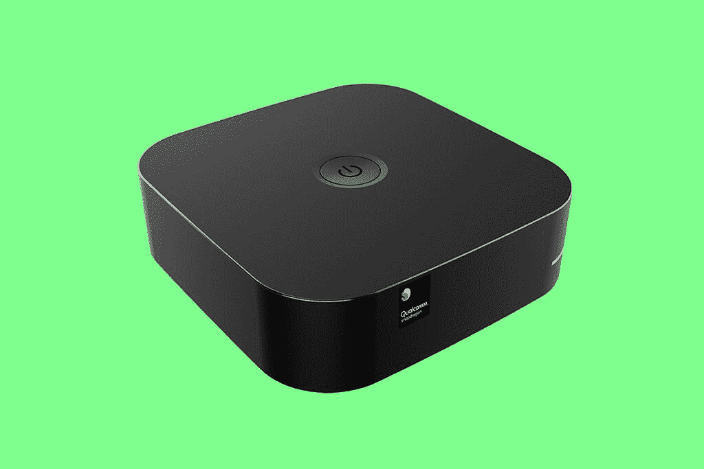
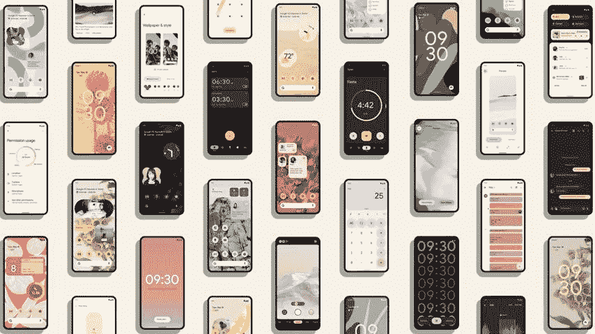
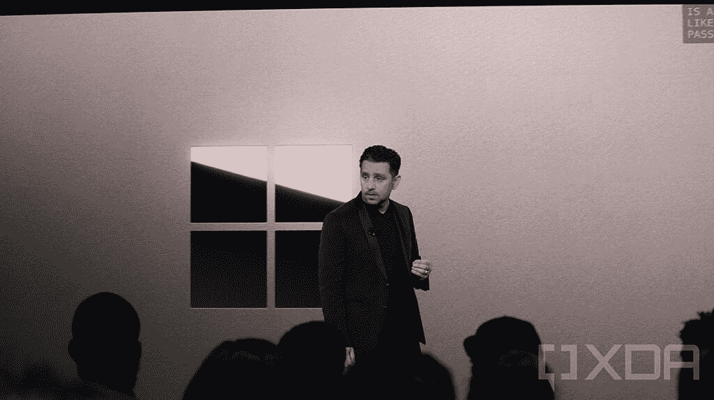

# 微软的构建很糟糕，公司需要做得更好

> 原文：<https://www.xda-developers.com/microsoft-build-bad/>

微软本周举行了年度构建开发者大会。这又是一次虚拟活动，因为雷德蒙德公司去年宣布，至少在 2021 年 7 月之前，其所有活动都将是虚拟的。遗憾的是，这并不是一个好节目，尤其是如果你是 Windows 的粉丝。

我知道你在想什么。我明白了。《Build》已经多年没有以 Windows 为中心的节目了，似乎每年它对自主开发的操作系统的关注都有所减少。今年的节目感觉很尴尬，甚至有点尴尬。

## 微软 Build 2021 上的所有 Windows 新闻

在微软现已公开的 Build 2021 [Book of News](https://news.microsoft.com/build-2021-book-of-news/) 中，Windows 下列出了 7 项。不管这在新闻总量中所占的比例有多小，让我们来看看这七项。

1.  [微软 Edge 91](https://www.xda-developers.com/microsoft-edge-91/) 现已推出，对启动加速和睡眠标签进行了改进。
2.  微软 Edge WebView2 现已在 WinUI 3 中全面上市。
3.  项目团聚 0.8 是在预览。
4.  ARM 上的 Windows 开发者套件将于今年夏天推出。
5.  Windows Insiders 现在可以在 WSL 中运行 GUI 应用程序。
6.  Windows 搜索框具有新功能。
7.  Windows 终端 1.9 已退出预览，现在您可以将其设置为默认的终端模拟器。

 <picture></picture> 

Snapdragon Developer Kit

就是这样。现在，考虑到其中一些甚至不是新闻。高通在展会前一天发布了 ARM 上的 Windows 开发套件。在 WSL 中运行 GUI 应用程序的能力自 Windows 10 Insider 预览版 21362 以来就已经存在，所以在那里没有什么变化。甚至 Edge 91 本周的到来也不是什么新闻。发布时间表已经公布，所有的功能都已经在测试版中发布了数周。

这就剩下 WinUI 3 中的 WebView2、Project Reunion 0.8、Windows 搜索改进和 Windows 终端 1.9。而且除了 Windows Terminal 1.9 似乎有一些终端粉丝感到兴奋的功能之外，其余的更新似乎都微不足道。

事实上，如果你收听微软 Windows 新闻版，你是在浪费时间。

## 嗯，在建造的时候有一个很大的 Windows 故事

在塞特亚·纳德拉的开幕主题演讲中，首席执行官[谈到了“下一代 Windows”](https://www.xda-developers.com/satya-nadella-teases-next-generation-windows-build/)。Windows 讲座持续了大约一分钟，事实上，如果你是 Windows 的粉丝，这是令人兴奋的一分钟。

这是个大新闻。在谷歌上搜索“Microsoft Build ”,纳德拉的 Windows tease 是该展会三大新闻中的两个。想象一下。一分钟的主题演讲比之前链接的新闻手册中 43 页的公告更受关注。

## Windows 活动将于 6 月举行

我并不惊讶在构建时有这么少的 Windows 新闻。除了 Windows 新闻近年来在该活动中逐渐减少之外，我们知道 6 月份将会有一个特定的 Windows 活动。是的，那时我们将听到塞特亚·纳德拉所说的“下一代 Windows”。

 <picture></picture> 

Windows 10X Start Menu

代号太阳谷，应该挺酷的。这是对操作系统的一次视觉革新，从现在已经不存在的 Windows 10X 中汲取元素。如果你是一个 Windows 迷，这是你应该感到兴奋的事情。

但不管出于什么原因，微软认为 Windows 不值得成为焦点。相反，它有自己的事件。

## 其他人都在开发者大会上这么做

这是你说，“但这是一个开发者的展示，Rich。它有消息*给开发者*

微软已经做了很好的工作来说服它的爱好者，消费者新闻和开发者新闻之间不应该有任何重叠。这实际上是一个有趣的现象，因为这些人似乎认为苹果和谷歌的开发者秀不是真正的开发者大会。

 <picture></picture> 

Android 12 Material You

在谷歌 I/O 大会上，该公司在两个小时的开幕主题演讲中展示了大量的东西。在 Android 12 中有一个大规模的视觉改革，名为 [Material You](https://www.xda-developers.com/material-you/) ，Wear OS 最终得到了它迫切需要的爱，与 Fitbit 合作提供更好的健康服务，与 Tizen 合作提供统一的开发者平台。

下个月在 WWDC，苹果将在主题演讲上宣布它的下一个重大更新。你可以打赌，我们将在一开始就看到 iOS 15、watchOS 8、macOS 12 和 tvOS 15。就苹果而言，我们[甚至可能也会看到新的硬件](https://www.xda-developers.com/apple-announce-m1x-mac-mini-wwdc/)。

当谈到下一次重大软件更新时，这是苹果和谷歌开发者大会的中心议题。对微软来说，它退居二线。我相信 Windows 和设备主管 Panos Panay 会说 Windows 将在 6 月的活动中获得更大的关注，但坦率地说，应该没有比 Build 更大的关注了。

 <picture></picture> 

Panos Panay

此外，如果 Panay 不想在 Build 上炫耀太阳谷，他可以利用这一天扣动扳机[发布 Windows 10 2021 年 5 月更新](https://www.xda-developers.com/windows-10-may-2021-update-now-available-for-everyone/)。相反，那发生在建造的前一周*。这也不奇怪。如今，任何关注微软的人都知道，微软不会在开发者大会上与 Windows update 发生重大冲突。*

## 微软不再关心 Windows 了

好了，放下干草叉。在我有生之年，Windows 不会有任何发展。塞特亚·纳德拉刚刚承诺 Windows 将获得十年来最大的更新。没错；Windows 8 问世不到十年。这可能是一个可怕的失败，但如果你想谈论 UX 改革，它肯定做到了这一点。

微软 Build 以前是 Windows 秀，后来逐渐越来越有 Azure 的味道。在这段时间里，Redmond 公司越来越关注 Azure。投入 Windows 开发的资源越来越少。

 <picture></picture> 

Satya Nadella

在过去的一年里，我们已经看到了 Windows 在微软的复苏。疫情让人们在家工作，个人电脑销量大幅增长，因此，Windows 突然变得重要起来。但即使是微软也很聪明，认为这种增长不会持续。

微软说它关心 Windows。它一遍又一遍地这么说。老实说，我不知道在构建过程中有多少次我看到有人说微软关心 Windows。但问题来了。

谷歌不说关心安卓，苹果也不说关心 iOS。他们不需要。他们真的在产品上下了功夫，所以没人会怀疑。

## 结论:微软重建得更好

我们正处于微软想要展示的东西和人们想要看到的东西之间的差距。毕竟，纳德拉在主题演讲中的一分钟 Windows talk 可能是这场展览最大的故事。不幸的是，它得到的时间最少。

微软是今天的 Azure 公司。每个微软观察家都知道这一点。这是多年来增长最快的领域。最近，它甚至成为最大的收入来源。

 <picture></picture> 

Satya Nadella

但在可预见的未来，Windows 仍将是微软的主要产品。我们每天盯着的仍然是操作系统。它是我们用来工作的，它是我们用来玩游戏的，它甚至是我们用来为 Azure 开发的。

全球有 13 亿人在使用 Windows 10。这是一个很大的数字，仅从 PC 领域来说，这是压倒性的多数。

这是一个犯罪，Windows 是事后才想到的。如果有微软的人正在读这篇文章，请不要告诉我们你关心 Windows。开始展示给我们看。不，如果你告诉我们你很快会给我们看，那也不算数。