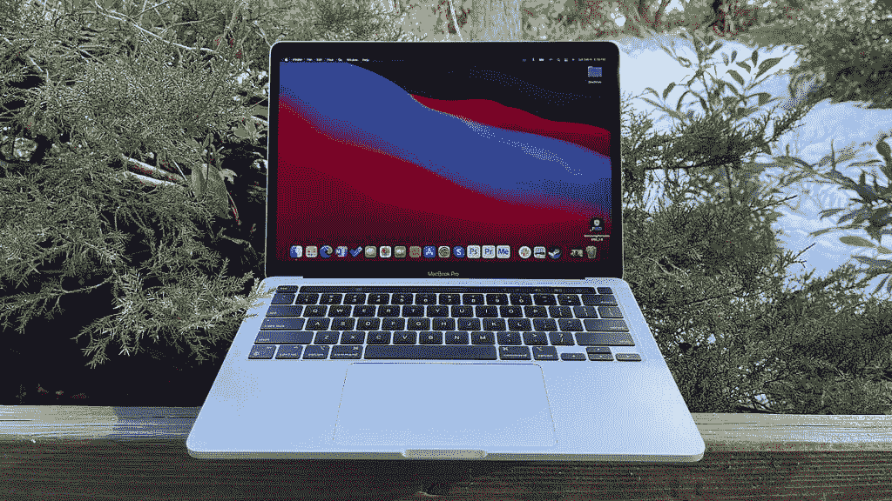
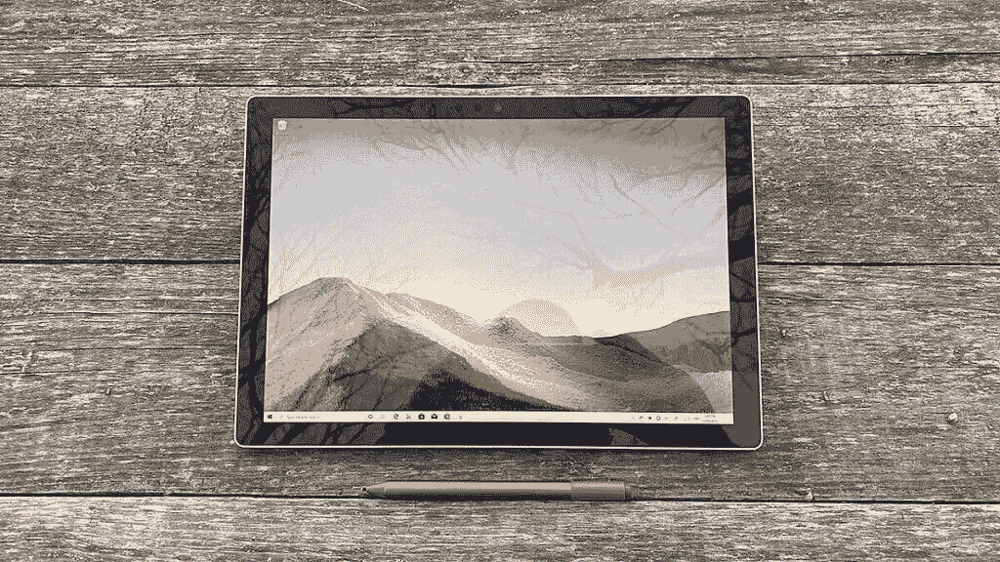

# 微软的 Surface Pro 已经赶不上苹果的 iPad Pro 了

> 原文：<https://www.xda-developers.com/microsoft-cant-keep-up-apple-ipad-pro-anymore/>

2010 年，史蒂夫·乔布斯(Steve Jobs)推出了 iPad，这是一款舒适地位于智能手机和笔记本电脑之间的所谓“第三设备”。乔布斯说，为了实现这一目标，该产品需要在某些方面比它的兄弟姐妹更好。他用阅读这样的案例作为例子，那些用例与今天的 iPad Pro 相去甚远。

两年后，微软推出了自己的平板电脑 Surface。一开始，有两款设备:Surface RT 和 Surface Pro，前者使用 ARM 处理器和支持它的 Windows 版本，而 Pro 使用英特尔芯片和普通的旧 Windows 8。

 <picture></picture> 

Credits: Apple

我不禁回想起这些设备首次向世界展示的时候，鉴于上周的事件，当时[苹果宣布其平板电脑](https://www.xda-developers.com/apples-new-ipad-pro-has-a-super-fast-m1-chip-and-5g-support/)将获得与 MacBook Pro 相同的[处理器，以及类似的内存配置。苹果公司提出了第三个设备的想法，而微软是那个试图将电脑塞进平板电脑的人，而平板电脑将是你唯一的*设备。随着时间的推移，苹果的战略有所发展，但微软的战略没有太大变化。*](https://www.xda-developers.com/apple-macbook-air-macbook-pro-13-mac-mini-m1-arm-soc/)

### 微软坚持其传统软件

微软使用了与苹果相反的策略，它正在追赶雷蒙德公司。最初的 iPad 运行的是 iOS——iphone 操作系统的更大版本——也就是现在的 iPadOS。这家位于库比蒂诺的公司花了十多年的时间来开发一个现代化的移动平台，并将其打造得功能更加完善，以提高工作效率。与此同时，微软一直在努力让其传统桌面操作系统在平板电脑上运行。苹果公司一直在壮大，而微软公司却在努力缩减规模。

在很长一段时间里，这也行得通。回到 2014 年，当全新设计的 Surface Pro 3 问世时，决定用新的笔记本电脑或那些花哨的新平板电脑取代笔记本电脑的消费者可能已经决定使用 Surface，希望两全其美。这是在 2013 年 iPad Air 发布后不久，蒂姆·库克在谈到微软时说道:“我们的竞争是不同的。他们很困惑。他们追逐上网本。现在他们正试图把个人电脑做成平板电脑，再把平板电脑做成个人电脑。”

当时，库克正在谈论 Windows 8，这是一个将会声名狼藉的操作系统版本。它有独立的以触摸为中心的环境和桌面环境，两者的工作方式完全不同。最重要的是，几乎没有关于如何使用彻底重新设计的操作系统的说明。Windows RT 甚至更糟糕，因为它看起来完全像 Windows 8，包括桌面环境，但它不支持桌面应用程序。

### 微软和苹果有着不同的愿景

事实上，当时微软真的认为计算的未来是平板电脑和触摸屏，并且全力以赴。Windows 10 是解决这些问题的答案，从那以后，该公司一直试图让平板电脑模式变得正确。比如 UI 就有各种不一致。这部分是因为点击屏幕可以做不同的事情。如果你使用的是经典的桌面应用程序、UWP 应用程序或 Windows 上的其他应用程序，你会得到不同的结果。

对于 Surface Pro 来说，它并不特别擅长作为平板电脑，但关键优势是你可以在上面运行完整的桌面应用程序。这是一台真正的电脑。另一方面，iPad 长期以来一直以消费设备闻名，甚至在早期是 Kindle 的竞争对手。微软在 iPad 上的优势一直是你可以在 Surface 上做真正的工作。

当 2015 年推出第一款 iPad Pro 时，这种情况仍在继续。苹果增加了一个可连接的键盘和铅笔支架。很自然，在当时，它看起来就像是在抄袭微软的 Surface，只是操作系统更加有限。

### iPadOS 诞生于现代操作系统

苹果用一个有点简单的操作系统开始了 iPad 的生命，至少，在平板电脑上使用起来很舒服。而且成功了。它做了它应该做的事情，并且随着时间的推移变得越来越好。当 iOS 13 在 2019 年 WWDC 发布时，苹果将该操作系统的 iPad 版本更名为 iPadOS。

 <picture></picture> 

Credits: Apple

今天，iPadOS 支持鼠标和触控板输入，苹果支持可以在 iPhone、iPad 和 macOS 上运行的通用应用程序。甚至像 Adobe Photoshop 和 Illustrator 这样的应用程序现在也可以在 iPad 上使用。在 macOS 上，该公司的 ARM 处理器可以模拟英特尔应用程序，当然，在 iPadOS 上，它从来不需要这样做。

苹果做了一件微软尝试过很多次的事情:它让 ARM 工作起来。计划一直都在。它开始在其 iPhones 和后来的 iPads 中构建定制处理器。最终，它们变得如此强大，以至于出现在苹果电脑上。

### 哦，苹果在 iPad Pro 上也使用了现代硬件

现在，苹果在 iPad Pro 上安装了 M1 芯片组。与此同时，微软目前有一款[英特尔驱动的 Surface Pro 7](https://www.xda-developers.com/microsoft-surface-duo-suface-neo-surface-pro-7-surface-laptop-3/) ，它已经有大约四代没有显著的视觉刷新了。如果我们把两者放在一起，苹果已经赶上了微软。如果你不同意，那也没关系。因为如果不这样，苹果明年就会赶上来，或者后年。事实是，苹果正在推进现代操作系统，而微软基本上停滞不前，这取决于其即将到来的 [Windows 10X](https://www.xda-developers.com/tag/microsoft-windows-10x/) 赌注如何收场。

不过，这里有一些简单的数字。在 Premiere Pro 中渲染一个 2 分 13 秒的视频需要 3 分 13 秒，使用的是 13 英寸的 MacBook Pro，配有 M1 处理器。在采用英特尔第 11 代处理器的 Razer Book 13 上，甚至需要 4 分钟。这只是比较两个平台时的视频渲染时间。

 <picture></picture> 

Apple Macbook Pro 13\. Credits: Rich Woods

最重要的是，MacBook Pro 的内存是 Razer Book 在测试中的一半。部分原因是因为记忆力更好。苹果使用了一种叫做统一高带宽内存(HBM)架构的东西，这种架构适用于整个芯片组。内存在芯片组上，可以由 CPU、GPU 和苹果的神经引擎访问，而不是每个都有自己的内存，必须四处移动数据。

我们不是在谈论新 iPad Pro 上通常的 10%或 15%的逐代改进。苹果公司承诺，通过 M1 的八核 CPU，与之前的型号相比，CPU 性能提高了 50%，八核 GPU 的图形性能提高了 40%。还有一个 16 核神经引擎，用于人工智能和机器学习任务。

简单来说，这个硬件简直不可思议。苹果已经把它的 iPad 带到了微软这样的竞争对手无法企及的高度。这就是当你拥有全部筹码时会发生的情况；你可以控制硬件和软件的每一点点来制造最好的产品。

### 这是一个不同的舵手在这一点上

另一个事实是，微软真的不在乎。Surface 越来越成为一个商业品牌。企业想从产品中得到什么很简单。他们想要更多相同的东西。他们想要 Windows 10，因为这是他们多年来的标准，他们想要一个相同机箱的新 Surface Pro，因为它将适合他们所有的坞站和外围设备。

Surface Pro 上一次显示屏发生变化是在 2015 年的 Surface Pro 4 上；尺寸从 12 英寸增加到 12.3 英寸。从那以后一直如此，如果你看看今天的 Surface Pro，它肯定看起来像是 2015 年设计的东西。

 <picture></picture> 

Microsoft Surface Pro 7\. Credits: Rich Woods.

与此同时，苹果刚刚在 iPad Pro 上添加了 Thunderbolt。与此同时，微软是唯一一家不把它包含在高端设备中的 PC OEM 厂商。库比蒂诺公司也在继续缩小边框尺寸，近年来放弃了 Home 键。iPad Pro 在 2018 年也进行了重新设计，当时苹果给了它平边，开创了现代苹果设计潮流。

如果你是微软的粉丝，你的本能很可能是拒绝被称为 iPad 的低端平板电脑已经赶上了 Surface，或者 iPadOS 在现代设备方面已经赶上了 Windows。你可能会指出*和*仍然缺少的东西，最好的例子可能是 Xcode 和 Final Cut Pro。是的，你确实可以在 Surface Pro 上运行完整的 Visual Studio 并进行软件开发。但是你仍然不能在 iPad 上使用。不过，没有什么能阻止苹果继续做这些事情了。iPad Pro 与现在的 13 英寸 MacBook Pro 采用相同的芯片组。

### 但是等等，还有 Windows 10X

同样值得注意的是，微软确实有一款名为 Windows 10X 的现代操作系统正在研发中。可悲的是，我们只能等着瞧了。它最初是作为双屏设备的 OS 公布的，比如微软自己的 Surface Neo。最终，Surface Neo 被无限期推迟。据宣布，Windows 10X 将首先出现在单屏幕设备上，尤其是入门级设备。从我们所听到的一切来看，Windows 10X 听起来[更像是 Chrome OS 的竞争对手](https://www.xda-developers.com/microsoft-windows-10x-hands-on-details/)而不是 iPadOS 的竞争对手。

 <picture></picture> 

Lenovo ThinkPad X1 Fold. Credits: Rich Woods.

Windows 10X 是一个全新的东西，不同于微软试图锁定 Windows 的其他尝试，如 Windows RT 或 Windows 10 S。雷德蒙德公司正在以其新的操作系统重新开始。它正在摆脱传统组件，同时专注于某些它认为是现代操作系统的主要功能。在 Windows 10X 上，你不会找到像 Hyper-V 虚拟化、Internet Explorer、Linux 的 Windows 子系统这样的东西，最值得注意的是，它不会附带 Win32 应用程序支持。

这意味着你将只能运行来自微软商店的应用。而对于网络浏览，你会被 Edge 卡住。最初的承诺是在容器中运行 Win32 应用程序，这样它们就不会影响系统的其他部分。但由于这将使用低端硬件，某种云虚拟化解决方案可能是前进的方向。

### 更现代的窗户

至于微软认为是现代操作系统一部分的功能，该公司实际上在 2019 年就已经概述了它们，甚至在它宣布 Windows 10X 之前。比如微软认为一个现代的操作系统应该有无缝的更新，比如 Chrome OS 如何在后台以最小的宕机时间进行更新。它还应该是安全的，始终通过 Wi-Fi 或蜂窝连接，支持各种外形规格，等等。

 <picture></picture> 

Early look at the start menu of Windows 10X. Credits: [Zac Bowden.](https://twitter.com/zacbowden/status/1349442417733361667)

当然，还有一个更现代的用户界面。Windows 10X 是自 Windows 10 问世以来，Surface 用户梦寐以求的平板模式。没有更多的活动瓷砖。它们已经被浮动在屏幕中间的开始菜单所取代。你也可以用手势控制它，而不是点击角落里的大 X 来关闭应用程序。

不幸的是，Windows 10X 甚至可能永远不会出现在 Surface Pro 上。新操作系统是 Chrome 操作系统的竞争对手，微软正在将其推向教育市场。如果我们在 Surface 中看到 Windows 10X，它将在 Surface Go 这样的设备中启动。目前来看，这个操作系统还没有准备好，我们期待在今年晚些时候听到更多关于它的消息。

Windows 10X 只是微软摆脱传统组件、构建现代操作系统的最新尝试，其竞争对手苹果和谷歌已经成功做到了这一点。不幸的是，对于 Redmond 公司来说，它的竞争对手已经这样做了一段时间了。苹果的 iPadOS 从 2007 年开始每年都在迭代。硬件也变得更好了。

### 微软再也跟不上 iPad Pro 了

微软几乎输掉了这场战争，就像它输掉了手机一样，它也以类似的方式输掉了这场战争。苹果建立了一个全新的操作系统，年复一年地改进它。最重要的是，它在硬件上的改进在竞争对手中是无与伦比的。它很早就开始设计自己的芯片，所以它拥有整个堆栈。第一代 iPad Pro 问世后不久，人们就开始注意到它在某些方面比 MacBook 做得更好。

然而，事实上情况不再是这样了，因为 iPad Pro 现在拥有与 MacBook 相同的处理器，甚至与 iMac 相同的处理器。你可以配置高达 16GB 的内存和 2TB 的存储，类似于任何电脑。的确，硬件绝对让 iPad Pro 成为市场上最好的电脑之一；它只是使用了一个现代的 OS，这是你在任何 Surface 中都找不到的。

所以，iPad Pro 拥有更现代的操作系统和更好的硬件。最后一点是价格，事实上，Surface Pro 7 的入门级价格比 11 英寸的 iPad Pro 便宜 50 美元。不幸的是，Surface Pro 7 配备了酷睿 i3、4GB 内存和 128GB 存储空间。基本型号的 iPad Pro 配有 8GB 内存、128GB 存储空间，当然还有售价 799 美元的定制 M1 处理器。很难争辩为什么有人应该得到 Surface Pro 7，因为苹果已经完成了它所拥有的，而且价格特别低。