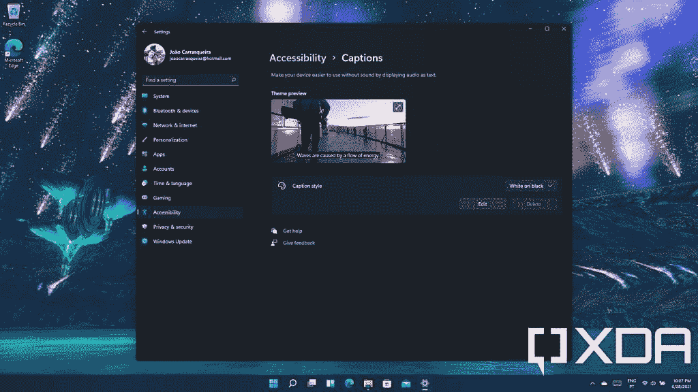

# 微软表示正在改善 Windows 11 的可访问性

> 原文：<https://www.xda-developers.com/microsoft-says-its-improving-windows-11-accessibility/>

微软最近发布了 Windows 11，我们很好地了解了新操作系统将会给大多数用户带来什么。更快的更新、全新的视觉体验等等，让 Windows 11 成为一款非常有趣的产品。如果你参加了内部计划，你现在就可以[尝试其中的许多功能](https://www.xda-developers.com/windows-11-features-in-preview)。虽然微软已经提到了 Windows 11 的可访问性改进，但今天分享的一篇博文[对此进行了更深入的探讨。](https://blogs.windows.com/windowsexperience/2021/07/01/whats-coming-in-windows-11-accessibility/)

该公司一开始表示，它希望从一开始就让 Windows 11 可以访问。为了做到这一点，它使用了 DHS 可信中心的一致性和可用性测试，以确保操作系统在发布时是可访问的。

至于实际功能，Windows 11 包括人们已经熟悉的工具，如讲述人、放大镜和隐藏字幕。但是，也有一些改进。例如，隐藏字幕的设置已经大大简化。这是你现在就可以尝试的事情，也是。隐藏式字幕有几个默认选项，但是您也可以根据需要对它们进行自定义。

 <picture></picture> 

Default caption settings

微软还为视障人士推出了新的对比主题，微软称这种主题看起来更舒服。Windows 语音输入也适用于行动能力有限的用户。微软重新设计了语音打字体验，但奇怪的是，这篇文章中似乎没有提到这一点。语音打字功能本身并不是新的，但微软正在为文本字段添加一个新的语音启动器。

实际上有一个新的东西是 Windows 11 中的辅助功能设置页面。和设置应用的其他部分一样，它也经过了大规模的改造，看起来更有吸引力，也更容易操作。这一部分过去被称为易于访问，但现在它被称为可访问性。

微软还承诺让辅助功能在更多情况下“正常工作”。例如，当 Office 应用程序被设置为本地集成的远程应用程序(RAIL)时,“讲述人”可以与它们一起使用。WSL 支持的 Linux GUI 应用程序也支持 Windows 11 中的辅助功能，如屏幕阅读器和颜色过滤器。

最后，微软还宣布，它与辅助技术领域的行业领导者合作，创建了“现代无障碍平台”。这些公司创造了新的 API，帮助辅助功能更好地与更多的应用程序配合使用。微软还让一些应用程序更容易暴露某些数据，而无需 Windows 更新。这样，开发人员可以更容易地实现访问这些数据的 UI 自动化扩展，使应用程序更容易访问。

当然，Windows 11 仍处于预览阶段，还有时间进行改进。微软鼓励用户加入 Insider 计划，并对辅助功能提供反馈。