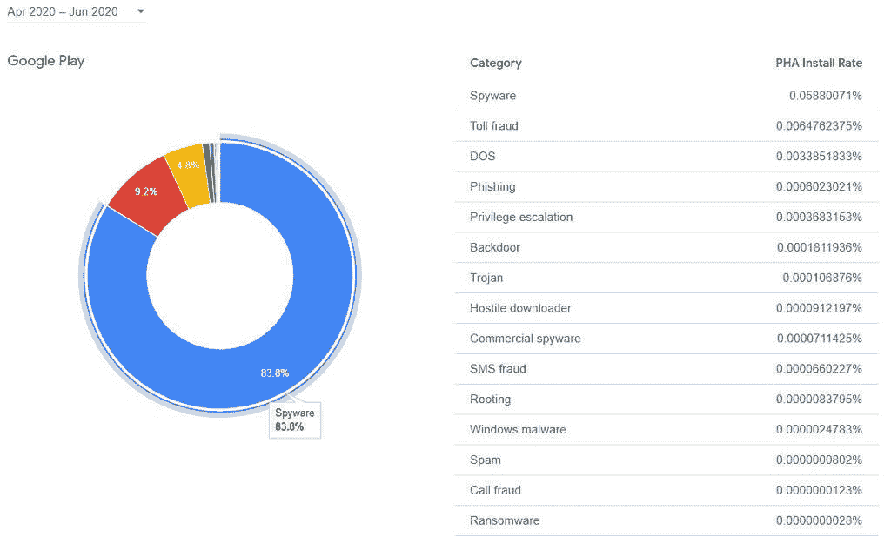
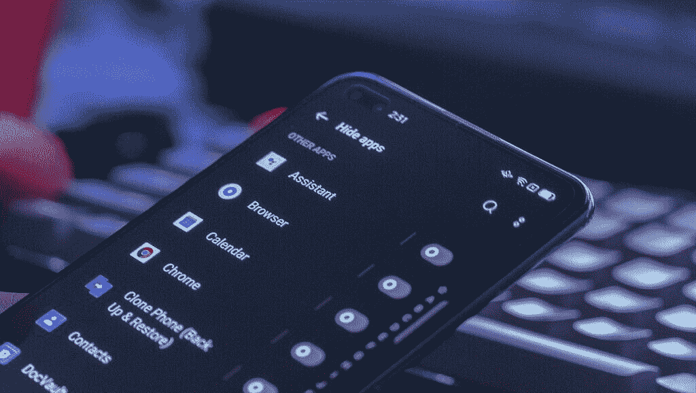
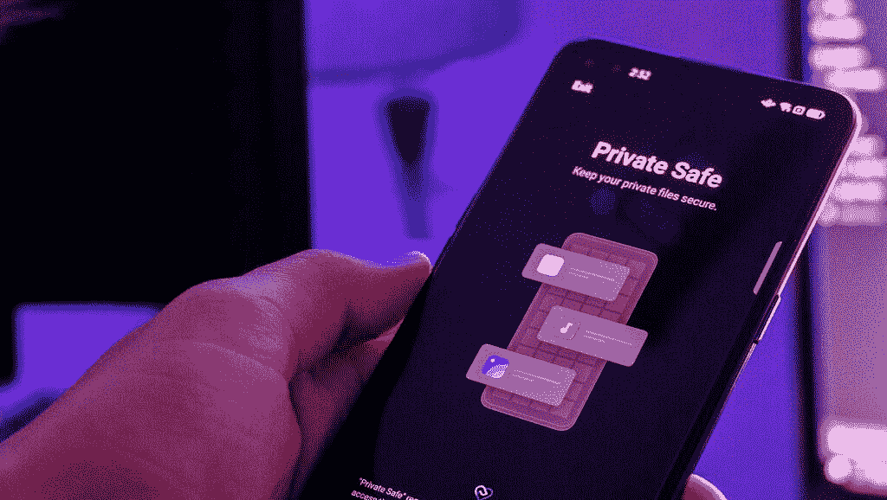
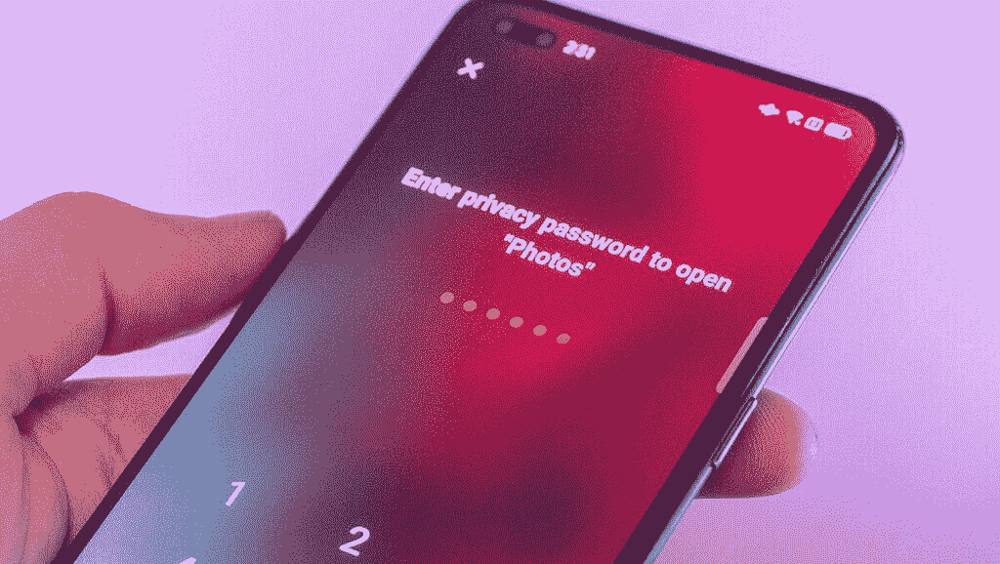

# OPPO 通过 ColorOS 11 中的新功能改善了 Android 隐私

> 原文：<https://www.xda-developers.com/oppo-coloros11-privacy/>

2020 年，智能手机隐私一直是媒体的一个巨大话题。人们非常关心你有多少数据是隐私的，以及哪些应用程序可以访问你的信息。社交媒体应用可以访问你的大量信息。用户比以往任何时候都更重视他们的隐私，并希望能够对他们与这些类型的应用程序共享的信息有更多的控制。看到人们更加关注自己的个人数据，这绝对是一件积极的事情。现在，市场需要适应这些新的期望。

在 2020 年，保护你的隐私不一定会失败。监控和审查你的应用程序正在收集的信息是控制这种情况的一个好方法。长期以来，这些数据收集活动都是在你的 Android 系统后台进行的。现在，应用程序权限更多的是一个受监控的过程，而不是在后台离散发生的事情。

随着 Android 在超过 20 亿台设备上运行，谷歌一直致力于通过每次新的更新来改善 Android 隐私。他们主要通过 Play store 来实现这一点。他们在从服务中移除恶意应用方面采取了积极的态度。除此之外，还有很多工作可以做。

 <picture></picture> 

Percentage of PHA installs by category

随着越来越多的人重视隐私，Android 操作系统需要适应并提供更好的工具来控制用户。朝着正确方向迈出的第一步是 Android 11 的更新。此次更新为您的智能手机引入了新的隐私功能。OPPO 在 9 月中旬发布的 ColorOS 11 中对此进行了扩展。我们已经看到 OEM 软件为 Android 增加额外的安全和隐私功能的趋势。现在我们将看到这一进展，因为它们建立在 Android 11 新的隐私功能之上。

* * *

## Android 11 引入了新的隐私功能

Android 11 正处于分发到世界各地手机的早期阶段。这个新的更新与 Android 10 有着相似的外观和感觉，其中一些最大的更新是以新的隐私功能的形式出现的。你的隐私可能面临风险的一个更常见的方式是通过应用程序权限。

Android 11 引入一次性 app 权限。此功能将授予应用程序访问特定功能的权限。因此，如果脸书要求使用你的位置，你可以一次性批准。下次打开脸书时，您必须再次批准位置数据，应用程序才能继续使用它。如果你已经批准了一个应用程序，并且该应用程序在很长一段时间内没有使用，Android 将触发新的权限自动重置功能。这将使未使用的应用程序的权限过期。这个新的隐私更新是一个很好的方法，可以确保应用程序不会继续不必要地在后台拉你的私人数据。

你也可以告诉 Android 只在一个应用被使用的时候才允许它访问数据。许多应用程序要求访问您的信息和通话记录等内容。将他们的访问限制在你实际使用应用程序的时候。

* * *

## 用于 OPPO 手机的 ColorOS 11 隐私功能

随着 Android 11 的推出，OPPO 是第一批迅速将这一新更新融入其设备的公司之一。Android 11 中的新安全功能将很快以 ColorOS 11 的形式提供给许多 OPPO 设备。当 OPPO 推出基于 Android 11 的 ColorOS 11 时，它对用户的隐私保护做了进一步的扩展。基于更多隐私的趋势，ColorOS 11 能够为用户提供以下功能:

### 隐藏应用程序

下载的应用程序不是唯一可以看到你的私人数据的东西。手机的物理用户可能会冒险进入他们不应该去的地方。在这种情况下，ColorOS 11 允许您隐藏特定的应用程序。一旦应用程序被隐藏，它只能通过隐藏的应用程序快捷方式访问，并在输入密码后。

 <picture></picture> 

ColorOS 11 Hide Apps Feature

### 个人信息保护

在许多情况下，应用程序坚持要求您授予某些权限才能正常运行。个人信息保护功能是绕过这种情况的一个非常聪明的方法。您可以打开对通话记录、联系人、信息和事件的保护。一旦启用保护，ColorOS 11 将向应用程序发送空信息，诱骗应用程序访问空白数据。这将保护您免受包括个人信息在内的数据泄露。

### 支付保护

支付保护通过将您的支付应用程序放在安全的位置来保护您的财务信息。将应用添加到您的支付保护门户，让 ColorOS 完成其余工作。

### 私人保险箱

OPPO 让 private safe 成为你存储私人文件的一个选项。当您将图像、视频、音频或其他类型的文件添加到您的私人空间时，您会将它们锁定在密码后面。这使得读取您的媒体的应用程序无法使用您的文件。您的私人空间的快捷方式可以添加到您的主屏幕，使添加和访问文件的过程简单快捷。

 <picture></picture> 

ColorOS 11 Private Safe

### 权限管理员

密切关注分配给每个应用程序的权限。权限管理器允许您检查每个权限，并限制或授予对试图读取您的数据的应用程序的访问权限。例如，您可以看到您的相机以及有多少应用程序正在访问。然后，您可以限制您永远不会使用相机的应用程序。这是一种更加用户友好的方式来管理你的手机，并提高你的整体隐私。

### 私人保险箱

私人保险箱在你的文件系统中给你一个加密的部分，在那里你可以保存个人照片、文档、视频或任何其他类型的文件。当您将文件放入“私人安全”部分时，其他应用程序将无法使用该文件。只有您可以访问您的加密文件。即使其他人使用你的手机，如果没有密码，他们也无法访问加密文件。

### 应用程序锁

应用程序锁是一个已经存在了一段时间的功能，但仍然和以前一样重要。将敏感应用置于密码之后的能力可以防止不必要的访问。这对电子邮件、聊天应用、网络浏览器和任何可能包含个人信息的东西都有意义。

 <picture></picture> 

ColorOS 11 App Lock Feature

### doc vault[在 Inida 中可用]

使用 DocVault 上传您的文档，如您的政府 ID、出生证明或税务文档。您可以访问和使用这些文档，就像它们是硬拷贝一样。你可以在机场和其他旅行场合使用它们，让你的生活更轻松。

## OEM 软件如何改善 Android 隐私

虽然 Android 11 在改善隐私方面做出了坚实的努力，但 ColorOS 11 向我们展示了在这一领域仍有很多事情可以做。原始设备制造商可以继续在 Android 的基础上提供这些重要的隐私功能。

每次 Android 推出新功能，都是你的隐私面临危险的新机会。OEM 厂商必须向 OPPO 这样的公司学习，开始实施更好的隐私功能，以跟上 Android 不断变化的世界。

###### *我们感谢 OPPO 赞助这篇文章。我们的赞助商帮助我们支付与运行 XDA 相关的许多费用，包括服务器成本、全职开发人员、新闻撰稿人等等。虽然您可能会在门户内容旁边看到赞助内容(这些内容将始终被标记为赞助内容),但门户团队对这些帖子不承担任何责任。赞助内容、广告和 XDA 仓库完全由一个独立的团队管理。XDA 绝不会通过接受金钱来赞扬一家公司，或以任何方式改变我们的观点或看法，从而损害其新闻诚信。我们的意见不能被收买。*