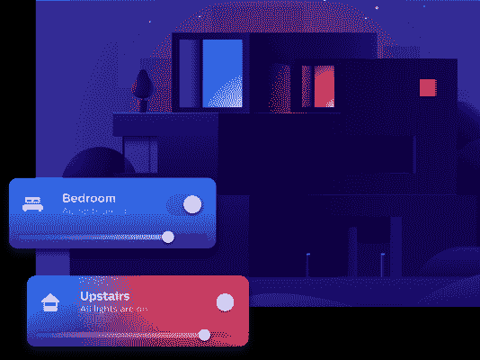

# Android 和 iOS 上的飞利浦 Hue 进行了重大的设计革新

> 原文：<https://www.xda-developers.com/philips-hue-android-ios-design-overhaul/>

# Android 和 iOS 上的飞利浦 Hue 进行了重大的设计革新

Android 和 iOS 上的 Philips Hue 应用程序正在进行重大的设计革新，增加了一些新功能，以实现更无缝的体验。

飞利浦在 Android 和 iOS 上重新构建了飞利浦 Hue 应用程序，并采用了全新的设计。更新后的应用程序已经开始通过 Google Play 和 App Store 向用户推出，它包括以下变化:

新的飞利浦 Hue 应用程序带有一个新的直观界面，使您可以更轻松地访问所有连接的设备。虽然它看起来与现有的应用程序几乎一样，但飞利浦已经做了一些有用的调整来提高性能。查看以下视频，快速了解最新设计:

简化的用户界面通过让您快速访问场景、亮度控制和同一屏幕上所有灯光的切换，保证了无缝体验。新的应用程序可以让你更快地控制房间。你可以点击一个房间来查看所有可用灯光和预设场景的网格，这将让你立即更改所有设置。与以前的布局相比，这是一个显著的改进，以前的布局需要用户在不同的选项卡之间切换来更改这些设置。

 <picture></picture> 

Updated room controls

此外，新的飞利浦 Hue 应用程序现在可以让您直接在房间标签中添加新的灯光，而不是去为每个新设备进行应用程序设置。如果你碰巧有多个色调桥，该应用程序现在还可以让你通过主屏幕上的一个新按钮在它们之间快速切换。

 <picture></picture> 

Easily switch between multiple Hue bridges

新的“自动”标签是飞利浦 Hue 应用程序的另一个重要补充。它取代了现有的“例程”功能，并提供更先进的自动化选项，根据各种参数打开/关闭您的灯。最重要的是，飞利浦计划在今年晚些时候为该应用程序添加一个新的“动态场景”功能，这将让你随着时间的推移在不同的颜色之间循环。如果你是飞利浦 Hue 的用户，你可以通过下面的 Play Store 链接下载新的应用程序。