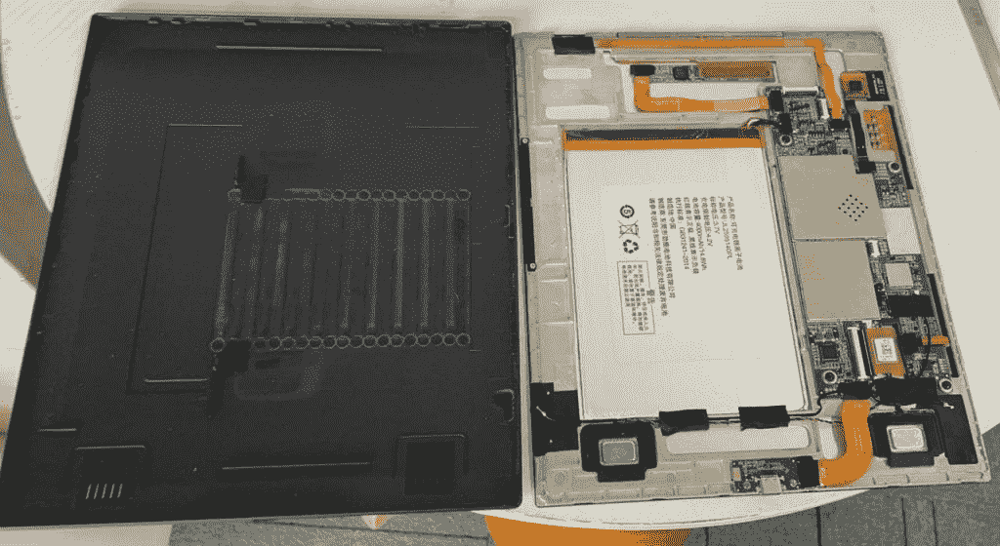

# Pine64 发布支持 Linux 和笔的 PineNote 电子墨水平板电脑

> 原文：<https://www.xda-developers.com/pine64-announces-399-e-reader-with-linux-and-pen-support/>

总部位于香港的 Pine64 多年来一直在销售单板电脑，但它最出名的可能是 PinePhone 和 PineBook Pro，这是目前最好的 ARM 驱动的 Linux 设备。现在，随着 PineNote 的发布，该公司正在向电子阅读器拓展，pine note 是一款带有笔支持的电子墨水 Linux 平板电脑，价格为 399 美元。

该公司在一篇博客文章中写道[“多年来，你们一直要求我们开发一种电子墨水设备，事实上，我们最早在 2017 年就开始寻找这种设备。”。“大品牌通过图书销售大量补贴他们的电子阅读器，即使我们以成本价(或亏本)出售开放式电子阅读器，我们也不可能与流行设备的价格相匹配。令人欣慰的是，自 2017 年以来，技术格局和使用电子墨水可以实现的目标已经发生了显著变化。自从 Rockchip 的 RK3566 发布以来，我们知道我们创造开放式电子墨水设备的机会已经到来。今年年初，我们决定创建 PineNote。"](https://www.pine64.org/2021/08/15/introducing-the-pinenote/)

 <picture></picture> 

PineNote engineering prototype

PineNote 旨在成为目前最好的电子墨水设备之一，拥有基于 ARM 的四核 [Rockchip RK3566 芯片组](https://files.pine64.org/doc/quartz64/Rockchip%20RK3566%20Datasheet%20V1.0-20201210.pdf)，4GB 内存，128 GB eMMC 闪存，两个麦克风，两个扬声器，一个用于充电和数据的 USB Type-C 端口，以及 2.4/5GHz AC Wi-Fi。内部框架由镁合金制成，背面有一层“防滑”塑料。Pine64 表示，这款设备的深度将超过 7 毫米，超过 8.4 毫米的 Kindle Oasis 3 和 8.6 毫米的 Nook GlowLight Plus。

电子墨水面板的尺寸为 10.1 英寸，长宽比为 3:4，分辨率为 1404×1872 (227 DPI)。Pine64 表示，它可以在 60Hz 的刷新率下显示 16 级灰度，并将有一个可调颜色的前光(从冷白色到暖琥珀色)。更高的刷新率应该会让它比几乎所有其他电子墨水阅读器都更流畅，但这也取决于软件优化。

 <picture></picture> 

PineNote with magnetic cover and EMR pen

说到软件，Pine64 预计 PineNote 将自带一个定制的 Linux 内核，但将显示驱动程序移植到主线 Linux 的工作正在进行中。该接口将是 KDE 等离子或等离子移动。这将允许它运行任何为 ARM Linux 编译的软件，或许还能通过 [Anbox](https://www.xda-developers.com/anbox-allows-you-to-run-android-apps-on-any-gnulinux-os/) 或 [WayDroid](https://www.xda-developers.com/waydroid-android-apps-on-linux/) 运行 Android 应用。

Pine64 还将出售 EMR 笔和 PineNote 的磁性外壳，但电子阅读器将支持任何 Wacom EMR 笔。价格标签定为 399 美元，Pine64 希望“今年晚些时候”开始向早期采用者发货，用于软件开发。