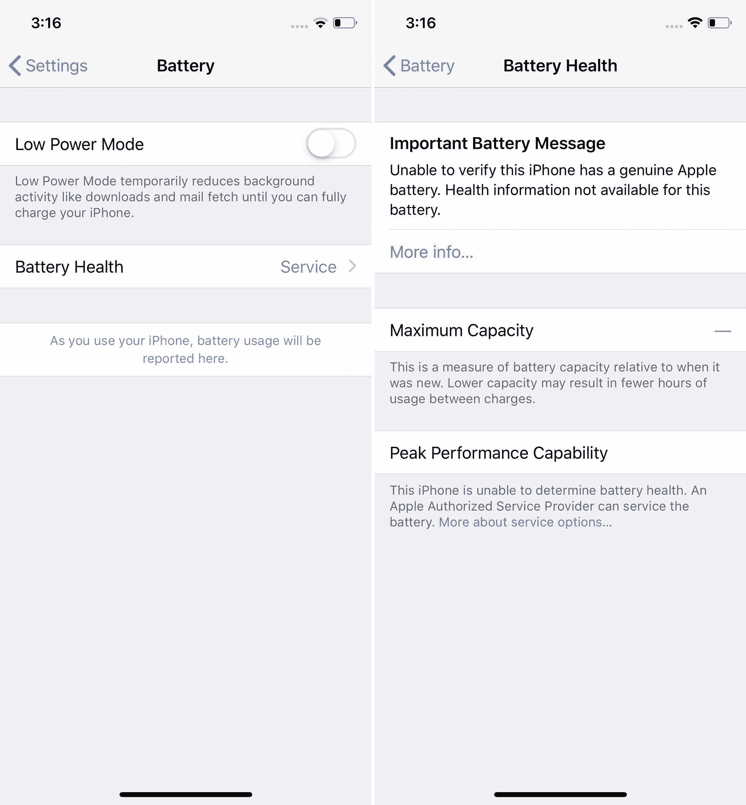

# 修理权大获全胜:联邦贸易委员会将审查修理限制

> 原文：<https://www.xda-developers.com/right-to-repair-wins-ftc-scrutinize-repair-restrictions/>

随着苹果和 John Deere 等公司加大维修限制，维修权利运动在美国和欧洲慢慢兴起。这场运动背后的理念当然是我们 XDA 人能够认同的。如果有能力，人们应该能够修理自己的手机，公司不应该设置任意的障碍，使更换零件变得更加困难。那些有可能失去维修收入来源的公司正在竭尽全力阻止维修权利运动，但是随着反大型科技运动的发展，欧洲和美国的政府开始站在消费者一边。上周，拜登总统[签署了一项行政命令](https://www.xda-developers.com/biden-executive-order-right-to-repair/)，指示行政机构，除其他事项外，限制公司限制维修的能力。现在，有权这样做的机构——美国联邦贸易委员会，或 FTC——宣布将加强针对非法维修限制的执法行动。

在一份新闻稿中，联邦贸易委员会表示，限制消费者和企业选择如何维修产品的能力会增加维修的总成本，产生危险的电子废物，并不必要地增加维修等待时间。另一方面，让消费者和企业能够维修自己的硬件可以降低成本，减少电子垃圾，提高维修的及时性，并带来更多的经济机会。

联邦贸易委员会在 2019 年举办了一场名为“[倪星修复](https://www.ftc.gov/news-events/press-releases/2019/03/ftc-hold-july-2019-workshop-product-repair-restrictions-seeks)的研讨会，以获得消费者、小企业、制造商和其他人的反馈。研讨会之后，公平贸易委员会得出结论认为，一些制造商和销售商可能以各种方式限制维修服务竞争，而没有充分的理由这样做。这些限制包括保修卡等物理障碍、维修/诊断软件等零件和资源的有限可用性、故意使简单维修变得相当困难的设计，以及限制远程信息处理信息的可用性，并阻止或完全阻止非 OEM 零件的使用。智能手机原始设备制造商，[最著名的苹果](https://www.ifixit.com/News/32343/apple-is-locking-batteries-to-iphones-now)，被发现参与了其中的一些，如果不是很多的话。联邦贸易委员会担心这些做法对消费者的影响，尤其是对低收入美国人的影响。

 <picture></picture> 

An iPhone XS unable to verify a genuine replacement Apple battery. Source: [iFixit](https://www.ifixit.com/News/32343/apple-is-locking-batteries-to-iphones-now)

他们对此采取了什么措施？虽然他们认识到维修权利以前并不在他们的优先考虑之列，但他们现在表示，他们将投入更多资源来打击这些做法。他们也会优先调查这些行为。他们鼓励公众提交投诉并提供其他信息，以帮助更有效地执行马格努森-莫斯保修法案及其实施条例。

他们还将寻找违反谢尔曼法案等反垄断法的行为，并确定维修限制是否是不公平的行为或做法，这两种行为也是联邦贸易委员会法案所禁止的。他们将采取跨学科的方法来解决这个问题，结合整个机构的资源和专业知识来打击非法维修限制。

然而，抛开所有这些法律术语，这里重要的是，联邦贸易委员会正在加大努力，打击维修限制，维护用户维修自己硬件的权利。老实说，这对美国的每一个智能手机用户来说都是好消息。你可以阅读联邦贸易委员会关于维修限制的最新政策声明全文[这里](https://www.ftc.gov/system/files/documents/public_statements/1592330/p194400repairrestrictionspolicystatement.pdf)。