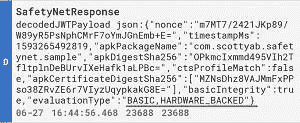

# SafetyNet 的硬件证明功能将继续存在

> 原文：<https://www.xda-developers.com/safetynet-hardware-attestation-feature-here-to-stay/>

# SafetyNet 的硬件证明功能将继续存在

在去年测试该功能后，谷歌终于让开发者可以使用 SafetyNet API 中的硬件证明。请继续阅读！

早在 2020 年 5 月，谷歌通过在一些设备上悄无声息地引入硬件支持的安全网响应认证，震惊了 Android 修改社区。由于谷歌的服务器没有完全停止接受“基本”评估报告来检查远程设备的软件环境的完整性，硬件支持的密钥认证的出现看起来更像是一个实验。然而，当时谷歌称他们是“...*评估和调整设备的合格标准...，*”表示大规模推广的潜力。嗯，谷歌终于做到了这一点。

根据[最近在谷歌“安全网 API 客户端”小组上的一篇帖子](https://groups.google.com/g/safetynet-api-clients/c/-6-w069c5a4/m/rEeRo0dcAgAJ)，安全网认证 API 响应中的“评估类型”字段现在已经成为官方支持的功能。对于开发人员来说，这意味着每当您想要验证设备的软件环境是否被以任何方式篡改时，您可以利用 Google Play 服务将使用设备的可信执行环境(TEE)或专用硬件安全模块(HSM)生成的未经修改的密钥库证书发送到 SafetyNet 服务器。然而，人们不应该过度使用该功能，因为它仅适用于已经使用“ctsProfileMatch”参数的应用程序，这些应用程序需要最高级别的设备完整性保证，正如官方文档所建议的[。](https://developer.android.com/training/safetynet/attestation#evaluation-types)

 <picture></picture> 

SafetyNet Attestation API response with evaluationType returning "BASIC" and "HARDWARE_BACKED." Credits: XDA Senior Member [Displax](https://forum.xda-developers.com/m/displax.6345368/)

几周前就有迹象表明这种情况发生了，当时人们注意到 Google Play 服务已经开始在许多情况下优先考虑 CTS 配置文件验证的硬件证明，即使选择了基本证明。请记住，在这种情况下,[仍然有可能利用](https://www.xda-developers.com/bypass-safetynet-hardware-attestation-unlocked-bootloader-magisk-module/)硬件证明例程的机会主义性质并通过基本证明。虽然这不是一个永久的解决办法(之前也没有被证明是)，但它应该允许人们绕过 SafetyNet，直到谷歌决定完全放弃基本评估。然而，对于我们的爱好者和开发者社区来说，谷歌首先采取这些措施是一种耻辱。

如果谷歌继续实施硬件支持的证明，这可能意味着高级用户可以通过使用屏蔽技术结合 root 访问运行 Google Pay 和其他基于安全网的应用程序的日子结束了。由于形势仍在发展，事情可能比表面上看起来更复杂。如果这件事有新的进展，我们会及时通知我们的读者。

*感谢 XDA 会员 [Some_Random_Username](https://forum.xda-developers.com/m/some_random_username.8234677/) 的提示！*