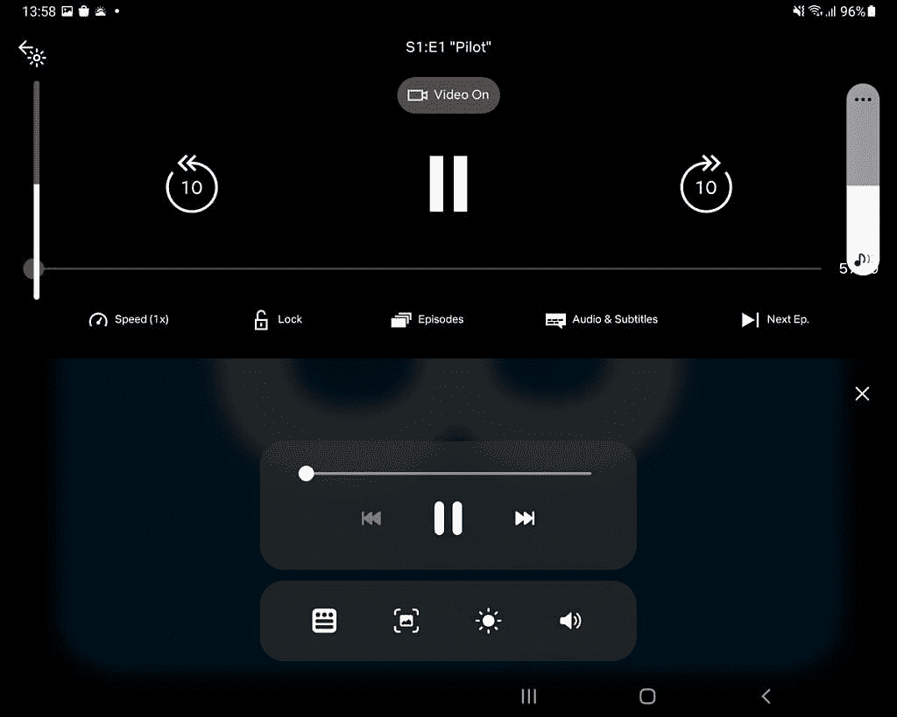

# 三星 Galaxy Z Fold 3 的一个 UI 功能亮点

> 原文：<https://www.xda-developers.com/samsung-galaxy-z-fold-3-one-ui-feature-highlights/>

三星几年来一直在研发可折叠手机。Galaxy Z Fold 3 是该品牌的第三代可折叠产品，正如你所料，他们每年都在努力改进体验。当然，硬件有所改进，但好的硬件需要好的软件来支持，尤其是可折叠产品，因为整个产品类别还有很大的增长和探索空间。

今年，随着 Galaxy Z Fold 3 的推出，三星引入了一系列新的软件功能和改进，提升了用户在使用可折叠手机时的体验。这些功能是 Galaxy Z Fold 上开箱即用的一个 UI 3.1.1 的一部分。其中一些功能也适用于 Galaxy Z Flip 3。

让我们来看看三星 Galaxy Fold 3 的这些新软件功能和亮点，并告诉你如何利用它们。

## 更多应用的灵活模式

三星首先通过 Galaxy Z Flip 引入了 Flex 模式，后来又推出了 Galaxy Z Fold 2。不过，在这两款设备上，Flex 模式只在少数应用程序上可用，大多数是系统应用程序，第三方应用程序无法利用它。随着 Galaxy Z Fold 3 的推出，灵活模式已经进入了其他几个应用程序，包括网飞和 Chrome 等第三方应用程序。

 <picture></picture> 

Flex Mode in Netflix

这提高了设备的功能性，并让您利用灵活的铰链，可以在任何角度保持直立。例如，在网飞上，使用 Flex 模式将让您享受设备上半部分的内容，而媒体控件位于底部。

## 强制灵活模式和自定义纵横比的实验室

虽然 Flex mode 已经被更多的应用程序所采用，但仍有一些第三方应用程序不支持它。为了解决这个问题，三星在 Galaxy Z Fold 3 的设置菜单中引入了一个名为 Labs 的新功能。通过实验室，您甚至可以在不受支持的应用程序上启用灵活模式，这使得通用工具栏可以控制设备的某些功能。

实验室还可以用来为应用程序设置自定义的长宽比，并缩放它们，使它们适合显示器。例如，Instagram 在以前的可折叠手机上就没有很好的扩展性。默认情况下，当你在 Galaxy Z Fold 3 上启动应用程序时，你会在屏幕的中间部分看到应用程序显示内容的空白区域。以前，应用程序的长宽比可以通过三星商店的 Good Lock 应用程序进行修改。现在，该选项在 Labs 下默认可用。

## 持久任务栏

由于 Galaxy Z Fold 3 上的大显示屏提供了一次执行多任务和运行多个窗口的机会，三星已经在一侧提供了一个持久任务栏的选项，该任务栏显示在正在运行的应用程序的顶部。您可以在任务栏中设置自定义快捷方式，甚至可以创建应用程序组。当你点击一个快捷方式或一个应用程序组时，它会启动你选择的应用程序以及已经在运行的应用程序，就像你使用电脑一样。

## 多个应用实例和多活动窗口

三星已经与微软合作了一段时间，当你将三星设备与 Windows PC 配对时，我们已经看到了它在你的手机应用程序中的一些独家功能。现在，我们看到了 Galaxy Z Fold 3 合作伙伴关系的延伸。在 Z Fold 3 的大显示屏上，你可以运行微软 Office 套件中一个应用的两个实例。如果您想将一个文档的内容复制到另一个文档，这非常有用。您可以只打开两个实例，然后在屏幕上拖放元素来复制它们。一个 UI 3.1.1 还允许你同时保持三个窗口活动，你甚至可以根据需要调整它们的大小。请注意，该特性确实有些滞后和缺陷，并且结果在第一次执行时并不完美。您还被限制只能在 Microsoft Office 应用程序中打开多个实例，而不能在 Word 或 Excel 等其他 MS 应用程序中打开。

**[三星 Galaxy Z Fold 3 就是我一直想要的微软 Surface Mini](https://www.xda-developers.com/samsung-galaxy-z-fold-3-microsoft-surface-mini/)**

多个应用程序实例也可以在一些预装的三星应用程序上工作，例如三星 Notes 应用程序。

 <picture></picture> 

Two instances of the Samsung Notes app

## 平板电脑视图

如果你以前使用过平板电脑，你会看到一些应用程序在分屏视图中显示信息，以充分利用屏幕空间。不是应用程序的一个部分占据整个屏幕，而是用不同的窗格显示，占据屏幕上的某个部分。

同样，Galaxy Z Fold 3 的 DPI 也是以一种用户界面模仿平板电脑的方式设置的。在一些股票应用程序如 Settings 中，屏幕的左半部分有一个窗格显示所有菜单，点击其中一个将在屏幕的右侧打开相关设置。

## iOS 到 Android WhatsApp 转移

在 Galaxy Z Fold 3 的发布会上，宣布用户现在可以[将他们的 WhatsApp 聊天和数据从 iOS 转移到 Android](https://www.xda-developers.com/whatsapp-move-chat-history-from-ios-to-android/) ，这在以前是不可能的。虽然该功能将在未来推广到所有 Android 设备，但它是在 Galaxy Z Fold 3 上首次亮相的。如果你打算从 iPhone 切换到 Galaxy Z Fold 3，这个软件功能肯定会派上用场，而且你不会错过你的聊天和媒体。

## 笔的功能

不管你喜欢与否，三星已经不幸地扼杀了它的 Note 系列手机。Galaxy Z Fold 系列似乎将成为三星下半年的旗舰产品。由于 S Pen 是 Galaxy Note 系列的主要功能之一，三星今年将对 S Pen 的支持带到了 Galaxy Z Fold 3。因此，您还可以获得以前的笔记设备上存在的所有 S Pen 功能，如在屏幕上批注、在屏幕关闭时记笔记、从屏幕的某些部分创建 gif 等。

**[三星 S Pen Pro 点评:一支手写笔统治星系](https://www.xda-developers.com/samsung-s-pen-pro-review/)**

## 覆盖屏幕镜像和旋转所有应用程序

有了 One UI 3.1.1，将封面屏幕上的内容镜像到内部显示屏会更加无缝。这基本上可以让你在封面和内部屏幕上拥有相同的屏幕和布局。这样，在手机菜单间导航就更容易了，因为你不必记住两种不同的显示屏布局。你现在还可以在你选择的任何应用程序中将 Galaxy Z Fold 3 的屏幕旋转到任何方向，它会相应地缩放。

* * *

这些是三星 Galaxy Z Fold 3 上一个用户界面的一些亮点。该设备上的软件与其前辈相比有了很大的改进，现在可以让您以更好、更有效的方式利用大屏幕。除了这些用户界面的变化，三星还在 Galaxy Z Fold 3 上引入了一些[相机功能](https://www.xda-developers.com/samsung-galaxy-z-fold-3-camera-features/)，让你的相机体验更好。

 <picture></picture> 

Samsung Galaxy Z Fold 3

##### 三星银河 Z 折叠 3

Galaxy Z Fold 3 是三星最新的可折叠手机，支持 S Pen。

如果你对 Galaxy Z Fold 3 印象深刻，并希望为自己挑选一款，你可以查看[最佳交易](https://www.xda-developers.com/best-galaxy-z-fold-3-deals/)以节省一些额外的钱，如果你已经订购了这款手机，请确保使用一些用于该设备的[最佳案例](https://www.xda-developers.com/best-samsung-galaxy-z-fold-3-cases/)来保护它。