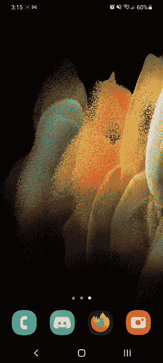

# 三星互联网现在可以跨 Galaxy 设备同步页面位置

> 原文：<https://www.xda-developers.com/samsung-internet-can-now-sync-page-positions-across-galaxy-devices/>

三星互联网是一款流行的网络浏览器，最初是为 Galaxy 智能手机开发的，但也可以在 Play Store 上为其他设备下载。该浏览器经常因其快速的基于 Chromium 的渲染引擎和广泛的可定制性而受到称赞，现在有一些新功能可以在测试版中试用。

三星发布了[一篇博客文章](https://medium.com/samsung-internet-dev/samsung-internet-v14-2-ebb0a3fedec8)概述了三星互联网 14.2 测试版的变化，其中包括可选的书签栏，我们上周报道过。除此之外，该浏览器现在还改进了对[三星“在其他设备上继续应用”功能的支持](https://www.xda-developers.com/samsung-one-ui-3-1-features-changes/#:~:text=Continue%20apps%20on%20other%20devices)，该功能作为 One UI 3.1 的一部分出现在 Galaxy 手机和平板电脑上。一台设备上的三星互联网标签可能已经出现在连接到同一三星帐户的其他设备上，但现在页面位置也同步了。

 <picture></picture> 

Continue apps feature on Galaxy S21 Ultra

要使用该功能，两台设备需要在同一个 Wi-Fi 网络上，启用蓝牙，需要安装最新的 Samsung Internet Beta 版本，并且必须启用系统设置中的“继续其他设备上的应用”(“设置应用”>“高级功能”)。该功能看起来像是一个不太有用的版本[苹果 Handoff](https://support.apple.com/en-us/HT209455) ，它可以在 iPhones 和 Mac 电脑上运行，而三星的实现只兼容部分手机和平板电脑。不过，如果你经常使用三星制造的平板电脑和 Galaxy 智能手机，它可能会很有用。

三星互联网 14.2 还引入了 [S Pen](https://www.xda-developers.com/tag/s-pen/) air actions，类似于通过系统相机应用程序提供的手势。在支持的设备上，您可以通过按住 S Pen 按钮并向左或向右移动手写笔来向前或向后导航(就像您是一个指点魔杖的向导)。您也可以向上或向下滚动页面，或者做一个圆圈手势来重新加载。

三星互联网测试版可以从下面的 Play 商店下载，或者通过三星自己的 Galaxy 商店下载。如果之前的更新是可靠的话，互联网 14.2 应该会在下一两周的某个时候离开测试版。