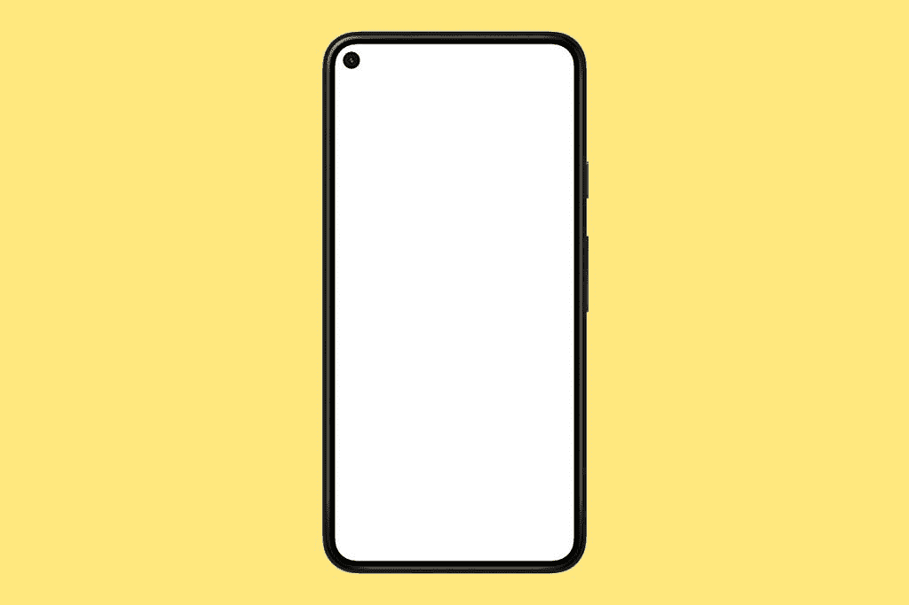

# 智能手机一年比一年无聊，这对你有好处

> 原文：<https://www.xda-developers.com/smartphones-boring-every-year-good-for-you/>

如果说最近发布的 [iPhone 13](https://www.xda-developers.com/iphone-13/) 系列给我强调了一件事，那就是每年的手机升级都在放缓。每年都有重大创新的日子已经一去不复返了，相反，智能手机的每一年或多或少都是一个稳定的保证，有一两个较小的变化或改进。iPhone 12 vs iPhone 13？三星 Galaxy S20 Ultra vs[三星 Galaxy S21 Ultra](https://www.xda-developers.com/samsung-galaxy-s21/) ？与他们的前辈相比，几乎没有什么区别，可以说我们已经到了这样一个点，这些迭代升级给智能手机的整体体验带来的价值越来越小。

 <picture></picture> 

This could literally be any one among the hundreds of smartphones released in the past 3 years

每当公众讨论转向称智能手机“无聊”时，我们经常看到智能手机发展的停滞引起人们的关注。“智能手机不会变得无聊”我听到你的呼喊，像三星 Galaxy Z Fold 3 这样的可折叠智能手机的扩散就是明显的证据。然而，“智能手机”作为一个行业已经比多年前成熟了很多，对消费者来说**是*好***。

## 摩尔定律的死亡

近年来，所有领域的技术都处于一个有趣的位置，不仅仅是移动技术。“摩尔定律”指出，密集集成电路中的晶体管数量大约每两年翻一番，而成本却减半。摩尔定律是由英特尔前首席执行官戈登·摩尔在 20 世纪 60 年代提出的。在 20 世纪 60 年代，技术领域显然与我们今天的情况非常非常不同，这样的指数增长不可能永远持续下去。

有意义的改进越来越难实现

摩尔定律为有规律的年复一年的创新奠定了基础，让整个行业都有所追求。即使我们现在不能满足摩尔定律，它的精神仍然存在，每年的发布周期也是部分原因。公司都在争先恐后地寻求有意义的改进和改变，然而迭代改进的价值递减意味着那些有意义的改进越来越难实现。

## 谷歌 Pixel 6 Pro 就是一个有意义改进的例子

Pixel 6 Pro 是一个有意义的改进和摩尔定律适用性的例子，原因很简单。这是谷歌多年来最大规模的智能手机发布，与去年的 Pixel 5、Pixel 4 和 Pixel 3 相比有了一些重大改进。一个升级的摄像头，一个全新的设计，一个*定制芯片组*，以及更多我们还不知道的东西才是真正令人兴奋的。这使得它成为几年来第一个真正被关注的像素。其中很大一部分是关于谷歌和像素的停滞，但它也强调了我们的主要观点——智能手机越来越无聊。

要明确的是，Pixel 6 Pro 不一定是摩尔定律的*产物*，但是当 Pixel 6 Pro 与 Pixel 5 相比时，有大量的变化。这款手机的每个方面都与去年的 Pixel 5 有所不同，这就是为什么它如此令人兴奋的原因*。这不是一个更新的芯片和稍微升级的摄像头的小升级-这是一个全新的东西。谷歌正在全力以赴打造一款旗舰产品，这让我们的智能手机爱好者心跳加速，因为它与去年的平板电脑有着天壤之别。*

事实上，如果我们深入研究 Pixel 系列的历史，从一个型号到下一个型号，从来没有真正的大规模迭代改进。最初的 Pixel 升级到 Pixel 2 并没有带来太多的变化。Pixel 2 采用了哑光涂层、当年的旗舰高通芯片组、一对前置扬声器、光学图像稳定和 Pixel 视觉核心。它还带来了 IMX362，比 Pixel 3 推出的 IMX363 低一级，一直被用作 Pixel 5 之前所有 Pixel 智能手机的主要传感器。让那件事过去一会儿。

似乎每次谷歌改进 Pixel 智能手机的某些东西，都会损害其他东西

当谈到 Pixel 3 时，也没有看到多少改进。除了缩小的边框和更大的显示屏，它还是老样子。Pixel 4 稍微改变了一些东西，尽管使用的 90Hz 面板有许多显示问题。除了高刷新率显示屏，Pixel 4 唯一的其他真正改进是对面部解锁的支持，尽管该公司后来放弃了指纹传感器。似乎每次谷歌改进 Pixel 智能手机的某些东西，都会损害其他东西。

在这方面，我们可以看到像素线与大多数普通旗舰的不同之处。大多数旗舰机不会从大规模的同比改善中受益，因为公司已经找到了一个有效的公式。为什么三星会从根本上改变 S 系列的前提，当该公司知道他们所做的增量改进是绝大多数消费者想要的？当每年都是同样的公式需要稍微改进时，就没有必要进行突破性的、昂贵的创新了。

然而，Pixel 6 不同，因为它似乎是谷歌测试、删除或以某种方式不太完美的几乎所有功能的高潮。Pixel 系列的历史是*为什么*消费者对 Pixel 6 系列如此狂热的原因，也是我们多年来看到的智能手机市场停滞不前的间接证明。这并不是说 Pixel 6 系列本身是开创性的(尽管它值得关注一下[谷歌张量芯片](https://www.xda-developers.com/exclusive-google-tensor-specs-in-pixel-6/))——而是说它的前辈只是简单而无聊。

## 未来会怎样？

很难说玻璃平板智能手机还没有达到顶峰。每年相同的公式是所有需要改进的地方，没有必要在相同的外形上进行昂贵的创新。智能手机的下一步是重新思考比玻璃板更好的东西，这一继任者似乎将以可折叠的形式出现。像三星 Galaxy Z Fold 3 和 Galaxy Z Flip 3 这样的设备令人兴奋，因为它们代表了 T2 全新的东西。三星甚至将 Fold 系列作为一个游乐场，因为 Z Fold 3 也包含了该公司的第一款显示器下摄像头。

然而，可折叠手机很可能仍然远离主流，随着智能手机变得一致，话题转向了软件。我们看到智能手机制造商开始关注软件支持的寿命，三星和小米等公司提供了更长的支持期。甚至谷歌也在寻求支持 Pixel 6 系列至少五年(T1)，使其与 iPhone 处于同一联盟。软件更新可以完全改变智能手机的体验，它们可能会说服消费者继续使用过时的设备。对于那些只把手机视为实用工具的人来说，这是个好消息——用它直到它坏掉，然后再买个新的。

此外，当智能手机更新的时间越长，它们的转售价值就会上升。这是因为他们仍然被视为“活跃”和受支持的，这也是 iPhones 能够多年保持其价值的部分原因。显然，也有一个转换到任何其他 Android 品牌的能力(而 iPhones 是获得 iOS 体验的唯一地方)，但软件更新肯定会有所帮助。

事实上，最近发布的 [Fairphone 4](https://www.xda-developers.com/fairphone-4-launch/) 可能会利用这一点，因为它承诺软件更新到 2025 年底。该公司还希望能够发布远至 Android 15 的重大更新，软件支持持续到 2027 年。这是一个艰巨的任务，之前没有智能手机制造商能够做到，但可持续发展之所以重要是有原因的。公司希望保持客户回头客，这样当他们将来升级时，他们会回到支持他们最久的公司。

## 为什么无聊的智能手机好

如今，购买智能手机不再像以前那样是一场漫长的折磨。我记得几年前，在购买智能手机之前，我会看几个小时的评论。在承诺购买 Nexus 5 或 OnePlus 3 之前，我想确保我做出了正确的决定，它能满足我的一切需求，尤其是在当时 Android 市场相当混乱的情况下。

事实上，几乎任何旗舰手机对任何人来说都足够好。见鬼，即使大多数中端智能手机对大多数人来说也足够好了。不再有任何超级怪异的怪癖，你知道你会得到什么，它将在很大程度上完成工作。无论最新的三星 Galaxy S 系列智能手机是什么，都可能是大多数用户的最佳选择，但如果你预算有限，那么你可能会考虑小米等其他品牌。大多数消费者知道他们在寻找什么，这使得在升级时更容易决定购买。

如果无聊的智能手机能让生活变得更轻松，那么它有很多优点。创新是有趣的，但是创新导致的产品并不适合所有人。中兴 Axon 30 系列就是一个最好的例子——Axon 30 本身就是一款出色的设备，创新是有益健康的，[但大多数消费者如果关心自拍质量，就不应该购买它](https://www.xda-developers.com/zte-axon-30-hands-on/)。当手机停滞不前时，这些问题不会发生，无聊意味着每一年的改进都是可预测的。

对于发烧友来说，智能手机的停滞是一个可悲的事实，但对于普通消费者来说，这是一件非常好的事情。玻璃平板已经基本达到顶峰，可折叠平板成为公司测试新硬件的新平台。去享受你的玻璃板四年吧，没有任何遗憾。