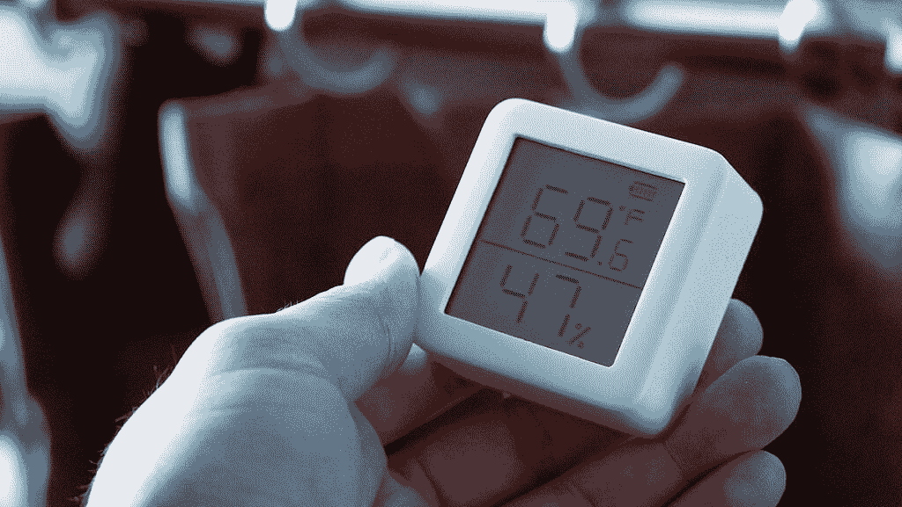
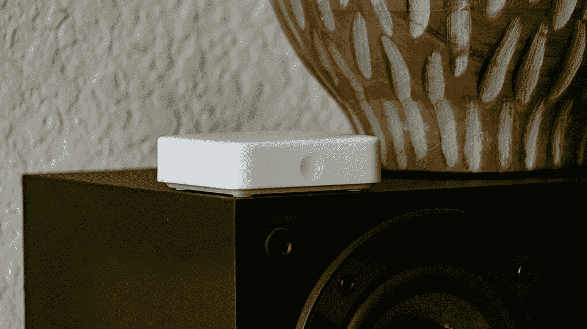

# 使用配电盘将窗帘添加到智能家居系统中

> 原文：<https://www.xda-developers.com/switchbot/>

随着智能家居产品的扩展方式，现在已经很少有事情不能自动化了。几乎每盏灯、电器、开关、门和窗户都可以添加到你的智能家居中。即使有了这些小玩意，直到现在，你家还有一个方面被忽略了。自动化您的窗户处理通常是一个非常昂贵的项目。除非你买的是电动窗帘五金件，否则还没有好的解决方案。switchbox 正在改变这种情况，他们神奇的窗帘机器人可以将你现有的窗帘变成智能窗帘。

* * *

## 配电盘窗帘和太阳能电池板

 <picture></picture> 

SwitchBot Curtain

这种分立电机可以很容易地安装在多种类型的窗帘硬件上。当它坐在布帘后面时，它夹在杆上。一个小橡胶轮抓住杆子，滑动窗帘来打开或关闭它们。但这是一款智能产品，你可以利用一系列不同的自动化功能。安排您的窗帘在特定时间打开或关闭，将它们连接到您的 Google Home 或 Alexa，使用光线传感器在太阳太亮时关闭它们，等等。

**兼容窗帘五金**

配电盘与三种常见类型的窗帘硬件正式兼容:I 型导轨、U 型导轨和拉杆。您的包装将包含每种窗帘所需的所有组件。退房时，请确保为窗帘选择合适的五金配件。在盒子里，你会发现一个 USB C 线，杆连接器，塑料带，和剪辑。然而，大多数人会发现，他们只需将配电盘帘直接夹在杆上，就大功告成了。您可以使用随附的夹子和塑料条来使用索环窗帘上的配电盘。这个设置比其他的花费更多的时间，但是一点也不难。

对于这样的电机，你可能会担心的一个问题是如何为它提供动力。配电盘窗帘由电池供电，可以通过设备背面的 USB 端口充电。一次充电可以让你使用大约八个月，这取决于你打开和关闭窗帘的频率。如果你想完全避免充电的问题，可以购买模块化太阳能电池板，让太阳做所有的工作。

如果您的窗帘位于难以够到的区域，或者需要梯子才能够到，请考虑这种解决方案。许多窗户位于楼梯上方或难以充电的尴尬区域。因此，在订购配电盘窗帘时，请务必考虑到这一点。

 <picture></picture> 

SwitchBot Solar Panel

这些小太阳能电池板可以贴在 SwtichBot 窗帘的背面，面向外面。利用阳光为你的配电盘充电，你将永远不用担心插上充电器来保持运转。太阳能电池板很容易安装，只需将其插入设备背面的 USB-C 端口即可。连接后，您就可以开始了。

配电盘产品的一贯主题是简单。窗帘机器人是非常简单的设置使用开关应用程序。发现和设置过程只需几秒钟，你就可以开始自动化窗帘了。该应用程序充满了伟大的功能和图形，让你从你的手机控制一切。

有时候不需要使用应用程序或语音控制。如果你的客人不熟悉你的智能家居系统，他们可能会本能地手动拉上你的窗帘。当这种情况发生时，SwitchBot 将激活一触即发功能，当它识别到有人试图手动打开窗帘时，就会开始打开窗帘。这可以通过拉动其中一个窗帘面板来启动，它会启动窗帘的自动打开或关闭。

使用过 SwitchBot 幕布后，你就会明白它为什么会获得优秀设计和创意奖(国际优秀设计奖)。这是美国最负盛名的奖项之一，在国际上备受推崇。

* * *

## 小型开关集线器和仪表

如果你想扩大你的配电盘家庭集成，他们有几个其他的智能家居产品。与智能窗帘特别相关的是开关温度计、迷你集线器和遥控器。这些产品中的每一个都可以与您的其他开关设备通信，并根据它们的数据帮助触发操作。例如，温度计可以测量房间的温度，并告诉你的窗帘在太热时关闭。

湿度计对于宠物护理和需要特定湿度的环境特别有用。从 SwitchBot 应用程序跟踪和导出您的温度和湿度数据。

 <picture></picture> 

SwitchBot Thermometer and Hygrometer

SwitchBot Hub Mini 是一种将所有电子设备连接到 Google Home 或 Alexa 的设备。这是你将窗帘融入日常生活所需要的。Hub Mini 还可用作红外遥控器，它可以控制您的电视、AC、AV 接收器或任何使用标准红外遥控器的设备。它还支持以下服务:

*   亚马逊 Alexa
*   谷歌助手
*   Siri 快捷方式
*   IFTTT
*   三星智能产品
*   克洛娃

**智能场景和自动化**

使用 Hub Mini，出门在外时，您可以轻松控制窗帘，甚至设定时间表和场景。在“切换面板”帐户中，您可以使用条件和动作创建新场景。设置需要满足的条件，无论是时间、温度读数、手动控制还是其他条件。然后，您可以设置想要发生的操作。例如:设置你的条件是你的仪表读数为 75 度，然后让你的动作是关闭那个房间的窗帘。

用 Google Home 或 Alexa 制作场景也一样简单。一旦你的账户被链接，你可以设置一个场景来触发一系列自定义命令。这就是你如何使用一个触发短语将所有不同的窗帘分组打开或关闭。

 <picture></picture> 

SwitchBot Hub Mini

使用“智能学习”模式，让 Hub Mini 在五秒钟内学习并模仿现有遥控器的信号。然后随意扔掉你所有的其他遥控器。

* * *

将窗帘改造成智能家居的理想设置是 SmartSwitch 窗帘+ Hub Mini +仪表。这将让你最大限度地利用应用程序，自动化控制，并允许你连接到你的智能助理进行语音控制。

如果你想在交换台产品上大捞一笔，就去找找他们的[亚马逊 Prime Day 销售](https://www.anrdoezrs.net/links/100122946/type/dlg/sid/UUxdaUeUpU2769/https://www.switch-bot.com/collections/all?sca_ref=873436.hCb75iaMhj)。您可以在选择配电盘产品时额外享受 30%的折扣。这对任何开始使用配电盘设置的人来说都是一个很好的机会。销售从 6 月 21 日开始，一直持续到 30 日。

###### 我们感谢 SwitchBot 赞助了这篇文章。我们的赞助商帮助我们支付与运行 XDA 相关的许多费用，包括服务器成本、全职开发人员、新闻撰稿人等等。虽然您可能会在门户内容旁边看到赞助内容(这些内容将始终被标记为赞助内容),但门户团队对这些帖子不承担任何责任。赞助内容、广告和 XDA 仓库完全由一个独立的团队管理。XDA 绝不会通过接受金钱来赞扬一家公司，或以任何方式改变我们的观点或看法，从而损害其新闻诚信。我们的意见不能被收买。