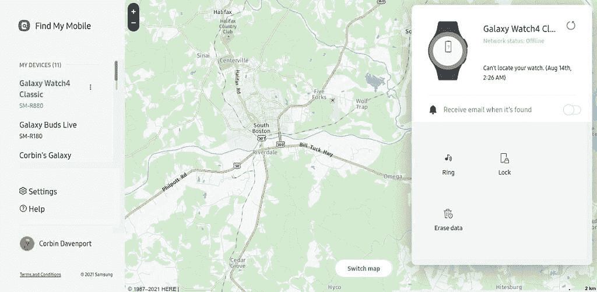
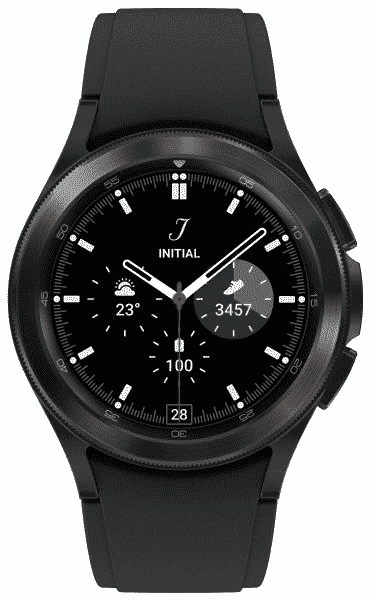

# Wear OS 3 评论:Galaxy Watch 4 上的一款 UI 手表与 Tizen 非常相似

> 原文：<https://www.xda-developers.com/wear-os-3-galaxy-watch-4-oneui-watch-review/>

三星正式发布了 Galaxy Watch 4 系列，这可能是三星*有史以来*发布的最重要的可穿戴设备。该公司已经放弃了自己开发的 Tizen 软件平台([除了电视](https://www.xda-developers.com/samsung-still-using-tizen-in-tvs/))，现在已经与谷歌合作开发 Wear OS 3。这种合作关系可能会使 Galaxy Watch 4 成为苹果手表系列 6 前所未有的强大竞争对手[。](https://www.xda-developers.com/samsung-galaxy-watch-4-classic-vs-apple-watch-6/)

事实上，Galaxy Watch 4 很可能是一段时间内唯一一款佩戴 OS 3 的手表——除非很快出现一款令人惊讶的 Pixel 手表。下一款获得更新的手表将是 Mobvoi 的 TicWatch 3 Pro，时间是"[2022 年中到下半年。](https://www.xda-developers.com/will-my-smartwatch-get-wear-os-3/)“如果你想尝试谷歌和三星最新最棒的产品，在可预见的未来，你唯一的选择就是 Galaxy Watch 4(如果你正在购买一款，[我们有一些乐队建议](https://www.xda-developers.com/best-galaxy-watch-4-bands/))。

版本号不是这里唯一重要的因素。谷歌有史以来第一次允许手表制造商定制其可穿戴平台的外观，这意味着三星可以发布外观或感觉都不太像 Wear OS 的 Wear OS 手表。事实上，Galaxy Watch 缺少许多现成的典型谷歌应用，有些功能现在根本不可用。

我们正在对 Galaxy Watch 4 和 Watch 4 Classic 进行评论，但三星 Wear OS 的变化如此之大，以至于它们值得单独报道。在这篇文章中，我们将展示带有一个用户界面的 Wear OS 3 与过去几年我们都习惯的 Wear OS 有何不同。

在很多方面，带有一个 UI 手表的 Wear OS 3 比 Wear OS 更像 Tizen。Tizen 死了，Tizen 万岁。

## 使用一个 UI 手表在 Wear OS 3 上进行设置和配对

Galaxy Watch 4 与所有其他 Wear OS 设备之间的第一个显著区别是配套的智能手机应用程序。每一款 Wear OS 手表(以及之前的所有 Android Wear 手表)都使用[谷歌的配套应用](https://play.google.com/store/apps/details?id=com.google.android.wearable.app)进行初始设置。该应用程序还用于切换手表面部、截图和更改一些设置。

Galaxy Watch 4 是首款不使用官方 Wear OS 配套应用的 Wear OS 手表。相反，设置和配对过程是通过三星自己的 [Galaxy 可穿戴应用程序](https://play.google.com/store/apps/details?id=com.samsung.android.app.watchmanager)完成的——这与之前的 Galaxy 手表、Galaxy Fit 系列健身追踪器、三星无线耳塞和其他配件的使用相同。

Galaxy Wearable 与谷歌自己的 Wear OS 应用程序有很大不同，可以说更好。它允许你从手机上改变手表的更多方面，比谷歌的 Wear OS 应用程序允许的更多，例如定制应用程序启动器(稍后会详细介绍)，定制手表表面和快速设置面板，以及更新和删除应用程序。手表上几乎所有可用的设置都在手机应用程序中，所以你不必在手表的小触摸屏上浏览所有选项。

其他 Wear OS 手表可能会继续使用谷歌的应用程序进行同步，但我希望谷歌计划将这些功能引入自己的应用程序。然而，消息并不都是好的。其他 Wear OS 手表可以与 iPhones 完美配合，但[Galaxy Watch 4 不能(至少目前)](https://www.xda-developers.com/galaxy-watch-4-not-compatible-with-apple-iphone/)，大概是因为三星没有更新其 iOS Galaxy 可穿戴应用程序。目前还不清楚其他 Wear OS 3 手表是否能与苹果智能手机兼容，但如果它们不能，我会感到惊讶。

## 观看面孔、快速设置和互动程序

任何以前使用过 Wear OS 智能手表的人都会对三星的 Wear OS 非常熟悉，但如果你使用过以前装有 Tizen 操作系统的 Galaxy 手表，你会有宾至如归的感觉。一些重要的元素已经被移动或重新设计，只有时间才能告诉我们(双关语)这些变化中有多少会延续到“库存”佩戴的 OS 3 手表上。

打开 Galaxy Watch 4，无论是抬起你的手臂(除非你关闭它)，还是按下其中一个按钮，你都会来到表盘上。向下滑动可以打开快速设置面板，就像普通的 Wear OS 手表一样，但 Galaxy 手表上的面板有更多按钮。它也可以定制，要么通过手机上的 Galaxy Wearable 应用程序，要么通过按住手表本身的图标。这允许您隐藏不想要的按钮，或者将最常用的按钮移到第一页。

[Wear OS 在 2019 年](https://www.xda-developers.com/google-wear-os-tiles-feature/)增加了对磁贴的支持，允许手表通过在主手表表面向左滑动来访问信息页面或快速操作(类似于 Android 上的小部件)。Galaxy Watch 版本的 Wear OS 3 上没有磁贴，但三星已经用自己的版本取代了谷歌的所有磁贴。定制的磁贴与老款 Galaxy 手表的页面设计更加匹配。

就像其他 Wear OS 手表一样，你可以在手表上添加、删除和移动磁贴，或者使用手机上的配套应用程序。Galaxy Watch 4 还保持了与来自第三方手表应用程序的[磁贴的兼容性——我将来自](https://www.xda-developers.com/wear-os-third-party-custom-tiles/)[可穿戴小工具](https://play.google.com/store/apps/details?id=com.wearablewidgets)的磁贴添加到列表的末尾没有问题。

## 通知

现有的 Wear OS 手表在表盘下方显示通知，通过在主屏幕上向上滑动即可访问。就像在普通的 Android 上一样，提醒显示在一个连续的可滚动列表中，点击它们会显示完整的信息(以及回复选项)。然而，Galaxy Watch 4 上的 Wear OS 3 完全改变了这一点，有利于类似 Tizen 的通知。

通知显示在表盘的左侧，每个警报作为一个单独的页面。就像在 Wear OS 上一样，点击通知会显示整个消息(或者消息链，如果是聊天的话)。三星和谷歌的方法都需要同样多的滚动和点击。

目前还不清楚这种自定义通知界面是否会延续到其他 Wear OS 3 手表上。最新的 Wear OS emulator build 混合了这两种设计，每个通知都是一个全屏卡，只需点击一下就可以扩展。

## 应用抽屉

三星还改变了 Wear OS 上应用程序启动器的位置(和设计)。其他手表上的应用程序列表是通过按下主侧按钮打开的，可以将一些应用程序“钉”在顶部，以便于访问。三星已经将应用程序移到了手表表面下方(其他 Wear OS 手表上的通知位置)，应用程序显示为气泡。它看起来像苹果手表上的应用程序页面。

应用抽屉可能看起来势不可挡，但比起 Wear OS 2 中简单的应用列表，我肯定更喜欢它。你通常不需要滚动太多才能找到你想要的应用程序，特别是因为你可以四处移动图标(无论是在手表上还是通过使用 Galaxy Wearable)。这里希望这种形式能够出现在其他 Wear OS 3 手表上。

## 谷歌服务减少

三星在 Galaxy Watch 4 完全公开之前就明确表示，它将定制 Wear OS，以更好地适应自己的软件生态系统。然而，凭借一款 UI 手表，三星似乎对 Wear OS 的改变比对其智能手机上的 Android 的改变更大。

Galaxy Watch 4 开箱安装的唯一谷歌应用和服务是谷歌地图和 Play Store——仅此而已。Samsung Pay 是默认的支付选项，而不是 Google Pay，Samsung Messages 是安装的，而不是 Google Messages，Samsung Health 是用于健康跟踪的，而不是 Google Fit。

你仍然可以从手表的 Play 商店下载谷歌的应用程序，如果你愿意的话，可以将它们设置为默认设置。然而，有一个遗漏现在无法修复——谷歌助手。Bixby 是默认的语音助手，没有办法安装谷歌助手。[三星目前正在“与谷歌密切合作”](https://www.xda-developers.com/galaxy-watch-4-doesnt-have-youtube-music-or-google-assistant-yet/)为其 Wear OS 版本带来助手和其他功能，但至少目前，你还停留在 Bixby 上。

## 许多三星应用程序

三星的 Android 手机由所有定制应用程序定义，这些应用程序(大部分)在其他公司的手机上不可用，现在对其 Wear OS 设备来说也是如此。Galaxy Watch 4 有几个由三星开发的应用程序，其中大多数与以前的 Galaxy Watch 上的应用程序相似(如果不是完全相同的话)。

一些应用程序反映了谷歌常用的 Wear OS 应用程序的功能，如电话拨号器、联系人应用程序和日历应用程序。然而，它们都有不同的设计来匹配三星的 One UI，有些与库存版本相比有额外的功能。如果你曾经买过无库存的安卓手机，这听起来应该很熟悉——制造商们喜欢创造他们自己的替代应用和服务。

除了之前提到的 Samsung Pay、Messages、Bixby 和 Samsung Health，还有一个图库(主要用于查看截图)、指南针、天气、日历、查找我的手机、时钟、定时器、闹钟、相机(Galaxy 手机上相机的取景器)、媒体控制、录音机和计算器。Spotify 和微软 Outlook 也是预装的。我的评测单元上的 Spotify 是 Wear OS 上多年来一直使用的基本遥控应用程序，但承诺的离线播放支持更新正在慢慢推出。

我最喜欢的定制三星应用程序是音乐，它的工作原理与以前 Galaxy 手表上的音乐应用程序完全相同。它允许你将手机中的音乐文件复制到手表上(使用 Galaxy Wearable app)，而不需要 Spotify 或 YouTube Music 等订阅服务。我将一些音乐存储在个人 Plex 服务器上，将这些曲目传输到手表上并不需要太多工作。

## Wear OS 3 上的其他变化有一个 UI 手表

与早期的 Wear OS 手表相比，Galaxy Watch 4 上的 Wear OS 3 还有一些值得注意的变化。

*   你可以使用 [SmartThings Find](https://findmymobile.samsung.com/) 来定位 Galaxy Watch 4，或者将其标记为丢失，以便在找到网络中的其他人找到它时接收电子邮件。Watch 4 还可以与[谷歌的 Find My Device 服务](https://www.google.com/android/find)配合使用，就像所有佩戴 OS 的手表一样。
*   同时按下两侧的按钮可以截图。在其他 Wear OS 手表上无法通过简单的快捷方式进行截图——只能通过手机上的 Wear OS 应用程序，或者使用 ADB 来完成。写这篇文章的时候，我无法告诉你这对我有多大的帮助。

 <picture></picture> 

Galaxy Watch 4 in Samsung Find My Mobile

*   Galaxy Watch 4 上的 Wear OS 3 有一个新的设置，可以为数字助理、家庭应用和电话应用选择默认应用，就像在普通的 Android 上一样。在有人提问之前，[我们已经尝试过侧装谷歌助手](https://twitter.com/MishaalRahman/status/1425897587542999050)并将其设置为默认助手，但它什么也没做。

## 结论

我已经花了几年时间使用各种 Wear OS 设备(回到三星 Gear Live)和 Tizen 驱动的手表，所以我很高兴看到这两个平台结合起来会是什么样子。谷歌尚未展示 Wear OS 3 的“库存”外观——只有模拟器图像，似乎是 2 和 3 的混合——让我们只能通过 Galaxy Watch 4 来了解 Wear OS 3 的工作原理。

三星的 Wear OS 3 与我用过的任何 Wear OS 手表都有很大不同，仍然有一些功能(如相机快门和心电图监测)需要三星制造的手机(顺便说一下，我们还没有尝试过[用非 Galaxy 设备实现心电图和血压监测](https://www.xda-developers.com/enable-ecg-samsung-galaxy-watch-3-watch-active-2-paired-non-samsung-phones/))。我很惊讶三星在定制 Wear OS 方面有多大的回旋余地——整个核心界面都不同，唯一包含的谷歌应用是地图和 Play Store。

即使我在 Galaxy Watch 4 上使用 Wear OS 3 没有遇到任何稳定性问题，但它确实感觉有点像预发布软件。一些承诺的 Wear OS 3 应用程序还没有到来(如 YouTube 音乐)，谷歌助手目前也不可用。缺乏 iPhone 配对支持也很奇怪，因为以前的 Galaxy 手表和所有当前的 Wear OS 可穿戴设备都可以与 iPhone 配合使用。

 <picture></picture> 

Galaxy Watch 4

##### 三星 Galaxy 手表 4

今年的 Galaxy Watch 4 自带 Wear OS，有两种款式。

我很想知道这种体验在其他 Wear OS 3 手表上有多少体现。然而，如果三星的手机有任何迹象的话，Mobvoi 和 Fossil 等公司的未来可穿戴设备可能会看起来完全不同。