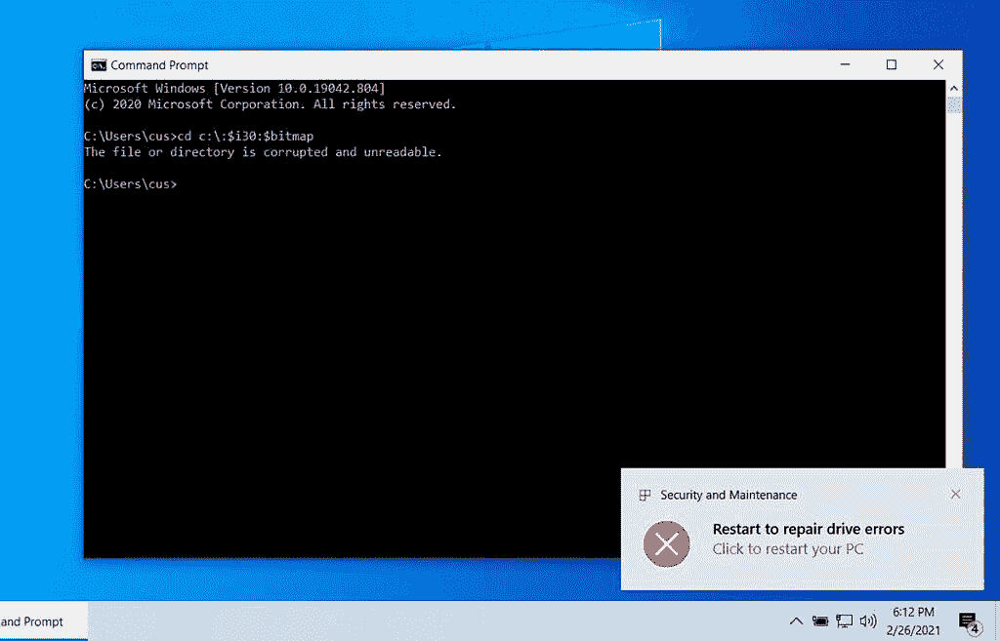

# Windows 10 磁盘损坏错误通过最新的内幕预览更新获得修复

> 原文：<https://www.xda-developers.com/windows-10-ntfs-disk-corruption-bug/>

# Windows 10 bug 可以用一个命令破坏驱动器，在最新的 Insider build 上打了补丁

最近发现，Windows 10 的一个错误将您的 NTFS 格式化磁盘驱动器标记为损坏，从而不允许用户访问该驱动器。

Windows 10 目前面临着另一个可能损坏 NTFS 格式驱动器的错误。只要访问一个特定的路径或打开一个特制的文件，就可以触发这个 bug。有报道称，微软本应在上个月推出一个补丁。然而，它只成功地为 Windows 10 内部版本的用户发布了相同的版本。

这个漏洞是上个月由 [*电脑*](https://www.bleepingcomputer.com/news/security/windows-10-bug-corrupts-your-hard-drive-on-seeing-this-files-icon/) 发现的。据报道，它允许几乎任何用户，包括低权限用户，只需一行命令就能破坏 NTFS 格式的硬盘。一旦执行，Windows 试图访问该路径，却以“文件或目录损坏且不可读”的错误结束，最终将驱动器标记为损坏并需要修复。根据*漏洞计算机*所做的测试，一行代码可以隐藏在 Windows 快捷方式文件、ZIP 存档、批处理文件或其他各种载体中，以触发破坏文件系统索引的硬盘错误。

 <picture></picture> 

Image credits: BleepingComputer

然后，Windows 会要求用户重新启动计算机并运行 chkdsk 来修复损坏的硬盘。根据微软的说法，驱动器实际上并没有坏，Windows chkdsk 应该可以解决这个问题。但是，测试表明 chkdsk 并没有解决这个问题；因此，Windows 无法启动。

预计微软将通过二月份的补丁解决这个问题。虽然这并没有发生，[报道](https://www.bleepingcomputer.com/news/microsoft/microsoft-fixes-windows-10-drive-corruption-bug-what-you-need-to-know/)现在表明，新的 Windows 10 内部版本 21322 确实包括一个未记录的问题修复程序。Windows 10 现在报告“目录名无效”，不再将 NTFS 卷标记为损坏。预计微软最终会为所有 Windows 10 用户发布类似的修复程序。

上个月，微软[为 Windows 10 推出了新的紧急更新](https://www.xda-developers.com/windows-10-kb5001028-emergency-update-wifi/),以修复连接 Wi-Fi 网络时导致 BSOD(蓝屏死机)的漏洞。该问题仅专门针对较新的 WPA3 安全性；本质上，只有少数用户受到影响。