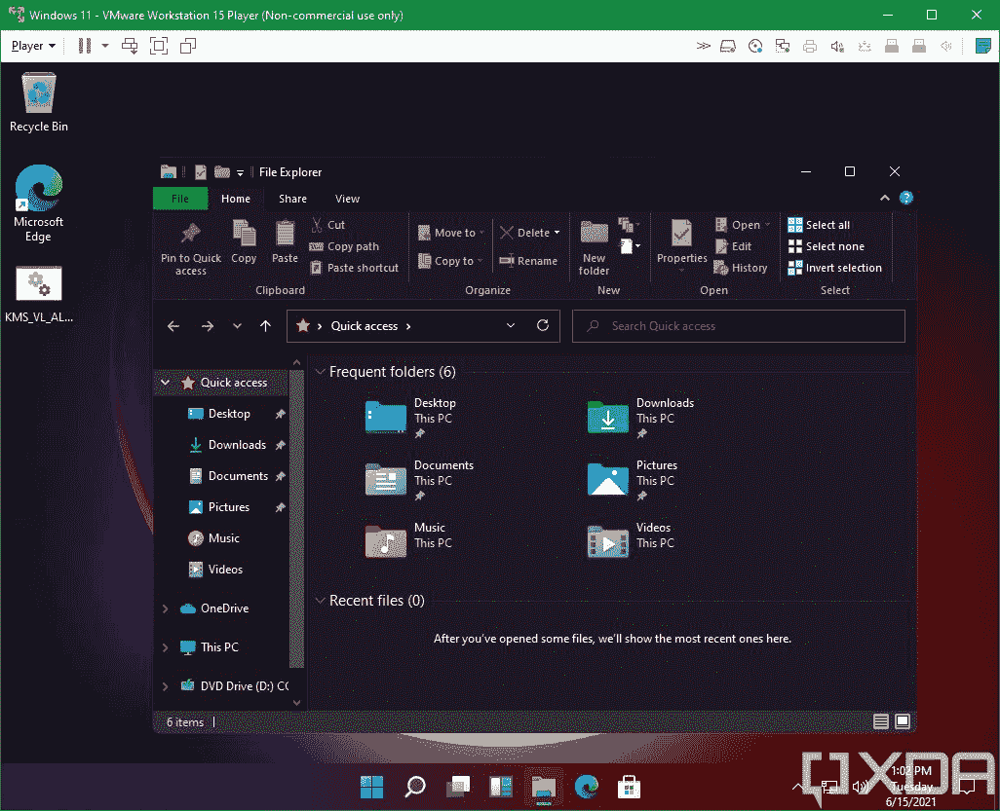

# 窗户 11 是一层新漆，只覆盖了半面墙

> 原文：<https://www.xda-developers.com/windows-11-leak-design-critique/>

下一个重大的 Windows 更新，我们相当确定被称为 [Windows 11](https://www.xda-developers.com/windows-11/) ，前几天[刚刚泄露了](https://www.xda-developers.com/hands-on-windows-11/)。泄露的版本是一个正在开发的版本，所以尽管它可能不能完全代表微软最终发布的内容，但它仍然让我们提前看到了 Windows 11 的内容。安装过程已经更新，任务栏默认有新的居中对齐(匹配 macOS 和 Chrome OS)，开始菜单有新的布局。

肯定会有令人兴奋的变化，就像 Windows 10 发布后的大多数更新一样。然而，[在看了泄露的版本](https://www.xda-developers.com/hands-on-windows-11/)后，我开始认为这远远不是“Windows 11”这个名字所暗示的彻底改革。Windows 以前的主要版本通常会推出突破性的新功能(Windows 10 中的 DirectX 12)，为大多数系统应用程序带来新界面(Vista 中的 Aero，7 中的 Ribbon)或向遗留功能挥手告别(Windows ME 对实模式 MS-DOS 的移除)。自[第一次发布 Windows NT](https://en.wikipedia.org/wiki/Windows_NT_3.1) 以来，Windows 的核心框架并没有发生重大变化，但在此后的近 30 年里，Windows 仍然有了显著的发展。

相比之下，Windows 11 似乎与大多数人期待的 Windows 10 年度更新有着相同的变化。这是一个早期泄露的测试版本，因此可能会有更多尚未可见的变化，但 Windows 10 的大多数痛点似乎仍然存在。界面和主要系统应用程序仍然是流畅 UI、Windows 7 Aero 甚至 XP 时代设计的混合——远远不是微软一直宣传的[流畅设计天堂](https://www.xda-developers.com/microsoft-android-app-devs-adopt-fluent-design-style/)。

 <picture></picture> 

File Explorer in Windows 11

文件浏览器是 Windows 最重要的组件之一，相对于它在 Windows 8 中的出现来说，它仍然没有什么变化——那时微软的大多数桌面应用程序都在使用“丝带”设计。任务管理器[看起来也与 Windows 8 和 10](https://twitter.com/tomwarren/status/1404859429644914694) 中的任务管理器一模一样，经典的 cmd.exe 命令行仍然有效(即使微软一直试图让每个人都使用[新的 Windows 终端](https://www.xda-developers.com/microsoft-windows-terminal-preview-1-9-quake/))，控制面板仍然围绕着用于尚未添加到 Windows 设置应用程序中的少数设置。

新的更新也延续了 Windows 10 中一些最糟糕的趋势。[你无法在 Windows 11 Home](https://twitter.com/CanterRain/status/1404891682722697218) 中创建本地账户(仅在 Pro 版中)，迫使你使用微软账户将你的设置和其他数据同步到云端。在几次 Windows 10 更新过程中，微软一直在[慢慢地将 Windows 用户推向在线账户](https://www.windowscentral.com/how-set-windows-10-local-account)，而 Windows 11 似乎将对大多数人完全取消这一选项。

泄露的 Windows 11 版本表明，微软仍然不愿意彻底检查 Windows 中的许多核心功能和应用程序，原因很简单——大型组织*不喜欢变化*。微软将对 Windows XP 的主流支持延长至 2014 年 4 月，这是它发布近 13 年后的事情，很大程度上是因为许多企业仍在使用过时的操作系统( [0.6%的 Windows PCs 仍*在 XP 上*](https://gs.statcounter.com/windows-version-market-share/desktop/worldwide/#monthly-201802-202104))。微软也仍然在企业环境中积极修补 Windows 7，尽管它在近十年前就被 Windows 8 取代了。

即使是已经升级到 Windows 10 的组织也经常需要运行传统软件，这就是为什么 Windows [保持与非常旧的应用](https://twitter.com/zoomosis/status/627677829304487936)兼容的原因。Windows 的向后兼容性是有代价的——许多核心应用程序和系统组件*永远不能改变*。自 Windows 8 以来，文件资源管理器仅得到了微小的改进，因为重大的重写可能会破坏与[外壳扩展](https://en.wikipedia.org/wiki/File_Explorer#Extensibility)的兼容性。虽然许多旧的应用程序和游戏已经在现代版本的 Windows 上崩溃，但操作系统的重大变化会影响更多的软件。

升级(或删除)Windows 中的重要组件，同时仍然保持传统兼容性的唯一方法是在容器或虚拟机中运行旧软件。这就是 Windows 10X 的计划，它将有一个容器将 Win32 应用程序与核心系统隔离开来。然而，随着 [Windows 10X 现在取消了](https://www.xda-developers.com/microsoft-confirms-windows-10x-dead/)，我们只剩下一个新的 Windows 版本，仍然保留着已经存在了几十年的传统。

微软可能会在未来计划更多的升级，但至少现在，Windows 11 的功能与 Windows 10 差不多。它是许多不同界面和设计语言的混合体，有着 Windows 已经处理了多年的所有相同的错误和缺点。微软可以也应该做得更好。