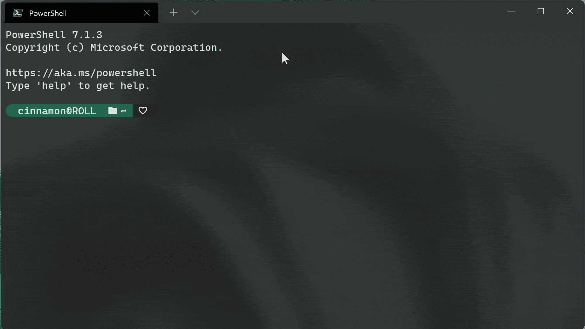

# Windows 终端在预览分支中更新到 1.10 版，具有新功能

> 原文：<https://www.xda-developers.com/windows-terminal-preview-1-10/>

# Windows 终端预览版 1.10 增加了新的设置、粗体文本支持等等

Windows 终端的最新预览版增加了新的视觉变化、更多可自定义的设置和一些错误修复。

Windows 终端是 Windows 10 和 11 的新应用程序，它是几个命令行 Windows 组件的中心枢纽，包括 PowerShell、CMD.EXE(从 MS-DOS 时代延续下来的)和 Linux 的 Windows 子系统。它去年退出了测试版，但微软继续提供预览版，为任何人提供最新和最棒的功能。 [Windows 终端预览版 1.9 于 5 月](https://www.xda-developers.com/microsoft-windows-terminal-preview-1-9-quake/)发布，现在随着 1.9 在稳定渠道推出，1.10 的测试版本也可以使用。

这次[更新](https://devblogs.microsoft.com/commandline/windows-terminal-preview-1-10-release/)包括几个视觉上的变化，包括支持文本渲染中的粗体文本(即将推出一个配置功能的设置)，设置中一个新的“默认”页面，将设置应用于所有配置文件，以及任何 quake 模式窗口的系统托盘图标。微软还增加了一个按钮，用于打开主下拉菜单的命令面板(位于选项卡旁边)。

 <picture></picture> 

Windows Terminal command palette button

除了设计上的更新，这个版本还有一个新的语言首选项设置(而不是只使用默认的 Windows 系统语言)，一个创建新键盘快捷键的选项，以及通过索引关闭选项卡的能力。微软还解决了一些问题，比如关闭标签页和打开设置界面会导致终端崩溃。

您可以从微软商店下载 Windows 终端预览版[。或者，如果你想坚持稳定的体验，](https://www.microsoft.com/en-us/p/windows-terminal-preview/9n8g5rfz9xk3)[常规 Windows 终端](https://www.microsoft.com/en-us/p/windows-terminal/9n0dx20hk701)也可以从微软商店下载。

https://apps.microsoft.com/store/detail/9n8g5rfz9xk3

https://apps.microsoft.com/store/detail/9n0dx20hk701